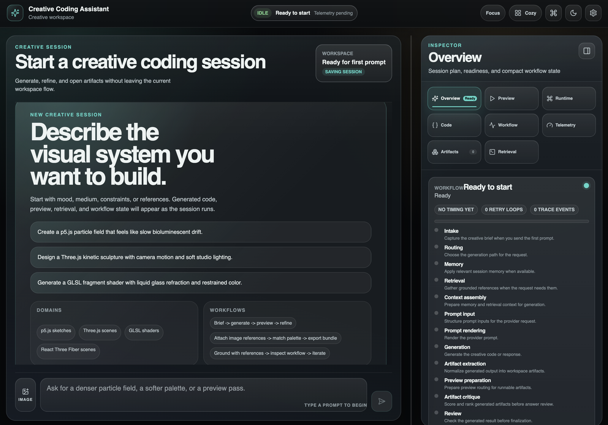

# Creative Coding Assistant

Creative Coding Assistant is a local AI workstation for creative coders,
technical artists, and reviewers who need to turn audiovisual intent into
grounded browser creative-coding guidance. It combines retrieval, workflow
orchestration, preview surfaces, generated artifact evidence, and evaluation
fixtures so a reviewer can inspect what the system can do and where the
boundaries are.



## Capstone Evaluator - Start Here

For the Turing College Capstone review, use this shortest path:

1. Read `docs/CAPSTONE_DEMO_SHOWCASE.md` for the 10-minute demo, 5-minute Q&A,
   and fallback route.
2. Read `docs/CAPSTONE_EVALUATION_ETHICS.md` for evaluation, privacy, source
   grounding, and ethical boundaries.
3. Read `docs/V8_GRAND_ENGINEERING_REVIEW.md` for release-candidate evidence,
   validation commands, known warnings, and remaining risks.
4. Start the backend and frontend locally, open Creative Coding Assistant, and
   use `Demo Mode` from the workstation top bar.
5. Keep `demo/final_demo_launcher.html` as a static fallback if the app, live
   provider, retrieval, or preview path is unavailable.

## Project Overview

Creative Coding Assistant helps users design and reason about p5.js, Three.js,
GLSL, Hydra, audio-reactive sketches, generative systems, and installation
planning. The product is not a generic chatbot. It is a reviewable creative
coding workflow surface with explicit source boundaries, fallback paths, and
local-first demo evidence.

The current release-candidate work focuses on a reliable local Capstone demo:
an integrated Demo Mode, generated golden artifacts, browser QA records,
retrieval evidence, sanitized/redacted RAGAs evaluation, and conservative
public claims.

## Why It Exists

Creative coding work often starts as ambiguous intent: motion, geometry, audio,
visual references, atmosphere, runtime constraints, and platform tradeoffs. A
plain assistant can produce plausible code, but reviewers still need to know:

- which sources shaped the answer;
- whether the runtime choice is realistic;
- what was actually validated in a browser;
- how failures are handled during a live demo;
- which advanced planning layers are advisory rather than live execution.

Creative Coding Assistant makes those boundaries visible.

## Key Features

Creative Coding:
- p5.js, Three.js, GLSL, Hydra, Web Audio, and browser-runtime guidance.
- Generated golden artifacts for p5.js, Three.js, GLSL, and Hydra.
- Runtime-specific fallback language for unsupported or unavailable previews.

Retrieval:
- Local Chroma-backed creative-coding knowledge base.
- Registered-source retrieval for p5.js, Three.js, Web Audio, GLSL, and demo
  evidence.
- Redacted and sanitized evaluation fixtures that avoid sending raw private
  live-session data to external evaluators.

Preview:
- Workstation preview surfaces and artifact inspection.
- Local browser QA records for generated artifacts.
- Explicit boundaries: QA evidence is not a display-FPS benchmark, public
  deployment, or external tool execution.

Demo Mode:
- Integrated in-app Demo Mode inside Creative Coding Assistant.
- Eight curated Capstone scenarios.
- Scenario selection loads prompts into the normal assistant composer.
- Each scenario includes expected behavior, fallback, source boundary,
  validation path, and output guidance.

Creative Translation:
- Converts abstract concepts into concrete visual systems.
- Uses geometry, motion, color, interaction, and runtime constraints.
- Keeps public language aesthetic and implementation-focused.

Geometry And Morphogenesis:
- Supports generative structures such as reaction diffusion, cellular
  automata, L-systems, flow fields, particle systems, differential growth,
  diffusion-limited aggregation, space-colonization-style branching, and
  emergent form.
- Jason Webb's Digital Morphogenesis material is treated as inspiration only;
  the project does not claim those sources are indexed in the KB.

Narrative And Architecture:
- Produces bounded planning guidance for installation, immersive scenes,
  audience movement, sequencing, and handoff.
- Does not claim venue scanning, engineering certification, public deployment,
  or external DCC/MCP execution.

Evaluation:
- Backend, frontend, API, and E2E validation evidence.
- Sanitized RAGAs context precision run.
- Redacted latest-live RAGAs run over reviewer-safe p5.js fixture rows.
- Artifact QA manifests and browser-render records.

Explainability:
- Workflow, retrieval, source, runtime, and fallback explanations.
- Typed Domain Intelligence Layers for planning, provenance, validation,
  creative reasoning, and future runtime execution boundaries.

Workflow:
- LangGraph-oriented backend workflow.
- Next.js workstation.
- Normal assistant flow remains the primary execution path; Demo Mode only
  curates scenario startup and evidence.

API:
- Local FastAPI development server.
- Health, readiness, workspace-session, and assistant request surfaces.
- Provider calls remain opt-in and environment-dependent.

## Architecture

Creative Coding Assistant is split into a local Python backend and a browser
workstation:

- `src/creative_coding_assistant/`: orchestration, retrieval, evaluation,
  typed contracts, API runtime, and domain intelligence.
- `clients/nextjs/`: product workstation, preview surfaces, Demo Mode, E2E
  smoke tests, and browser UI.
- `demo/`: Capstone demo suite, static fallback launcher, generated artifacts,
  RAGAs fixtures, and manual checklist.
- `docs/`: reviewer evidence, architecture notes, evaluation and ethics,
  deployment target, and release-candidate engineering review.

V4-V8 are best understood as Typed Domain Intelligence Layers. They provide
planning, explainability, provenance, validation, creative reasoning, and
future runtime execution boundaries. They do not imply every named planning
surface is an active runtime executor.

## Technology Stack

- Python, Pydantic, FastAPI, LangGraph-style workflow orchestration.
- Chroma for local retrieval.
- Next.js, React, TypeScript, Vitest, and Playwright.
- p5.js, Three.js, GLSL/WebGL, and Hydra artifact validation paths.
- RAGAs for opt-in evaluator metrics over sanitized or redacted fixtures.

## Demo Mode

Start Creative Coding Assistant locally and select `Demo Mode` in the
workstation top bar. The app shows eight curated scenarios:

1. Three.js audio-reactive visual system
2. p5.js generative morphogenesis sketch
3. GLSL shader / post-processing visual
4. Hydra feedback-pattern demo
5. Retrieval-grounded creative coding answer
6. Concept-to-visual translation
7. Geometry / morphogenesis visual system
8. Installation / immersive scene planning

Selecting a scenario pre-fills the normal assistant composer. The presenter can
then send the prompt through the standard workflow or use the documented
fallback evidence if a provider, retrieval, frontend, backend, or preview path
fails.

Scenario cards show optimized live-smoke timing and token usage when those rows
exist. The current optimized run brought the core live demos into a 19-69s
range, while Hydra remains bounded to a no-provider artifact-QA support path.

Hydra support is limited to the validated local `hydra-synth` browser artifact
path recorded in `demo/golden_artifacts/browser_full_runtime_qa_results.json`.

## Quick Start

Prerequisites:

- Python environment with project dependencies installed.
- Node dependencies installed under `clients/nextjs`.
- Optional provider credentials for live generation or RAGAs evaluator runs.

Backend:

```bash
.venv/bin/python -m creative_coding_assistant.api.dev_server --host 127.0.0.1 --port 8000
```

Frontend:

```bash
cd clients/nextjs
npm run dev
```

Open:

```text
http://127.0.0.1:3000
```

Minimum reviewer validation:

```bash
.venv/bin/pytest tests/test_golden_artifacts.py tests/test_ragas_live_eval_foundation.py tests/test_demo_showcase_experience.py tests/test_retrieval_demo_pack.py
cd clients/nextjs
npm run typecheck
npm run test -- src/lib/demo-mode.test.ts src/components/workstation-shell.test.tsx
npm run test:e2e:smoke
```

Static fallback launcher:

```bash
python3 -m http.server 8126 --bind 127.0.0.1
```

Then open:

```text
http://127.0.0.1:8126/demo/final_demo_launcher.html
```

## Evaluation

Primary evidence:

- `docs/V8_GRAND_ENGINEERING_REVIEW.md`
- `docs/V8_CAPSTONE_EVIDENCE_MATRIX.md`
- `demo/evaluation/README.md`
- `demo/golden_artifacts/qa_manifest.json`
- `demo/golden_artifacts/browser_full_runtime_qa_results.json`
- `demo/final_demo_suite.json`

RAGAs evidence is intentionally conservative:

- Sanitized fixture: synthetic/public content only.
- Redacted latest-live fixture: preserves latest-live structure while replacing
  private question, answer, and context text.
- Raw private live-session rows remain local-only.
- The redacted p5.js run includes a weak faithfulness row; it is documented as
  a fixture/evaluator phrasing issue rather than hidden.

## Ethics

Creative Coding Assistant keeps public claims bounded:

- No religious, medical, psychological, historical, or metaphysical authority
  claims.
- No public cloud deployment claim for the Capstone demo.
- No live DCC/MCP execution claim.
- No autonomous delivery claim.
- No raw private evaluation export.
- Internal planning layers are treated as engineering evidence, not objective
  truth.

## Current Product Scope

Implemented and reviewable:

- Local backend and Next.js workstation.
- Integrated Demo Mode.
- Retrieval-grounded creative-coding answers.
- Browser-focused creative coding guidance.
- Generated p5.js, Three.js, GLSL, and Hydra golden artifacts.
- Local browser QA evidence for the golden artifacts.
- Sanitized and redacted RAGAs evidence.
- Fallback static launcher and presenter checklist.

Out of scope for this Capstone release:

- Public cloud deployment.
- External DCC/MCP execution.
- Autonomous end-to-end delivery.
- Broad load/soak or display-FPS benchmarking.
- Raw private live-session evaluator calls.
- Final freeze, merge, push, or tag without HITL.

## Future Roadmap

The long-term product direction separates the system into three clearer
layers:

```text
Knowledge Engine
  -> Creative Execution Engine
  -> Experience Engine
```

Knowledge Engine:
- source ingestion, retrieval, provenance, freshness, trust, and safe
  evaluation fixtures.

Creative Execution Engine:
- stronger runtime-specific generation, artifact packaging, browser preview,
  visual QA, and model/provider routing.

Experience Engine:
- richer workstation flows, installation planning, gallery/demo packaging,
  collaboration, and production handoff.

These are roadmap directions, not current Capstone claims.

## License

License information should be confirmed before public distribution. Keep this
branch local until HITL approves release, freeze, tag, and publication actions.
