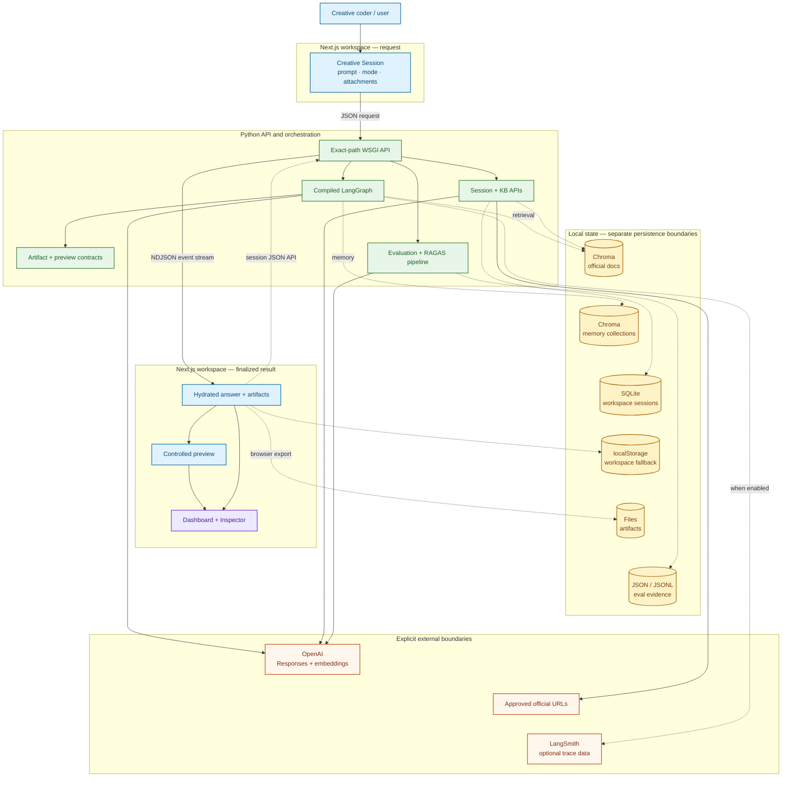

# Creative Coding Assistant

Creative Coding Assistant is a local-first AI-native creative translation
system and creative coding platform, delivered as a Creative Workstation. It
combines a Next.js workstation, a Python API, a bounded LangGraph workflow,
official-source retrieval, OpenAI generation and embeddings, local persistence,
and browser-focused preview paths.

![Creative Workspace with sessions, starter briefs, composer, and workflow inspector][screenshot-workspace]

*The Creative Workspace keeps composing, session history, and inspectable workflow state in one view.*

## Purpose

Creative Coding Assistant bridges artistic vision and technical implementation,
using AI and creative coding as tools for artistic and visionary expression. It
helps artists, creative technologists, and developers translate ideas,
references, and creative intent into inspectable, grounded, browser-native
creative systems while preserving transparency, reproducibility, and
engineering rigor. A request is validated and routed through a visible workflow,
enriched with local memory and official documentation when appropriate, rendered
into a structured prompt, sent to the configured model, converted into
artifacts, and checked against a bounded preview contract before the result is
presented. The objective is not simply to generate code, but to help transform 
artistic intent into technically grounded interactive experiences.

## Problem

Creative-code requests mix artistic intent with technical constraints: runtime,
dependencies, interaction, performance, source quality, and safe execution.
Unstructured model output can obscure where information came from, which path
ran, whether code is executable, and what failed.

## Solution

Creative Coding Assistant keeps those boundaries explicit:

- a browser workspace captures prompts, modes, creativity controls, and optional
  image references;
- a local API validates requests and streams typed workflow events;
- LangGraph selects and executes a Single Agent or Multi Agent route;
- local ChromaDB collections provide official-source retrieval and conversation
  memory through separate data boundaries;
- Jinja templates isolate policy, user input, memory, and retrieved context;
- OpenAI adapters own text generation and embedding calls;
- extracted or previously saved artifacts remain inspectable when preview is
  unavailable; a provider failure remains explicit and does not fabricate a new
  artifact; and
- the Dashboard and Inspector expose route, retrieval, runtime, session, and
  evaluation state without presenting telemetry as model reasoning.

## Key capabilities

| Area | Implemented capability | Boundary |
|---|---|---|
| Creative assistance | Generate, explain, debug, design, review, and preview creative code | Output still requires human inspection |
| Retrieval-Augmented Generation | Local retrieval over schema-versioned, content-addressed records from an approved official-source corpus, using OpenAI embeddings, Chroma similarity search, ranking, and provenance | Request-time open-web browsing is excluded by design; index contents reflect the latest successful per-source sync, not guaranteed upstream completeness |
| Workflow orchestration | Compiled LangGraph with Single Agent, Multi Agent, and Auto selection | Roles are sequential responsibilities, not an autonomous parallel swarm |
| Multimodal input | Text plus up to four validated image references in one provider request | No audio upload or image-understanding quality claim |
| Creative runtimes | Browser previews for bounded p5.js, Three.js, GLSL, and Tone.js artifacts | Other domains remain code/export or external-tool handoffs |
| Memory and sessions | Chroma conversation memory plus SQLite workspace snapshots and browser fallback state | Local storage is not encrypted or automatically deleted |
| Evaluation | Current-product seven-case benchmark, five RAGAS metrics, history, provenance, and public-safe evidence projection | Small samples and evaluator variance limit generalization |
| Observability | NDJSON workflow events, provider usage metadata, runtime telemetry, and optional LangSmith tracing | Tracing is off by default; events are not private chain-of-thought |

## Product boundaries

Implemented paths are distinguished from bounded, optional, and unsupported
paths throughout the UI and documentation. In particular, this repository does
not claim a hosted multi-user service, direct execution in external creative
tools, a separate LangChain chain layer, arbitrary tool execution, audio input,
or a completed human creativity study.

## Repository Layout

```text
.
├── architecture/                         # Current architecture guides and Mermaid sources.
├── assets/                               # Public visual assets.
│   └── screenshots/                      # Current product screenshots used in documentation.
├── clients/                              # User-facing client applications.
│   ├── nextjs/                           # Primary browser workstation.
│   │   ├── src/                          # UI, stream hydration, state, and browser runtimes.
│   │   ├── public/                       # Preview sandbox host and vendored Three.js runtime.
│   │   └── e2e/                          # Playwright product, preview, and responsive checks.
│   └── streamlit/                        # Lightweight local reference client.
├── demo/                                 # Curated scenarios, prompts, and demo assets.
│   ├── evaluation/                       # Public evaluation schemas and retained evidence.
│   └── golden_artifacts/                 # Browser-ready reference artifacts and QA results.
├── docs/                                 # Installation, product, evaluation, and safety guides.
├── scripts/                              # KB sync, evaluation, reporting, and quality-gate CLIs.
├── src/                                  # Installable Python source tree.
│   └── creative_coding_assistant/        # Backend application package.
│       ├── api/                          # HTTP, streaming, session, KB, and evaluation endpoints.
│       ├── contracts/                    # Typed request and event contracts.
│       ├── orchestration/                # LangGraph workflow, routing, review, and metadata.
│       ├── llm/                          # Generation service and provider adapter.
│       ├── knowledge/                    # Curated domain knowledge contracts and catalogs.
│       ├── memory/                       # Conversation-memory records and repositories.
│       ├── rag/                          # Approved-source registry and health contracts.
│       ├── vectorstore/                  # Chroma collection and repository layer.
│       ├── preview/                      # Backend artifact-preview contracts.
│       ├── eval/                         # Retrieval and RAGAS evaluation runners.
│       └── security/                     # Input and generation guardrails.
└── tests/                                # Python backend and contract regression suite.
```

## Quick start

### Prerequisites

- Python 3.11 or newer
- Node.js 22.13+ on the 22.x line, or Node.js 24+
- npm
- An OpenAI API key for live generation, embeddings, knowledge-base sync, or
  provider-scored evaluation

From the repository root:

```bash
python3 -m venv .venv
.venv/bin/python -m pip install --upgrade pip
.venv/bin/python -m pip install -e ".[dev]"
npm ci --prefix clients/nextjs
cp .env.example .env
```

Set `OPENAI_API_KEY` in the uncommitted `.env` file and keep
`LANGSMITH_TRACING=false` unless external tracing is intentionally configured.

Start the API:

```bash
.venv/bin/python -m creative_coding_assistant.api.dev_server --host 127.0.0.1 --port 8000
```

In a second terminal, start the workstation:

```bash
npm run dev --prefix clients/nextjs
```

Open [http://127.0.0.1:3000](http://127.0.0.1:3000) and verify the API:

```bash
curl --fail http://127.0.0.1:8000/api/health
curl --fail http://127.0.0.1:8000/api/health/ready
```

The application starts without a populated knowledge base, but retrieval will
be empty or unavailable. Populate Chroma only after reviewing the source,
network, privacy, and provider-cost boundaries:

```bash
.venv/bin/python scripts/sync_official_kb.py --all --continue-on-error
```

See the [Installation Guide](docs/INSTALLATION_GUIDE.md) for optional RAGAS and
browser-test dependencies.

![Advanced Dashboard user guide showing the five-step first-run workflow][screenshot-user-guide]

*The in-product User Guide carries the same path from brief and route selection to inspection and handoff.*

## How the product works

1. The user selects a task, domain, creativity profile, and workflow, then
   submits a prompt with optional image references.
2. The Python API validates size, media, safety, and request contracts before
   starting the graph.
3. Routing publishes the resolved Single or Multi path. Auto is a selector, not
   a third execution graph.
4. Memory and retrieval add bounded context when available. Missing retrieval
   remains explicit and recoverable.
5. Jinja renders provider-neutral system, user, memory, and retrieval messages.
   The OpenAI adapter performs the generation call and streams typed events.
6. Non-Explain results pass through artifact extraction and preview preparation.
   Multi Agent can critique, review, and request bounded refinement.
7. The browser hydrates the final response, revalidates the preview contract,
   runs supported code in an isolated surface, and records workspace state.

![Advanced Dashboard overview of outcome, route, artifact, preview, runtime, and retrieval][screenshot-overview]

*The Dashboard overview keeps the current result and its strongest published evidence together.*

## Architecture overview

Open the [dedicated system architecture page](architecture/system_architecture_overview.md)
for a larger view and its standalone Mermaid source.



The browser never calls a model directly. The API owns validation,
orchestration, provider access, retrieval, session services, and evaluation;
the browser owns final hydration and supported preview execution. The diagram's
file output represents explicit user downloads and exports. The configured
backend artifact directory is not an automatic artifact writer.

The local HTTP surface includes assistant streaming, health/readiness, workspace
sessions, knowledge-base operations, domain inventory, and evaluation jobs. The
assistant route streams newline-delimited JSON rather than WebSockets.

A central engineering challenge is keeping generation, preview, and persistence
evidence distinct across the backend and browser runtimes. Typed workflow
events, browser-side preflight, explicit runtime telemetry, and separate storage
contracts keep provider, artifact, preview, and session states distinguishable.

### End-to-end workflow

`request → validation → routing → memory → retrieval → context → prompt → generation → artifact → preview preparation → review/refinement → finalization → stream → browser preview`

Single Agent and Explain skip the stages that do not apply. The completed
[End-to-End Product Workflow](architecture/end_to_end_product_workflow.md)
preserves every route and evidence boundary in the full diagram; it is linked
instead of duplicated here so its labels remain readable at normal GitHub
width. See the [Architecture Diagram Guide](architecture/README.md) for the
system, role, preview, and evaluation views.

![Advanced Dashboard architecture comparing Single Agent and Multi Agent workflow roles][screenshot-architecture]

*The architecture view distinguishes the direct route from the sequential five-role quality pipeline.*

## Main workflows

| Choice | Behavior | Retrieval | Generation calls |
|---|---|---|---|
| **Single Agent** | Direct prompt-rendering and generation path; skips planning, critique, review, and refinement | Explicitly skipped | One when the provider is configured |
| **Multi Agent** | Sequential Planner, Researcher, Generator, Critic, and Reviewer responsibilities | Requested; failure can recover with empty context | One initial call plus up to two review-requested refinements |
| **Auto** | Resolves to Single or Multi, publishes the decision, then follows that route | Follows the resolved route | Follows the resolved route |

Auto selects Single only when the resolved task is Explain or Debug, there is
no image attachment, and routing resolved no domains. Other Auto requests use
Multi. Role names describe responsibility inside one compiled graph; only the
Generator owns a text-generation provider call.

A typical creative session is:

1. describe the artifact, runtime, interaction, and constraints;
2. optionally attach a non-sensitive image reference;
3. run Single, Multi, or Auto and follow streamed workflow state;
4. inspect the answer, source, retrieved evidence, preview, and diagnostics;
5. refine the artifact, compare outputs, save the workspace, or export it.

Demo Mode provides curated starting scenarios for p5.js, Three.js, GLSL,
Tone.js, retrieval, workflow selection, image input, exports, and failure
recovery. Loading a scenario still uses the normal request path and is not
evidence that a provider or runtime succeeded.

![Demo Mode selector for Tone.js, p5.js, Three.js, and GLSL workflows][screenshot-demo-mode]

*Demo Mode prepares bounded creative-coding scenarios without bypassing the normal request path.*

## Retrieval and knowledge system

The knowledge pipeline is explicit and reproducible:

1. a committed registry limits ingestion to approved official HTTPS sources;
2. sync fetches, normalizes, chunks, and attaches source metadata;
3. OpenAI embeddings are stored as schema-versioned, content-addressed records
   in the dedicated local ChromaDB collection;
4. a query embedding drives bounded vector search, filtering, and source/domain
   diversity;
5. ranked excerpts and lineage enter the Multi Agent context; and
6. selected source IDs, titles, URLs, ranks, and reasons remain inspectable.

The application distinguishes four states:

| State | Meaning |
|---|---|
| Registered | A source exists in the approved registry |
| Indexed | Compatible chunks exist in the active Chroma collection |
| Retrieved | Chunks were returned for this request |
| Cited | The response or UI attributes material to the source |

None of those states proves the next one, and retrieval does not prove that a
generated claim is correct. Query text crosses the embedding-provider boundary;
retrieved excerpts remain local until they are selected for a generation or
approved evaluation request. See [Data and Knowledge Base](docs/DATA_AND_KB.md).

![Advanced Dashboard knowledge base with official-source index and creative guidance][screenshot-knowledge-base]

*The Knowledge Base separates registered sources, indexed content, and inspectable creative guidance.*

## Agents and orchestration

The active orchestration library is LangGraph, used directly through a compiled
`StateGraph`. The repository does not add a separate LangChain chain layer.
This distinction keeps the architecture accurate while using LangGraph's typed
graph contracts directly.

The runtime registry order is:

`intake -> routing -> memory -> retrieval -> context_assembly -> prompt_input -> planning -> director -> reasoning -> prompt_rendering -> generation -> artifact_extraction -> preview_preparation -> artifact_critique -> review -> refinement -> finalization -> failure`

Not every node runs on every route. Planning, direction, reasoning, critique,
and review are deterministic application stages. The Multi Agent workflow is a
bounded multi-step automation path, not five independent model processes.

Prompt engineering is implemented with strict Jinja templates that separate
system policy, task input, memory, and retrieved evidence. Retrieved material is
treated as context rather than system instruction. The provider adapter then
maps these neutral messages to the OpenAI Responses API.

### Model and generation controls

| Control | Current behavior |
|---|---|
| Model | Selected through backend configuration; OpenAI is the only active generation provider |
| Creativity profile | Controlled, Balanced, and Exploratory request temperatures; sent only to known compatible model families |
| Output length | Configurable maximum output tokens, validated from 64 to 8,000 |
| Timeout | Configurable provider timeout with bounded validation |
| Refinement | Multi Agent can make up to two additional generation attempts |

These controls expose relevant model parameters, but they are not evidence of a
completed comparative performance-tuning experiment. Unsupported sampling
parameters are omitted instead of being reported as applied.

## Multimodal and creative coding capabilities

The input path supports text plus up to four PNG, JPEG, WebP, or GIF references
of at most 1 MiB each. The browser and backend validate declared type, decoded
size, and file signature. Accepted pixels are added as `input_image` content
beside user text in the configured-provider payload. Images are request-scoped:
they are cleared after submission and not restored with a session.

The tested boundary covers payload construction; it does not establish live
provider receipt, image influence, or visual quality. The product has no audio
upload, transcription, or audio analysis. Tone.js is a generated browser-audio
runtime with an explicit user start gesture, not an audio-input modality.

![Creative session preview runtime with a generated p5.js artifact and workflow trace][screenshot-preview-runtime]

*The session view keeps the generated artifact, preview health, and executed workflow visible together.*

| Delivery kind | Current scope |
|---|---|
| Live browser preview | Bounded p5.js, Three.js, GLSL, and Tone.js artifact contracts |
| Code/export | Inspectable source for domains such as Hydra and React Three Fiber |
| External-tool handoff | Source and supporting files for tools such as TouchDesigner, Blender, Houdini, Unreal, or Unity; CCA does not run those tools |

![Advanced Dashboard domains with browser runtimes, source exports, and external handoffs][screenshot-domains]

*Domain contracts distinguish four live browser runtimes from export-only and external-tool delivery paths.*

Generated code can be opened, copied, downloaded, refined, and saved inside
workspace snapshots. Live-generated Markdown/export artifacts retain their
individual Open, Copy, and Download actions and also expose an operator-approved
Export project action that downloads the current workspace as a ZIP bundle. A
prepared preview contract is not proof of a rendered frame; the browser performs
its own preflight and reports runtime state after backend finalization. See
[Domain Experience](docs/DOMAIN_EXPERIENCE.md).

## Evaluation methodology

Evaluation runs the current product path: official-source retrieval, the
current prompt renderer, configured generation, and RAGAS evaluation. A frozen,
versioned seven-case public benchmark prevents test selection from drifting
with each run. Full evaluation also records separate local Creative, Workflow,
and Reliability snapshots; those are not additional generated answers and are
not combined into a universal product score. The Dashboard always reports the 
latest current-product evaluation produced by the versioned benchmark, 
rather than historical fixtures or synthetic regression datasets.

The five metrics are:

| Metric | Question answered |
|---|---|
| Context precision | Were useful contexts ranked ahead of less useful ones? |
| Faithfulness | Is the answer supported by the retrieved context? |
| Answer relevancy | Does the answer address the question? |
| Context relevancy | Is the retrieved material useful for the question? |
| Context recall | Does retrieval cover the authored reference answer? |

Every retained current-product result carries benchmark version, dataset and pipeline
fingerprints, model and embedding configuration, timestamps, eligibility,
skips, metric failures, and run identity. The Dashboard owns the current dynamic
score and session history. Canonical committed JSON is a public-safe projection;
raw prompts, answers, references, and local excerpts are excluded.

Historical synthetic or redacted fixtures remain useful for evaluator and
schema regression, but they do not exercise the current retrieval, prompt, and
generation path and therefore are not the current score. Seven cases are a
small sample; evaluator models are stochastic, metric behavior can vary across
versions, code-heavy answers can be difficult to judge, and no automated RAG
metric measures artistic quality. See [Evaluation Methodology](docs/eval.md).

## Data and knowledge sources

| Source class | Provenance | Handling |
|---|---|---|
| Official technical documentation | Committed source registry with URL/domain metadata and schema-versioned index records | Fetched explicitly, normalized, chunked, embedded, and stored in local Chroma |
| User prompts and images | Submitted by the user for one request | Sent to configured providers only for the selected operation; images are not restored in sessions |
| Conversation memory | Successful prompt/answer pairs with a conversation ID | Embedded through OpenAI when configured, then stored in a separate local Chroma collection |
| Workspace state | Session, artifact, workflow, preview, and UI data | Stored in local SQLite with a compact browser fallback |
| Evaluation benchmark | Committed, versioned public cases | Used only through explicit dry-run or provider-authorized evaluation paths |

![Advanced Dashboard artifacts with a retained GLSL deliverable and live preview][screenshot-artifacts]

*The Artifacts surface keeps retained source, preview eligibility, runtime state,
and session provenance attached to the deliverable.*

Conversation turns are the automatically recorded memory type. Other summary
and project-memory collections are available to runtime readers but are not
automatically populated by the current product. Source registration does not
grant redistribution rights, and the local vector store should not be
published as a dataset.

## Privacy, ethics, and safety

Local-first storage does not mean that no data leaves the machine.

| Operation | External boundary |
|---|---|
| Generation | Rendered prompts, selected context, and submitted image pixels can be sent to OpenAI |
| Retrieval and memory | Query text, successful prompt/answer pairs, and source chunks can be sent for embeddings |
| Knowledge sync | Approved official-source text is downloaded and embedded before local storage |
| RAGAS | Only an explicitly reviewed public, synthetic, or redacted dataset should cross the evaluator boundary |
| LangSmith | Optional trace data is sent only when tracing and credentials are enabled; exposure can include workflow inputs or state depending on tracing configuration |

Current safeguards include request-size and image-signature validation, bounded
safety checks, context isolation in prompts, explicit provider-call gates for
evaluation, supported-preview source validation, request-scoped image payloads
that redact values during standard model serialization, separate local stores,
and visible failure states.

Residual risks remain: models can hallucinate, reflect source or evaluator
bias, generate unsafe or resource-heavy code, imitate protected work, or mishandle
cultural material. Local files, browser storage, logs, backups, exports, and
screenshots can disclose user data. Human responsibility remains necessary for
generated work, licenses, attribution, provider settings, and sensitive inputs
shared or run outside the bounded preview. See
[Ethics and Privacy Assessment](docs/ETHICS_PRIVACY_ASSESSMENT.md).

## Testing and validation

The repository includes Python unit and integration tests, compiled-workflow
tests, multimodal payload tests, API contract tests, frontend type checks and
Vitest suites, documentation/Mermaid gates, and Playwright browser smoke tests.

![Advanced Dashboard telemetry with run events, runtime, usage, cost, and retrieval evidence][screenshot-telemetry]

*Telemetry reports published run facts and retained usage without presenting provider reasoning.*

Core deterministic checks from the repository root:

```bash
.venv/bin/python -m pytest -q
.venv/bin/ruff check src tests scripts
.venv/bin/python -m compileall -q src tests scripts
.venv/bin/python scripts/v7_quality_gates.py docs-mermaid
npm run lint --prefix clients/nextjs
npm run typecheck --prefix clients/nextjs
npm run test --prefix clients/nextjs
```

With the local stack running and Chromium installed:

```bash
npm run test:e2e:smoke --prefix clients/nextjs
```

Provider-backed generation, embedding refresh, and RAGAS scoring are separate
opt-in checks because they require credentials, network access, privacy review,
and may incur cost.

## Limitations

- OpenAI is the only active generation and embedding provider; no offline model
  is bundled.
- The workstation has a local single-user posture. It does not implement hosted
  identity, multi-user authorization, rate limiting, managed backup, or
  enterprise isolation.
- A versioned local index is intentional: CCA searches an approved, locally
  indexed official-source corpus instead of arbitrary live pages during a
  request. The design is intended to improve reproducibility, provenance,
  latency, evaluation stability, and resistance to untrusted or changing web
  content. Freshness is bounded by the content captured in each source's latest
  successful sync; newer or missed upstream material waits for a later
  successful refresh.
- Multi Agent roles are sequential, bounded application responsibilities. They
  do not execute arbitrary tools or operate as an autonomous swarm.
- Browser runtimes cover only validated source shapes. Generated code can still
  fail, consume excessive resources, or behave differently elsewhere.
- Image transport is implemented, but controlled evidence of image influence is
  not yet complete. Audio input is unsupported.
- External creative tools are handoff targets, not integrated execution
  environments.
- The current evaluation benchmark is intentionally small, has evaluator
  variance, and does not replace human usability, accessibility, security, or
  aesthetic evaluation.
- No public hosted deployment is claimed.

## Future work

Priorities are broader versioned evaluation with repeated runs, stronger
image-influence evidence, deeper professional-tool continuation packages and
eventual round-trip workflows, preview expansion only under equivalent safety
contracts, and production identity, privacy, deployment, and observability
controls if the application becomes hosted. See [Future Work](docs/FUTURE_WORK.md).

## Documentation index

| Topic | Document |
|---|---|
| Architecture and diagrams | [Architecture Diagram Guide](architecture/README.md) |
| Installation | [Installation Guide](docs/INSTALLATION_GUIDE.md) |
| Configuration | [Configuration Guide](docs/CONFIGURATION_GUIDE.md) |
| Product workflows | [User Manual](docs/USER_MANUAL.md) |
| Retrieval and data | [Data and Knowledge Base](docs/DATA_AND_KB.md) |
| Evaluation | [Evaluation Methodology](docs/eval.md) |
| Privacy and safety | [Ethics and Privacy Assessment](docs/ETHICS_PRIVACY_ASSESSMENT.md) |
| Domain/runtime boundaries | [Domain Experience](docs/DOMAIN_EXPERIENCE.md) |
| Troubleshooting | [Troubleshooting](docs/TROUBLESHOOTING.md) |
| Planned improvements | [Future Work](docs/FUTURE_WORK.md) |


[screenshot-workspace]: assets/screenshots/creative-workspace.jpg
[screenshot-user-guide]: assets/screenshots/user-guide.jpg
[screenshot-overview]: assets/screenshots/dashboard-overview.jpg
[screenshot-architecture]: assets/screenshots/dashboard-architecture.jpg
[screenshot-demo-mode]: assets/screenshots/demo-mode.jpg
[screenshot-knowledge-base]: assets/screenshots/dashboard-kb.jpg
[screenshot-preview-runtime]: assets/screenshots/preview-runtime.jpg
[screenshot-domains]: assets/screenshots/dashboard-domains.jpg
[screenshot-artifacts]: assets/screenshots/dashboard-artifacts.jpg
[screenshot-telemetry]: assets/screenshots/dashboard-telemetry.jpg
