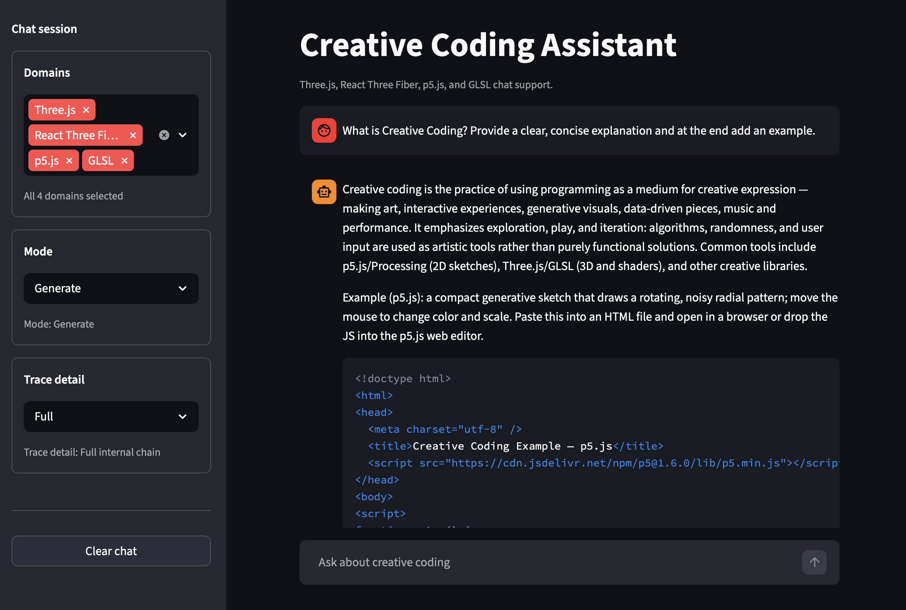

# Creative Coding Assistant

Creative Coding Assistant is a Python-first assistant for creative coding and
graphics programming workflows. V1 provides a Streamlit chat client over a
frontend-agnostic backend service, with retrieval-augmented answers grounded in
curated documentation and live-session evaluation support.

The project is currently in a pre-agent phase. The V1 app is feature-complete
for interactive chat, domain-aware retrieval, short-term memory, trace
visibility, and local evaluation workflows.



## Project Structure

```text
.
├── clients/
│   └── streamlit/
│       └── app.py                # Streamlit UI entry point
├── src/
│   └── creative_coding_assistant/
│       ├── orchestration/        # Service pipeline: memory, retrieval, prompt, generation
│       ├── rag/                  # Knowledge base, indexing, retrieval logic
│       ├── llm/                  # Provider adapters (OpenAI)
│       ├── eval/                 # RAG evaluation (RAGAs, live sessions)
│       └── clients/              # Streamlit helpers and rendering logic
├── tests/                        # Pytest test suite
├── scripts/                      # CLI utilities (KB sync, eval runs)
├── data/                         # Local runtime data (Chroma, eval logs)
├── assets/                       # README images (screenshots)
├── README.md
└── pyproject.toml
```

## Architecture

- `clients/streamlit/`: thin Streamlit chat client and UI rendering.
- `src/creative_coding_assistant/orchestration/`: request routing, memory
  assembly, retrieval orchestration, prompt input construction, prompt
  rendering, provider-boundary preparation, and streamed service events.
- `src/creative_coding_assistant/rag/`: official source registry, KB sync,
  chunking, embedding, retrieval, filtering, deduplication, and deterministic
  post-processing.
- `src/creative_coding_assistant/llm/`: provider-neutral generation contracts
  and OpenAI generation adapter.
- `src/creative_coding_assistant/eval/`: live session recorder and manual RAGAs
  evaluation runner over recorded real app usage.

Local application data is stored under `data/`, including Chroma collections
and evaluation JSONL outputs. Runtime data is not intended to be committed.

## Supported Domains

- Three.js
- React Three Fiber
- p5.js
- GLSL

## Core V1 Features

- Domain intent detection from the user query.
- Multi-domain routing for queries that span multiple creative coding domains.
- RAG over curated official and high-quality documentation sources.
- Improved retrieval ranking, including p5.js example-priority ranking and
  low-value source filtering.
- Prompt and retrieval alignment so explicit query intent takes priority over
  sidebar selections.
- Generate, explain, and debug modes with mode-specific output guidance.
- Follow-up memory for short multi-turn creative coding edits.
- Lightweight session summaries for longer chat continuity.
- Retrieval trace/debug UI showing detected domains, retrieval domains, source
  IDs, and assembled context.
- Code block rendering for generated code.
- Download buttons for generated code blocks.
- Smart filenames for common generated artifacts such as `index.html`,
  `sketch.js`, `App.jsx`, and `shader.glsl`.
- User-facing error handling for configuration, provider, network, and
  retrieval failures.
- Retrieval fallback so generation can continue when the knowledge base is
  temporarily unavailable.

## Setup

Create and activate a virtual environment, then install the project with dev
dependencies:

```bash
python -m venv .venv
.venv/bin/python -m pip install -e ".[dev]"
```

Copy the environment template and fill in local values:

```bash
cp .env.example .env
```

Required for live generation and embeddings:

```bash
OPENAI_API_KEY=your_openai_api_key_here
```

Useful optional settings:

```bash
CCA_OPENAI_API_KEY=
CCA_OPENAI_MODEL=gpt-5-mini
CCA_OPENAI_EMBEDDING_MODEL=text-embedding-3-small
CCA_LOG_LEVEL=INFO
CCA_CHROMA_PERSIST_DIR=data/chroma
CCA_EVAL_DATA_PATH=data/eval/live_sessions.jsonl
```

## Run the App

```bash
.venv/bin/streamlit run clients/streamlit/app.py --server.headless true --server.port 8501
```

Then open:

```text
http://localhost:8501
```

## Sync the Knowledge Base

The app can run without retrieval context, but RAG quality depends on a synced
local Chroma knowledge base. Sync all approved sources:

```bash
.venv/bin/python scripts/sync_official_kb.py --all
```

Sync selected sources:

```bash
.venv/bin/python scripts/sync_official_kb.py \
  --source-id three_docs \
  --source-id r3f_canvas_api \
  --source-id p5_examples \
  --source-id glsl_mdn_webgl_examples
```

## Evaluation

Live app sessions are recorded locally for later retrieval evaluation. RAGAs is
manual and offline from normal app usage; running it may call evaluator LLM APIs
and incur provider cost.

Evaluate the latest eligible samples:

```bash
.venv/bin/python scripts/eval_live_sessions.py \
  --input-path data/eval/live_sessions.jsonl \
  --output-path data/eval/ragas_latest4_context_precision.jsonl \
  --latest 4 \
  --metric context_precision
```

Or use the helper:

```bash
scripts/run_eval_latest.sh 4
```

## Validation

Run the project checks from the repository root:

```bash
.venv/bin/python -m pytest
.venv/bin/python -m ruff check src clients tests scripts
.venv/bin/python -m compileall -q src clients tests scripts
```

## Demo (Example Usage)

These examples highlight different capabilities of the assistant, including code generation, multi-domain reasoning, memory, and UI controls.

**Controls:**
- **Domains:** restrict retrieval to specific technologies
- **Mode:** generate, explain, or debug code
- **Trace detail:** control visibility of retrieval and prompt context

### 1. Beginner explanation + code
**Domains:** All (no filter)  
**Mode:** Generate  
**Trace detail:** Medium  

**Prompt:**
> What is creative coding? Explain it clearly and include a minimal Three.js example.

### 2. Visual generation (p5.js)
**Domains:** p5.js  
**Mode:** Generate  
**Trace detail:** Medium  

**Prompt:**
> Create a generative sketch in p5.js with animated circles reacting to noise.

### 3. Three.js basic scene
**Domains:** Three.js  
**Mode:** Generate  
**Trace detail:** Medium  

**Prompt:**
> Create a rotating cube in Three.js with basic lighting.

### 4. Shader example (GLSL)
**Domains:** GLSL  
**Mode:** Generate  
**Trace detail:** High  

**Prompt:**
> Create a simple fragment shader that generates a gradient animation.

### 5. Multi-domain example
**Domains:** React Three Fiber + GLSL  
**Mode:** Generate  
**Trace detail:** High  

**Prompt:**
> Create a shader material in React Three Fiber using GLSL.

### 6. Follow-up interaction (memory)
**Domains:** Three.js  
**Mode:** Generate  
**Trace detail:** Medium  

**Prompt 1:**
> Create a rotating cube in Three.js.

**Prompt 2:**
> Make it faster and change the color to red.
