# Artifact Intelligence Dependency Graph

This document is the developer inspection view for the V3.3 Artifact
Intelligence capability. It focuses on the ten artifact-level metadata engines
implemented inside the single `planning` runtime node after the V3.1 Creative
Cognition and V3.2 Generative Design metadata are available.

It is the dense companion to:

- [workflow_graph.md](workflow_graph.md) and
  [workflow_graph.mmd](workflow_graph.mmd), which document the real LangGraph
  runtime graph
- [creative_intelligence_graph.md](creative_intelligence_graph.md) and
  [creative_intelligence_graph.mmd](creative_intelligence_graph.mmd), which
  provide the readable full capability pipeline
- [generative_design_graph.md](generative_design_graph.md) and
  [generative_design_graph.mmd](generative_design_graph.mmd), which document
  the V3.2 design dependency graph
- [workstation_surface_graph.md](workstation_surface_graph.md) and
  [workstation_surface_graph.mmd](workstation_surface_graph.mmd), which
  document the V3.5 workstation surfaces that inspect artifact metadata,
  provenance, and readiness signals

## Scope And Boundary

- The V3.3 Artifact Intelligence engines are internal deterministic helpers,
  not separate LangGraph nodes with their own retries or failure routing.
- The engines produce typed metadata, prompt guidance, workflow serialization
  payloads, and stream-hydrated summaries.
- Artifact Engine Contracts standardize the metadata contract surface for the
  artifact engines and are exposed as workflow/stream metadata.
- Artifact Engine Contracts are intentionally not rendered into provider prompt
  text; the artifact profile sections are rendered, while the registry remains
  metadata-only.
- V3.5 workstation surfaces read artifact metadata, artifact contract
  summaries, provenance sources, readiness signals, and dashboard card inputs
  from already-hydrated workflow and stream metadata.
- V3.3 remains metadata-only guidance. It does not execute artifacts, modify
  artifacts, export artifacts, select runtimes, change provider routing, change
  previews, trigger retries, or implement future V4/V5/V6 systems.
- V4 Agentic Studio, V5 Execution Optimization & Production Intelligence, and
  V6 HoloGenesis Core OS consumers are future extension points only.
- V3.6 stabilization keeps these V3.3 dependency and contract boundaries
  unchanged.

```mermaid
flowchart LR
    classDef upstream fill:#E8F5E9,stroke:#2E7D32,color:#1B5E20,stroke-width:1.5px;
    classDef artifact fill:#EEF2FF,stroke:#4338CA,color:#312E81,stroke-width:1.5px;
    classDef contract fill:#F4F4F5,stroke:#52525B,color:#18181B,stroke-width:1.5px;
    classDef store fill:#FEF3C7,stroke:#B45309,color:#78350F,stroke-width:1.5px;
    classDef consumer fill:#F3E8FF,stroke:#7E22CE,color:#4C1D95,stroke-width:1.5px;
    classDef note fill:#F4F4F5,stroke:#52525B,color:#18181B,stroke-width:1.5px,stroke-dasharray: 6 4;
    classDef relationship fill:#FEFCE8,stroke:#A16207,color:#713F12,stroke-width:1.5px,stroke-dasharray: 6 4;

    upstream["Upstream stored metadata<br/>V3.1 Creative Cognition<br/>V3.2 Generative Design"]:::upstream

    subgraph artifact_stack["1. V3.3 Artifact Intelligence Pipeline"]
        direction TB
        planner["1. Artifact Planner"]:::artifact
        dependency["2. Artifact Dependency Graph"]:::artifact
        runtime["3. Runtime Compatibility Engine"]:::artifact
        capability["4. Artifact Capability Matrix"]:::artifact
        strategy["5. Multi-Artifact Strategy"]:::artifact
        critic["6. Artifact Critic"]:::artifact
        refiner["7. Artifact Refiner"]:::artifact
        synthesis["8. Artifact Intelligence Synthesis"]:::artifact
        merge["9. Artifact Merge Planner"]:::artifact
        export["10. Artifact Export Intelligence"]:::artifact
    end

    contracts["Artifact Engine Contracts<br/>shared static registry<br/>10 metadata contracts"]:::contract
    store["Metadata Store<br/>AssistantWorkflowState<br/>PromptInputResponse<br/>workflow serialization"]:::store
    director["Creative Assistant Director<br/>runtime node"]:::consumer
    reasoning["Creative Reasoning Engine<br/>runtime node"]:::consumer
    prompt["Prompt Rendering<br/>artifact profile sections"]:::consumer
    stream["Next.js stream hydration<br/>workflow metadata readers"]:::consumer
    workstation["V3.5 Workstation surfaces<br/>provenance + timeline + inspector + dashboard"]:::consumer
    note["Metadata-only architecture<br/>No artifact execution, modification, or export<br/>No runtime selection, provider routing,<br/>retries, preview changes, or future systems"]:::note
    planning_boundary["Planning relationship<br/>artifact plan + dependency graph<br/>define artifact shape and ordering"]:::relationship
    compatibility_boundary["Compatibility relationship<br/>runtime compatibility + capability matrix<br/>bound multi-artifact strategy"]:::relationship
    critique_boundary["Critique relationship<br/>strategy, critic, and refiner<br/>set artifact improvement focus"]:::relationship
    synthesis_boundary["Synthesis relationship<br/>critic + refiner evidence<br/>feeds synthesis and merge planning"]:::relationship
    export_boundary["Merge/export relationship<br/>synthesis + merge plan<br/>produce export intelligence metadata"]:::relationship

    upstream --> planner --> dependency --> runtime --> capability --> strategy --> critic --> refiner --> synthesis --> merge --> export
    contracts -. standardizes .-> planner
    contracts -. standardizes .-> dependency
    contracts -. standardizes .-> runtime
    contracts -. standardizes .-> capability
    contracts -. standardizes .-> strategy
    contracts -. standardizes .-> critic
    contracts -. standardizes .-> refiner
    contracts -. standardizes .-> synthesis
    contracts -. standardizes .-> merge
    contracts -. standardizes .-> export

    export --> store
    contracts --> store
    store --> director
    store --> reasoning
    store --> prompt
    store --> stream
    stream --> workstation
    director --> reasoning
    note -.-> artifact_stack
    planner -. scopes .-> planning_boundary
    dependency -. orders .-> planning_boundary
    planning_boundary -. informs .-> runtime
    runtime -. checks .-> compatibility_boundary
    capability -. maps .-> compatibility_boundary
    compatibility_boundary -. bounds .-> strategy
    strategy -. focuses .-> critique_boundary
    critic -. evaluates .-> critique_boundary
    critique_boundary -. guides .-> refiner
    critic -. evidence .-> synthesis_boundary
    refiner -. guidance .-> synthesis_boundary
    synthesis_boundary -. consolidates .-> synthesis
    synthesis -. informs .-> export_boundary
    merge -. assembles .-> export_boundary
    export_boundary -. publishes .-> export
    export_boundary -. stores .-> store
```

The raw Mermaid source for this detailed dependency view is available in
[artifact_intelligence_graph.mmd](artifact_intelligence_graph.mmd).

## Artifact Intelligence Relationship Map

| Relationship | Implemented metadata path | Downstream use |
| --- | --- | --- |
| Planning and dependency shape | `Artifact Planner` produces `artifact_plan`; `Artifact Dependency Graph` turns it into ordered artifact metadata | Gives compatibility, capability, strategy, critique, merge, and export engines a stable artifact shape and dependency order |
| Compatibility and capability bounds | `Runtime Compatibility Engine` and `Artifact Capability Matrix` read the plan, dependency graph, runtime capabilities, strategy, constraints, and trade-offs | Bounds `Multi-Artifact Strategy` with supported runtimes, artifact roles, and capability expectations |
| Critique and refinement focus | `Multi-Artifact Strategy` feeds `Artifact Critic`; `Artifact Refiner` reads the critic output | Converts artifact-level risks, strengths, weaknesses, and improvement focus into inspectable refinement guidance |
| Synthesis and merge planning | `Artifact Intelligence Synthesis` consolidates plan, dependency, compatibility, strategy, critic, and refiner metadata; `Artifact Merge Planner` reads that synthesis | Prepares multi-artifact composition guidance without executing or modifying generated artifacts |
| Export intelligence handoff | `Artifact Export Intelligence` reads synthesis and merge metadata, then stores `artifact_export_intelligence` | Supplies Director, Reasoning, prompt rendering, workflow serialization, stream hydration, and workstation surfaces with export-planning metadata only |
| Contract standardization | `Artifact Engine Contracts` is a static registry for the ten artifact engines | Standardizes serialized metadata shape for workflow/stream readers while remaining outside provider prompt text |

## Dependency Matrix

| Capability | Reads | Produces | Used by |
| --- | --- | --- | --- |
| `Artifact Planner` | `request`, `route_decision` stored Creative Cognition metadata stored Generative Design metadata | `artifact_plan` | `Artifact Dependency Graph`, `Runtime Compatibility Engine`, `Artifact Capability Matrix`, `Multi-Artifact Strategy`, `Artifact Critic`, `Artifact Refiner`, `Artifact Intelligence Synthesis`, `Artifact Merge Planner`, `Artifact Export Intelligence`, metadata store |
| `Artifact Dependency Graph` | `request`, `route_decision`, `artifact_plan` stored Creative Cognition metadata stored Generative Design metadata | `artifact_dependency_graph` | `Runtime Compatibility Engine`, `Artifact Capability Matrix`, `Multi-Artifact Strategy`, `Artifact Critic`, `Artifact Refiner`, `Artifact Intelligence Synthesis`, `Artifact Merge Planner`, `Artifact Export Intelligence`, metadata store |
| `Runtime Compatibility Engine` | `request`, `route_decision`, `artifact_plan`, `artifact_dependency_graph` `runtime_capabilities`, `creative_plan`, `creative_constraints`, `creative_tradeoffs` | `runtime_compatibility` | `Artifact Capability Matrix`, `Multi-Artifact Strategy`, `Artifact Critic`, `Artifact Refiner`, `Artifact Intelligence Synthesis`, `Artifact Merge Planner`, `Artifact Export Intelligence`, metadata store |
| `Artifact Capability Matrix` | `request`, `route_decision`, `artifact_plan`, `artifact_dependency_graph`, `runtime_compatibility` `runtime_capabilities`, `creative_plan`, `creative_constraints`, `creative_strategy`, `creative_techniques`, `creative_tradeoffs` | `artifact_capability_matrix` | `Multi-Artifact Strategy`, `Artifact Critic`, `Artifact Refiner`, `Artifact Intelligence Synthesis`, `Artifact Merge Planner`, `Artifact Export Intelligence`, metadata store |
| `Multi-Artifact Strategy` | `request`, `route_decision`, `artifact_plan`, `artifact_dependency_graph`, `runtime_compatibility`, `artifact_capability_matrix` `runtime_capabilities`, `creative_plan`, `creative_constraints`, `creative_tradeoffs` | `multi_artifact_strategy` | `Artifact Critic`, `Artifact Refiner`, `Artifact Intelligence Synthesis`, `Artifact Merge Planner`, `Artifact Export Intelligence`, metadata store |
| `Artifact Critic` | `request`, `route_decision`, `artifact_plan`, `artifact_dependency_graph`, `runtime_compatibility`, `artifact_capability_matrix`, `multi_artifact_strategy` | `artifact_critic` | `Artifact Refiner`, `Artifact Intelligence Synthesis`, `Artifact Merge Planner`, `Artifact Export Intelligence`, metadata store |
| `Artifact Refiner` | `request`, `route_decision`, `artifact_plan`, `artifact_dependency_graph`, `runtime_compatibility`, `artifact_capability_matrix`, `multi_artifact_strategy`, `artifact_critic` | `artifact_refiner` | `Artifact Intelligence Synthesis`, `Artifact Merge Planner`, `Artifact Export Intelligence`, metadata store |
| `Artifact Intelligence Synthesis` | `request`, `route_decision`, `artifact_plan`, `artifact_dependency_graph`, `runtime_compatibility`, `artifact_capability_matrix`, `multi_artifact_strategy`, `artifact_critic`, `artifact_refiner` | `artifact_intelligence_synthesis` | `Artifact Merge Planner`, `Artifact Export Intelligence`, metadata store |
| `Artifact Merge Planner` | `request`, `route_decision`, `artifact_plan`, `artifact_dependency_graph`, `runtime_compatibility`, `artifact_capability_matrix`, `multi_artifact_strategy`, `artifact_critic`, `artifact_refiner`, `artifact_intelligence_synthesis` | `artifact_merge_planner` | `Artifact Export Intelligence`, metadata store |
| `Artifact Export Intelligence` | `request`, `route_decision`, `artifact_plan`, `artifact_dependency_graph`, `runtime_compatibility`, `artifact_capability_matrix`, `multi_artifact_strategy`, `artifact_critic`, `artifact_refiner`, `artifact_intelligence_synthesis`, `artifact_merge_planner` | `artifact_export_intelligence` | metadata store, Director, Reasoning, prompt rendering, workflow serialization, stream hydration, workstation surfaces |
| `Artifact Engine Contracts` | static contract registry for the ten Artifact Intelligence engines | `artifact_engine_contracts` | metadata store, workflow serialization, stream hydration, workstation surfaces, future V4 Agentic Studio / V5 Execution Optimization & Production Intelligence / V6 HoloGenesis Core OS consumers |

## Downstream Consumption

- All V3.3 artifact outputs are stored on `AssistantWorkflowState` and mirrored
  into `PromptInputResponse`.
- `Creative Assistant Director` reads the stored artifact metadata after
  `planning` completes and adds artifact-aware planning focus, risks, and
  next-action signals.
- `Creative Reasoning Engine` reads the stored artifact metadata after the
  Director brief is available and adds artifact evidence, unresolved decisions,
  and implementation guidance.
- `prompt_rendering` serializes artifact profile prompt sections for the
  artifact engines that expose prompt guidance.
- `artifact_engine_contracts` is stored in prompt input metadata and workflow
  serialization but is not rendered into provider prompts.
- Final payload serialization includes the artifact profiles and engine
  contract registry when available.
- Next.js stream hydration reads artifact profile summaries and the Artifact
  Engine Contract registry from workflow metadata.
- V3.5 workstation provenance, timeline, inspector panels, and dashboard
  surfaces make the hydrated artifact metadata inspectable without changing
  artifact generation, preview execution, export execution, or provider prompt
  rendering.
