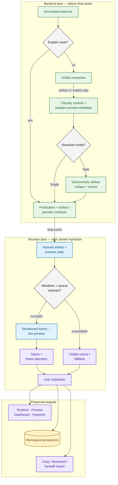

# Artifact and Preview Runtime Workflow

## Purpose

This diagram separates artifact handling inside the backend request from actual
preview execution in the browser. That split is essential for interpreting
“preview prepared,” runtime telemetry, critique, persistence, and export
truthfully. The [standalone Mermaid source](artifact_preview_runtime.mmd)
contains the same diagram for full-size rendering.

## Key properties

- Explain finalizes without entering artifact handling. Other routes extract
  code, infer artifact/runtime metadata, and prepare a `PreviewResult` or an
  explicit skip.
- Single finalizes after preview preparation. Only Multi continues through
  deterministic artifact critique/review before finalization.
- The client rechecks the renderer route and source contract before mounting an
  iframe with `sandbox="allow-scripts"`. Runtime status and frame samples then
  become local evidence for Runtime, Preview, Dashboard, and Inspector views.
- The user can preserve the workspace or export the source whether preview
  runs or falls back.

## Truth boundary

Backend “preview succeeded” means preview metadata was prepared; it is not
proof that the browser rendered a frame. On Multi, backend critique consumes
that prepared metadata and therefore occurs before live runtime telemetry.
Telemetry does not reopen the same LangGraph review loop. The canonical generated
live-preview contracts are p5.js, Three.js, GLSL, and Tone.js. The client
contains additional bounded adapters, but their existence alone does not turn
every code-export domain into a validated generation-to-preview product claim.

Browser preflight or runtime failure keeps the answer and extracted source
inspectable, publishes an explicit local error/fallback state, and does not
rewrite the already-finalized backend result.

## Deeper documentation

- [Domain Experience](../docs/DOMAIN_EXPERIENCE.md)
- [End-to-End Product Workflow](end_to_end_product_workflow.md)
