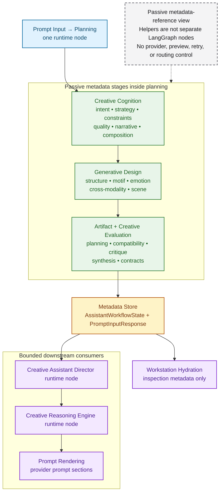

# Creative Intelligence Pipeline

This document keeps the historical `creative_intelligence_graph.*` filename and
catalogs the deterministic metadata pipeline formerly grouped under V3 labels.
It shows how Creative Cognition metadata feeds Generative Design, Artifact
Intelligence, Creative Evaluation, and Workstation metadata consumers.

> **Reference notice:** This is a passive metadata-reference diagram, not the
> current request lifecycle or a map of separately executing agents. Start with
> [System Architecture Overview](system_architecture_overview.md),
> [End-to-End Product Workflow](end_to_end_product_workflow.md), and
> [Single and Multi Runtime Routes](workflow_graph.md) for executable behavior.
> Version labels below identify registry provenance; they are not a delivery
> schedule or a statement that a capability is a current runtime subsystem.

It documents the deterministic capability flow implemented inside:

- `src/creative_coding_assistant/orchestration/workflow_graph.py`
- `src/creative_coding_assistant/orchestration/workflow.py`
- `src/creative_coding_assistant/orchestration/creative_director.py`
- `src/creative_coding_assistant/orchestration/creative_reasoning.py`
- `src/creative_coding_assistant/orchestration/prompt_templates.py`
- `clients/nextjs/src/lib/assistant-stream.ts`

## Scope And Boundary

- The real LangGraph runtime graph remains documented in
  [workflow_graph.md](workflow_graph.md) and
  [workflow_graph.mmd](workflow_graph.mmd)
- The denser V3.2 developer dependency graph and dependency matrix live in
  [generative_design_graph.md](generative_design_graph.md) and
  [generative_design_graph.mmd](generative_design_graph.mmd)
- The V3.3 Artifact Intelligence dependency graph and engine contract matrix
  live in [artifact_intelligence_graph.md](artifact_intelligence_graph.md) and
  [artifact_intelligence_graph.mmd](artifact_intelligence_graph.mmd)
- The V3.5 Creative Workstation surface graph and contract boundary live in
  [workstation_surface_graph.md](workstation_surface_graph.md) and
  [workstation_surface_graph.mmd](workstation_surface_graph.mmd)
- This file is intentionally the human-readable pipeline, not the exhaustive
  dependency reference
- The Mermaid below is a compact top-to-bottom stage view. It replaces the
  older serpentine readability view with three grouped passive-metadata boxes
  so labels stay legible in typical Markdown renderers
- The capabilities below are internal deterministic helpers executed inside the
  single `planning` runtime node; they are not separate LangGraph nodes
- The grouped layout does not imply separate LangGraph runtime nodes,
  branching semantics, changed provider routing, or changed preview behavior
- The pipeline remains metadata-only guidance and inspection. It does not
  execute artifacts, modify artifacts, export artifacts, select runtimes,
  change provider routing, change previews, trigger retries, or activate the
  V4/V5/V6 registry families
- Versioned stabilization entries preserve the same runtime-node and metadata
  boundaries

The raw Mermaid source for this diagram is available in
[creative_intelligence_graph.mmd](creative_intelligence_graph.mmd).

## Creative Cognition Relationship Map

- Strategy framing: `Creative Intent Decomposer` and `Creative Hierarchy
  Planner` shape `Creative Strategy Engine`, then `Creative Technique Selector`
  and `Creative Execution Plan` turn strategy into an executable creative
  direction. This gives the rest of planning a coherent intent, hierarchy,
  technique set, and plan before constraints are evaluated.
- Constraint handling: `Creative Execution Plan`, `Creative Constraint Solver`,
  and `Runtime Capability Reasoner` feed `Creative Trade-off Explorer` and
  `Creative Constraint Prioritizer`. This converts feasibility limits into
  ordered trade-offs before quality, narrative, and composition metadata are
  derived.
- Quality shaping: `Creative Constraint Prioritizer` informs `Creative Quality
  Predictor`, which then sits before `Symbolic Narrative Planner` and
  `Creative Composition Planner`. This keeps narrative and composition guidance
  aligned with expected quality and prioritized constraints.
- Reasoning handoff: `Metadata Store` persists planning outputs on
  `AssistantWorkflowState` and `PromptInputResponse` before Director, Reasoning,
  prompt rendering, and workstation hydration consume them. This keeps runtime
  consumers downstream of the single `planning` node without turning helper
  engines into LangGraph nodes.

## Pipeline Stages

- `Prompt input context` contributes normalized request context, route
  direction, translated creative cues, retrieval payload, and clarification
  state
- The Mermaid above groups the same deterministic capability sequence into
  three short planning stages without changing the meaning of the pipeline
- The V3.1 Creative Cognition spine derives intent, hierarchy, strategy,
  technique, planning, feasibility, quality, narrative, and composition
  metadata in one deterministic pass
- The V3.2 Generative Design Core extends that cognition metadata into
  `Procedural Structure Planner`, `Generative Structure Engine`,
  `Semantic Motif Engine`, `Emotional Consistency Engine`,
  `Cross-Modality Composer`, and `Audio-Visual Scene System`
- The V3.3 Artifact Intelligence stack extends the stored creative/design
  metadata into `Artifact Planner`, `Artifact Dependency Graph`,
  `Runtime Compatibility Engine`, `Artifact Capability Matrix`,
  `Multi-Artifact Strategy`, `Artifact Critic`, `Artifact Refiner`,
  `Artifact Intelligence Synthesis`, `Artifact Merge Planner`,
  `Artifact Export Intelligence`, and `Artifact Engine Contracts`
- The `Metadata Store` is the combination of `AssistantWorkflowState` and
  `PromptInputResponse`, where all typed results are persisted after planning
- The V3.4 Creative Evaluation layer derives critic, self-evaluation,
  improvement, reflection, confidence, score, consistency, report, and
  evaluation contract metadata from the stored creative, design, and artifact
  metadata
- The `Creative Assistant Director runtime node`, `Creative Reasoning Engine
  runtime node`, and `prompt rendering runtime node` consume the stored
  metadata after the single `planning` runtime node completes
- Artifact profile sections feed prompt rendering; Artifact Engine Contracts
  and Evaluation Engine Contracts remain metadata-only for workflow
  serialization and stream hydration
- V3.5 Workstation Hydration reads the workspace snapshot, stream events,
  workflow trace, and V3 metadata to drive workstation state, session
  intelligence, workflow explorer, provenance, timeline, inspector panels, and
  dashboard surfaces
- The grouped layout is a readability view only and does not imply separate
  LangGraph runtime nodes, changed runtime execution, or new branching logic

## Why This View Stays Simplified

- The goal here is human understanding of the main flow, not exhaustive edge
  completeness
- The actual V3.2 and V3.3 read sets are dense enough that drawing every
  dependency edge would reduce readability
- The detailed developer inspection views and dependency matrices are therefore
  split into `generative_design_graph.*` and `artifact_intelligence_graph.*`
- The dependency matrix remains the preferred way to read dense relationships
- This separation keeps the runtime graph truthful, the pipeline readable, and
  the dense dependency reference inspectable

## Historical Labels And Runtime Truth

- V3.1 through V3.6 identify the provenance of these deterministic registries
  and serialization seams; they do not add runtime nodes.
- V4, V5, and V6 names in registry metadata identify passive catalog families.
  Their presence here does not activate orchestration, routing, optimization,
  learning, or operating-system behavior.
- Older documentation called this a “future V4 multi-agent blueprint.” That
  wording is retired: the current Multi path is a bounded, sequential runtime
  route, and these metadata helpers remain inside the single `planning` node.
  <!-- Compatibility phrase: future V4 multi-agent blueprint -->
