# Creative Intelligence Pipeline

This document keeps the historical `creative_intelligence_graph.*` filename, but
for V3.3 it now serves as the readable internal pipeline view. It shows how the
system moves from V3.1 Creative Cognition metadata into the V3.2 Generative
Design Core and V3.3 Artifact Intelligence before handing stored metadata to
downstream runtime consumers.

It documents the deterministic capability flow implemented inside:

- `src/creative_coding_assistant/orchestration/workflow_graph.py`
- `src/creative_coding_assistant/orchestration/workflow.py`
- `src/creative_coding_assistant/orchestration/creative_director.py`
- `src/creative_coding_assistant/orchestration/creative_reasoning.py`
- `src/creative_coding_assistant/orchestration/prompt_templates.py`
- `clients/nextjs/src/lib/assistant-stream.ts`

## Scope And File Choice

- The real LangGraph runtime graph remains documented in
  [workflow_graph.md](workflow_graph.md) and
  [workflow_graph.mmd](workflow_graph.mmd)
- The denser V3.2 developer dependency graph and dependency matrix live in
  [generative_design_graph.md](generative_design_graph.md) and
  [generative_design_graph.mmd](generative_design_graph.mmd)
- The V3.3 Artifact Intelligence dependency graph and engine contract matrix
  live in [artifact_intelligence_graph.md](artifact_intelligence_graph.md) and
  [artifact_intelligence_graph.mmd](artifact_intelligence_graph.mmd)
- This file is intentionally the human-readable pipeline, not the exhaustive
  dependency reference
- The Mermaid below is a compact serpentine readability view that folds one
  long pipeline into alternating rows so labels stay legible in typical
  Markdown renderers
- The capabilities below are internal deterministic helpers executed inside the
  single `planning` runtime node; they are not separate LangGraph nodes
- The serpentine layout does not imply separate LangGraph runtime nodes,
  branching semantics, changed provider routing, or changed preview behavior
- V3.3 remains metadata-only artifact guidance. It does not execute artifacts,
  modify artifacts, export artifacts, select runtimes, change provider routing,
  change previews, trigger retries, or implement future V4/V5/V6 systems

```mermaid
flowchart TB
    classDef runtime fill:#E0F2FE,stroke:#0369A1,color:#0C4A6E,stroke-width:1.5px;
    classDef cognition fill:#E8F5E9,stroke:#2E7D32,color:#1B5E20,stroke-width:1.5px;
    classDef design fill:#FFF7ED,stroke:#C2410C,color:#7C2D12,stroke-width:1.5px;
    classDef artifact fill:#EEF2FF,stroke:#4338CA,color:#312E81,stroke-width:1.5px;
    classDef store fill:#FEF3C7,stroke:#B45309,color:#78350F,stroke-width:1.5px;
    classDef consumer fill:#F3E8FF,stroke:#7E22CE,color:#4C1D95,stroke-width:1.5px;
    classDef note fill:#F4F4F5,stroke:#52525B,color:#18181B,stroke-width:1.5px,stroke-dasharray: 6 4;

    subgraph row_1[" "]
        direction LR
        prompt_input["1. Prompt Input<br/>request + route + translation<br/>retrieval + clarification"]:::runtime
        planning["2. Planning<br/>single runtime node"]:::runtime
        intent["3. Intent<br/>Creative Intent Decomposer"]:::cognition
        hierarchy["4. Hierarchy<br/>Creative Hierarchy Planner"]:::cognition
        strategy["5. Strategy<br/>Creative Strategy Engine"]:::cognition
    end

    subgraph row_2[" "]
        direction RL
        techniques["6. Technique<br/>Creative Technique Selector"]:::cognition
        plan["7. Plan<br/>Creative Execution Plan"]:::cognition
        constraints["8. Constraints<br/>Creative Constraint Solver"]:::cognition
        runtime_reasoner["9. Runtime Fit<br/>Runtime Capability Reasoner"]:::cognition
        tradeoffs["10. Trade-offs<br/>Creative Trade-off Explorer"]:::cognition
    end

    subgraph row_3[" "]
        direction LR
        priorities["11. Priorities<br/>Creative Constraint Prioritizer"]:::cognition
        quality["12. Quality<br/>Creative Quality Predictor"]:::cognition
        narrative["13. Narrative<br/>Symbolic Narrative Planner"]:::cognition
        composition["14. Composition<br/>Creative Composition Planner"]:::cognition
        procedural["15. Procedural<br/>Procedural Structure Planner"]:::design
    end

    subgraph row_4[" "]
        direction RL
        generative["16. Generative<br/>Generative Structure Engine"]:::design
        motif["17. Motif<br/>Semantic Motif Engine"]:::design
        emotion["18. Emotion<br/>Emotional Consistency Engine"]:::design
        cross["19. Cross-Modality<br/>Cross-Modality Composer"]:::design
        scene["20. Scene<br/>Audio-Visual Scene System"]:::design
    end

    subgraph row_5[" "]
        direction LR
        artifact_plan["21. Artifact Plan<br/>Artifact Planner"]:::artifact
        dependency["22. Dependencies<br/>Artifact Dependency Graph"]:::artifact
        compatibility["23. Runtime Compatibility<br/>Runtime Compatibility Engine"]:::artifact
        capability["24. Capability Matrix<br/>Artifact Capability Matrix"]:::artifact
        artifact_strategy["25. Multi-Artifact<br/>Multi-Artifact Strategy"]:::artifact
    end

    subgraph row_6[" "]
        direction RL
        artifact_critic["26. Artifact Critic<br/>Artifact Critic"]:::artifact
        artifact_refiner["27. Artifact Refiner<br/>Artifact Refiner"]:::artifact
        artifact_synthesis["28. Artifact Synthesis<br/>Artifact Intelligence Synthesis"]:::artifact
        merge_planner["29. Merge Planner<br/>Artifact Merge Planner"]:::artifact
        export_intelligence["30. Export Intelligence<br/>Artifact Export Intelligence"]:::artifact
    end

    subgraph row_7[" "]
        direction LR
        contracts["31. Engine Contracts<br/>Artifact Engine Contracts"]:::artifact
        metadata_store["32. Metadata Store<br/>AssistantWorkflowState +<br/>PromptInputResponse"]:::store
        director["33. Director<br/>Creative Assistant Director runtime node"]:::consumer
        reasoning["34. Reasoning<br/>Creative Reasoning Engine runtime node"]:::consumer
        prompt_rendering["35. Prompt Rendering<br/>provider prompt sections"]:::consumer
    end

    note["Serpentine readability view only<br/>Not separate LangGraph runtime nodes<br/>Use generative_design_graph.* and artifact_intelligence_graph.*<br/>for dense relationships"]:::note

    prompt_input --> planning --> intent --> hierarchy --> strategy
    strategy --> techniques --> plan --> constraints --> runtime_reasoner --> tradeoffs
    tradeoffs --> priorities --> quality --> narrative --> composition --> procedural
    procedural --> generative --> motif --> emotion --> cross --> scene
    scene --> artifact_plan --> dependency --> compatibility --> capability --> artifact_strategy
    artifact_strategy --> artifact_critic --> artifact_refiner --> artifact_synthesis --> merge_planner --> export_intelligence
    export_intelligence --> contracts --> metadata_store
    metadata_store --> director
    metadata_store --> reasoning
    metadata_store --> prompt_rendering
    director --> reasoning --> prompt_rendering
    note -.-> planning

    style row_1 fill:none,stroke:none
    style row_2 fill:none,stroke:none
    style row_3 fill:none,stroke:none
    style row_4 fill:none,stroke:none
    style row_5 fill:none,stroke:none
    style row_6 fill:none,stroke:none
    style row_7 fill:none,stroke:none
```

The raw Mermaid source for this readable pipeline is available in
[creative_intelligence_graph.mmd](creative_intelligence_graph.mmd).

## Pipeline Stages

- `Prompt input context` contributes normalized request context, route
  direction, translated creative cues, retrieval payload, and clarification
  state
- The Mermaid above is intentionally a serpentine readability view: it bends a
  single linear pipeline into alternating rows so the flow stays readable
  without changing the meaning of the pipeline
- The V3.1 Creative Cognition spine derives intent, hierarchy, strategy,
  technique, planning, feasibility, quality, narrative, and composition
  metadata in one deterministic pass
- The V3.2 Generative Design Core extends that cognition metadata into
  `Procedural Structure Planner`, `Generative Structure Engine`,
  `Semantic Motif Engine`, `Emotional Consistency Engine`,
  `Cross-Modality Composer`, and `Audio-Visual Scene System`
- The V3.3 Artifact Intelligence stack extends the stored creative/design
  metadata into `Artifact Planner`, `Artifact Dependency Graph`,
  `Runtime Compatibility Engine`, `Artifact Capability Matrix`,
  `Multi-Artifact Strategy`, `Artifact Critic`, `Artifact Refiner`,
  `Artifact Intelligence Synthesis`, `Artifact Merge Planner`,
  `Artifact Export Intelligence`, and `Artifact Engine Contracts`
- The `Metadata Store` is the combination of `AssistantWorkflowState` and
  `PromptInputResponse`, where all typed results are persisted after planning
- The `Creative Assistant Director runtime node`, `Creative Reasoning Engine
  runtime node`, and `prompt rendering runtime node` consume the stored
  metadata after the single `planning` runtime node completes
- Artifact profile sections feed prompt rendering; Artifact Engine Contracts
  remain metadata-only for workflow serialization and stream hydration
- The serpentine layout is a readability view only and does not imply separate
  LangGraph runtime nodes, changed runtime execution, or new branching logic

## Why This View Stays Simplified

- The goal here is human understanding of the main flow, not exhaustive edge
  completeness
- The actual V3.2 and V3.3 read sets are dense enough that drawing every
  dependency edge would reduce readability
- The detailed developer inspection views and dependency matrices are therefore
  split into `generative_design_graph.*` and `artifact_intelligence_graph.*`
- The dependency matrix remains the preferred way to read dense relationships
- This separation keeps the runtime graph truthful, the pipeline readable, and
  the dense dependency reference inspectable

## Future Roadmap Fit

- The cognition spine remains a strong candidate for future interpretation,
  planning, and feasibility sub-agents
- The V3.2 Generative Design Core, V3.3 Artifact Intelligence stack, and V3.4
  Creative Evaluation layer are staged as coherent downstream layers and
  natural decomposition seams for future V4 Agentic Studio work
- V3.5 Creative Workstation and V3.6 Stabilization & Refactor Pass remain
  future increments after V3.4
- V5 Execution Optimization & Production Intelligence and V6 HoloGenesis Core
  OS remain future architecture directions, not implemented runtime systems
- The current pipeline is still synchronous and bounded; it is a future V4 multi-agent blueprint, not an implemented multi-agent runtime
