# Creative Intelligence Pipeline

This document keeps the historical `creative_intelligence_graph.*` filename, but
for V3.2 it now serves as the readable internal pipeline view. It shows how the
system moves from V3.1 Creative Cognition metadata into the V3.2 Generative
Design Core before handing stored metadata to downstream runtime consumers.

It documents the deterministic capability flow implemented inside:

- `src/creative_coding_assistant/orchestration/workflow_graph.py`
- `src/creative_coding_assistant/orchestration/workflow.py`
- `src/creative_coding_assistant/orchestration/creative_director.py`
- `src/creative_coding_assistant/orchestration/creative_reasoning.py`
- `src/creative_coding_assistant/orchestration/prompt_templates.py`

## Scope And File Choice

- The real LangGraph runtime graph remains documented in
  [workflow_graph.md](workflow_graph.md) and
  [workflow_graph.mmd](workflow_graph.mmd)
- The denser V3.2 developer dependency graph and dependency matrix live in
  [generative_design_graph.md](generative_design_graph.md) and
  [generative_design_graph.mmd](generative_design_graph.mmd)
- This file is intentionally the human-readable pipeline, not the exhaustive
  dependency reference
- The capabilities below are internal deterministic helpers executed inside the
  single `planning` runtime node; they are not separate LangGraph nodes
- V3.2 remains metadata and design guidance, not code generation execution,
  runtime mutation, or preview behavior changes

```mermaid
flowchart LR
    classDef runtime fill:#E0F2FE,stroke:#0369A1,color:#0C4A6E,stroke-width:1.5px;
    classDef cognition fill:#E8F5E9,stroke:#2E7D32,color:#1B5E20,stroke-width:1.5px;
    classDef design fill:#FFF7ED,stroke:#C2410C,color:#7C2D12,stroke-width:1.5px;
    classDef store fill:#FEF3C7,stroke:#B45309,color:#78350F,stroke-width:1.5px;
    classDef consumer fill:#F3E8FF,stroke:#7E22CE,color:#4C1D95,stroke-width:1.5px;
    classDef note fill:#F4F4F5,stroke:#52525B,color:#18181B,stroke-width:1.5px,stroke-dasharray: 6 4;

    prompt_input["Prompt input context<br/>request + route + translation + retrieval + clarification"]:::runtime
    planning["Planning runtime node<br/>bounded deterministic execution"]:::runtime

    subgraph cognition_core["V3.1 Creative Cognition spine"]
        direction LR
        intent["Creative Intent Decomposer"]:::cognition
        hierarchy["Creative Hierarchy Planner"]:::cognition
        strategy["Creative Strategy Engine"]:::cognition
        techniques["Creative Technique Selector"]:::cognition
        plan["Creative Execution Plan"]:::cognition
        constraints["Creative Constraint Solver"]:::cognition
        runtime_reasoner["Runtime Capability Reasoner"]:::cognition
        tradeoffs["Creative Trade-off Explorer"]:::cognition
        priorities["Creative Constraint Prioritizer"]:::cognition
        quality["Creative Quality Predictor"]:::cognition
        narrative["Symbolic Narrative Planner"]:::cognition
        composition["Creative Composition Planner"]:::cognition
    end

    subgraph generative_design["V3.2 Generative Design Core"]
        direction LR
        procedural["Procedural Structure Planner"]:::design
        generative["Generative Structure Engine"]:::design
        motif["Semantic Motif Engine"]:::design
        emotion["Emotional Consistency Engine"]:::design
        cross["Cross-Modality Composer"]:::design
        scene["Audio-Visual Scene System"]:::design
    end

    metadata_store["Metadata Store<br/>AssistantWorkflowState + PromptInputResponse"]:::store
    director["Creative Assistant Director runtime node<br/>CreativeAssistantDirectorBrief"]:::consumer
    reasoning["Creative Reasoning Engine runtime node<br/>CreativeReasoningResult"]:::consumer
    prompt_rendering["Prompt rendering runtime node<br/>provider prompt sections"]:::consumer
    note["Readable pipeline only<br/>Use generative_design_graph.* for dense dependencies"]:::note

    prompt_input --> planning --> intent --> hierarchy --> strategy --> techniques --> plan --> constraints --> runtime_reasoner --> tradeoffs --> priorities --> quality --> narrative --> composition --> procedural --> generative --> motif --> emotion --> cross --> scene
    scene --> metadata_store
    metadata_store --> director
    metadata_store --> reasoning
    metadata_store --> prompt_rendering
    director --> reasoning --> prompt_rendering
    note -.-> planning
```

The raw Mermaid source for this readable pipeline is available in
[creative_intelligence_graph.mmd](creative_intelligence_graph.mmd).

## Pipeline Stages

- `Prompt input context` contributes normalized request context, route
  direction, translated creative cues, retrieval payload, and clarification
  state
- The V3.1 Creative Cognition spine derives intent, hierarchy, strategy,
  technique, planning, feasibility, quality, narrative, and composition
  metadata in one deterministic pass
- The V3.2 Generative Design Core extends that cognition metadata into
  `Procedural Structure Planner`, `Generative Structure Engine`,
  `Semantic Motif Engine`, `Emotional Consistency Engine`,
  `Cross-Modality Composer`, and `Audio-Visual Scene System`
- The `Metadata Store` is the combination of `AssistantWorkflowState` and
  `PromptInputResponse`, where all typed results are persisted after planning
- The `Creative Assistant Director runtime node`, `Creative Reasoning Engine
  runtime node`, and `prompt rendering runtime node` consume the stored
  metadata after the single `planning` runtime node completes

## Why This View Stays Simplified

- The goal here is human understanding of the main flow, not exhaustive edge
  completeness
- The actual V3.2 read sets are dense enough that drawing every dependency edge
  would reduce readability
- The detailed developer inspection view and the dependency matrix are therefore
  split into `generative_design_graph.*`
- This separation keeps the runtime graph truthful, the pipeline readable, and
  the dense dependency reference inspectable

## Future V4 Fit

- The cognition spine remains a strong candidate for future interpretation,
  planning, and feasibility sub-agents
- The V3.2 Generative Design Core is already staged as a coherent downstream
  design layer and is a natural decomposition seam for future V4 work
- The current pipeline is still synchronous and bounded; it is a future V4 multi-agent blueprint, not an implemented multi-agent runtime
