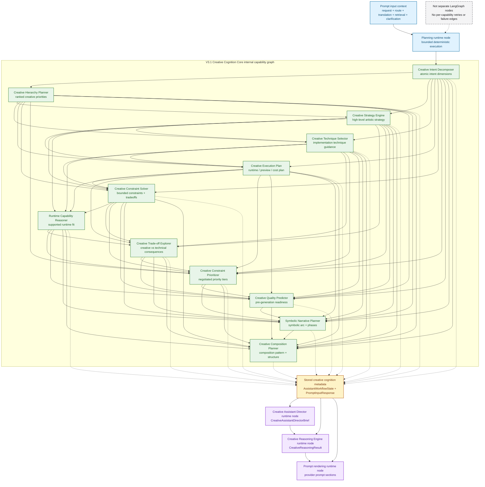

# Creative Intelligence Graph

This document describes the internal V3.1 Creative Cognition Core currently
executed inside the backend `planning` runtime node. It documents the
deterministic capability call chain and the downstream consumers implemented in:

- `src/creative_coding_assistant/orchestration/workflow_graph.py`
- `src/creative_coding_assistant/orchestration/workflow.py`
- `src/creative_coding_assistant/orchestration/creative_director_signals.py`
- `src/creative_coding_assistant/orchestration/creative_reasoning.py`
- `src/creative_coding_assistant/orchestration/prompt_templates.py`

## Scope And Boundary

- The real LangGraph runtime graph remains documented in
  [workflow_graph.md](workflow_graph.md) and
  [workflow_graph.mmd](workflow_graph.mmd)
- This graph shows internal capability dependencies inside `planning`, plus the
  downstream runtime consumers that read the resulting metadata
- The diagram includes `Creative Execution Plan` because later capabilities
  depend on that planning artifact, even though it is part of the runtime
  `planning` step rather than a separate Creative Intelligence capability
- The capabilities below are synchronous typed helpers; they do not own
  separate LangGraph retries, failure routing, or autonomous agent control

The raw Mermaid source for the internal capability graph is available in
[creative_intelligence_graph.mmd](creative_intelligence_graph.mmd).

## Capability Roles

- `Creative Intent Decomposer`: normalizes the request into inspectable atomic
  intent dimensions, unresolved gaps, HITL questions, and prompt guidance
- `Creative Hierarchy Planner`: ranks the creative dimensions that should be
  protected, relaxed, or sacrificed first when tensions appear
- `Creative Strategy Engine`: chooses the primary high-level artistic strategy
  and records alternatives, confidence, goals, and directives
- `Creative Technique Selector`: recommends the main implementation technique
  and records compatibility, complexity pressure, and technique constraints
- `Creative Constraint Solver`: structures the active intent, runtime, safety,
  performance, complexity, cost, and HITL pressures into bounded trade-offs
- `Runtime Capability Reasoner`: evaluates supported runtimes against strategy,
  technique, plan, and constraints without auto-selecting a runtime
- `Creative Trade-off Explorer`: records creative benefit versus technical cost,
  runtime implications, mitigations, and Director discussion points
- `Creative Constraint Prioritizer`: negotiates which constraint categories are
  non-negotiable, flexible, relaxable, or sacrificial
- `Creative Quality Predictor`: estimates pre-generation readiness, likely
  failure modes, missing information, and suggested improvements
- `Symbolic Narrative Planner`: maps symbolic arc, phase progression, and
  transformation beats before generation
- `Creative Composition Planner`: turns prior signals into focal structure,
  visual hierarchy, density, balance, transition, and composition risks
- `Creative Reasoning Engine`: synthesizes the stored metadata into one
  inspectable decision brief after the separate `director` runtime node runs

## Metadata Flow

- `prompt_input` contributes the normalized request context, domain/route
  decision, translated creative cues, retrieval payload, and clarification state
- `_planning_node()` derives the Creative Cognition Core in one bounded call
  chain: intent, hierarchy, strategy, techniques, execution plan, constraint
  solving, runtime capability reasoning, trade-off exploration, constraint
  prioritization, quality prediction, symbolic narrative, and composition
- `AssistantWorkflowState` stores each typed output on dedicated fields such as
  `creative_intent`, `creative_hierarchy`, `creative_strategy`,
  `creative_techniques`, `creative_constraints`, `runtime_capabilities`,
  `creative_tradeoffs`, `creative_constraint_priorities`,
  `creative_quality_prediction`, `symbolic_narrative`, and
  `creative_composition`
- `PromptInputResponse` mirrors that metadata so prompt rendering can expose
  dedicated prompt sections without re-deriving the same signals
- The `director` runtime node, implemented as Creative Assistant Director,
  consumes route, retrieval/clarification/review context plus the stored
  Creative Cognition Core metadata to build `CreativeAssistantDirectorBrief`
- The `reasoning` runtime node, implemented as Creative Reasoning Engine,
  consumes the Director brief plus the stored Creative Cognition Core metadata
  to build `CreativeReasoningResult`
- `prompt_rendering` serializes intent, hierarchy, strategy, techniques, plan,
  constraints, constraint priorities, runtime capabilities, trade-offs, quality
  prediction, symbolic narrative, composition, Director guidance, and Reasoning
  guidance into provider prompt sections

## Future V4 Candidate Seams

- Intent and hierarchy analysis could split into an early interpretation agent
  pair without changing the public runtime graph first
- Strategy, technique, and execution planning form a natural creative design
  cluster
- Constraint solving, runtime capability reasoning, trade-off exploration, and
  constraint prioritization form a natural feasibility and negotiation cluster
- Symbolic narrative and composition are already downstream structure builders
  and are strong candidates for later scene-level or artifact-level agents
- Director and Reasoning already behave like bounded synthesis layers and are
  the clearest future orchestration seams

## Why This Is Not Yet A True Multi-Agent Graph

- All capability calls currently execute synchronously inside the single runtime
  `planning` node
- There are no separate LangGraph nodes, handoffs, retries, memory scopes, or
  parallel worker states for the individual capabilities
- Failure handling, lifecycle events, and refinement loops are still owned by
  the outer runtime graph only
- The current shape is intentionally inspectable and bounded first; it is a
  blueprint for future V4 decomposition, not an implemented multi-agent runtime
