# End-to-End Product Workflow

## Purpose

This diagram follows one normal request from the browser through route
selection, context, generation, artifact handling, final publication, preview,
and evidence persistence. It shows the shared failure terminal once; detailed
error and recovery behavior remains in a dedicated view.

```mermaid
flowchart TB
    classDef client fill:#E0F2FE,stroke:#0369A1,color:#0C4A6E,stroke-width:1.5px
    classDef runtime fill:#E8F5E9,stroke:#2E7D32,color:#1B5E20,stroke-width:1.5px
    classDef decision fill:#F4F4F5,stroke:#52525B,color:#18181B,stroke-width:1.5px
    classDef external fill:#FFF7ED,stroke:#C2410C,color:#7C2D12,stroke-width:1.5px
    classDef evidence fill:#EDE9FE,stroke:#6D28D9,color:#4C1D95,stroke-width:1.5px
    classDef failure fill:#FEE2E2,stroke:#B91C1C,color:#7F1D1D,stroke-width:1.5px

    subgraph request_row["1 · Request and shared stages"]
        direction LR
        request["User request"]:::client --> validation["HTTP validation<br/>+ safety"]:::runtime
        validation --> intake["intake"]:::runtime --> routing["routing<br/>publish mode"]:::runtime
        routing --> memory["memory"]:::runtime --> retrieval["retrieval"]:::runtime
    end

    subgraph route_row["2 · Context and route branch"]
        direction LR
        context["context_assembly"]:::runtime --> prompt_input["prompt_input"]:::runtime
        prompt_input --> clarify{"clarification?"}:::decision -->|"no"| mode{"Resolved mode"}:::decision
    end

    subgraph generation_row["3 · Plan and generation"]
        direction LR
        planning["planning"]:::runtime --> director["director"]:::runtime --> reasoning["reasoning"]:::runtime
        reasoning --> render["prompt_rendering"]:::runtime --> generate["generation"]:::runtime
        generate -. "provider call" .-> openai["OpenAI Responses"]:::external
    end

    subgraph artifact_row["4 · Artifact path"]
        direction LR
        explain{"Explain route?"}:::decision -->|"no"| artifact_extraction["artifact_extraction"]:::runtime
        artifact_extraction --> preview_preparation["preview_preparation"]:::runtime --> post{"Resolved mode"}:::decision
    end

    subgraph review_row["5 · Review, refine, or finish"]
        direction LR
        artifact_critique["artifact_critique"]:::runtime --> review["review"]:::runtime --> gate{"Review outcome"}:::decision
        gate -->|"refine"| refinement["refinement"]:::runtime
        finalization["finalization"]:::runtime
        failure["failure<br/>shared terminal path"]:::failure
    end

    subgraph client_row["6 · Final publication and product evidence"]
        direction LR
        stream["NDJSON final event"]:::runtime --> hydrate["Hydrate workspace"]:::client
        hydrate --> preview["Browser preflight<br/>+ preview"]:::client --> evidence["Dashboard<br/>+ Inspector"]:::evidence
        memory_record["Conversation memory<br/>success + conversation ID"]:::evidence
        eval_record["Local eval JSONL<br/>if recorder enabled"]:::evidence
        workspace["SQLite session<br/>+ localStorage fallback"]:::evidence
    end

    retrieval --> context
    clarify -->|"yes"| finalization
    mode -->|"Single"| render
    mode -->|"Multi"| planning
    generate --> explain
    explain -->|"yes"| finalization
    post -->|"Single"| finalization
    post -->|"Multi"| artifact_critique
    gate -->|"pass / stop"| finalization
    refinement --> generate
    finalization --> stream
    failure --> stream
    finalization -. "after stream" .-> memory_record
    stream --> eval_record
    hydrate --> workspace
    hydrate --> evidence

    %% Auto publishes Single or Multi and then follows that route; it is not a third graph.
    %% Executable review logic currently permits up to two refinement attempts.
    %% Browser runtime telemetry is post-final evidence and does not feed this backend review loop.
```

## What the reviewer should notice

- Auto publishes either Single or Multi and then follows that route; it is a
  selector, not a third execution graph.
- Planning, Director, reasoning, critique, and review are deterministic stages.
  Generation is the only graph stage that calls the configured text provider.
- Preview execution and runtime telemetry begin after the final stream payload
  reaches the browser. Persistence and evidence projections are product paths,
  not LangGraph nodes.

## Truth boundary

Memory can be unavailable, Single runs the retrieval node as an explicit skip,
and an Explain route goes from generation directly to finalization. A generated
answer with no extractable artifact also follows explicit skip/review rules.
The executable review logic currently permits up to two refinement attempts
and may stop earlier; the published Multi execution-plan field still reports
one, which is a known contract drift documented in the
[exact runtime routes](workflow_graph.md). The compact `failure` endpoint avoids
repeating an arrow from every node; use
[Error and Recovery Paths](error_and_recovery_paths.md) for those states.

## Deeper documentation

- [Single and Multi Runtime Routes](workflow_graph.md)
- [Multi-Agent Role Zooms](multi_agent_roles.md)
- [Artifact and Preview Runtime](artifact_preview_runtime.md)
- [Architecture Walkthrough](../docs/ARCHITECTURE_WALKTHROUGH.md)
