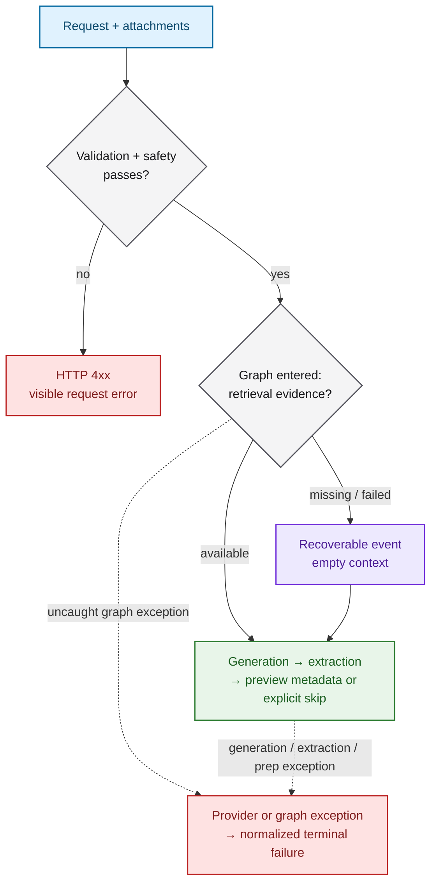
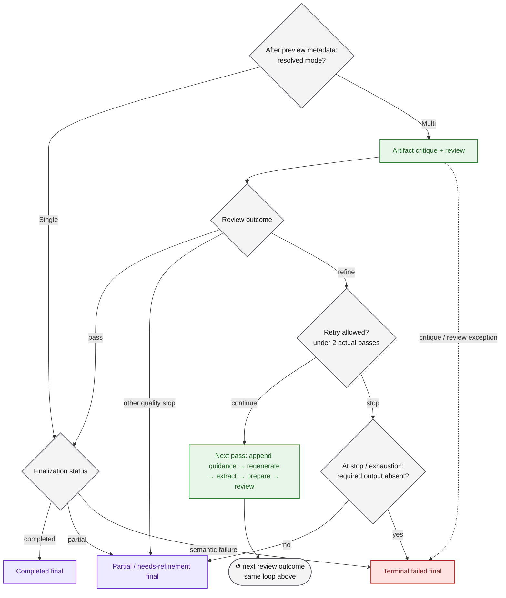
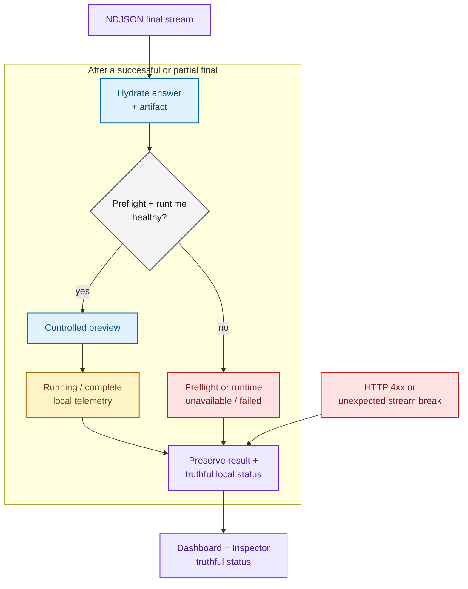

# Error and Recovery Paths

## Purpose

These diagrams separate recoverable conditions, bounded Multi-Agent refinement,
terminal backend failures, and post-final browser runtime failures. It shows
which conditions continue with explicit evidence and which conditions end the
workflow without hiding or upgrading the outcome.

### Backend validation and recoverable retrieval

### Review, refinement, and exhaustion

### Post-final browser recovery

## What the reviewer should notice

- Invalid request, attachment, or safety input returns an HTTP 4xx response
  before the LangGraph workflow starts.
- Retrieval failure and missing evidence are explicit recoverable states. They
  emit an event, use empty retrieval context, and continue without invented
  sources.
- No extracted artifact is an explicit skip, not an extraction exception.
  Single finalizes with the resulting semantic status; Multi review can still
  request a bounded regeneration.
- Review may run up to two actual refinement passes and may stop earlier when
  another pass would not help.
- Exhausting refinement for a required deliverable produces a terminal failed
  final. Exhausting a non-deliverable quality refinement preserves a partial,
  needs-refinement final.
- Browser preflight and runtime failures occur after the backend final. They
  preserve the finalized answer and artifact while publishing a truthful local
  runtime status.

## Truth boundary

The backend prepares preview metadata; it does not execute browser creative
code. Browser telemetry therefore does not reopen or automatically feed the
backend artifact-critique and review loop. A later user refinement is a new
explicit request. Likewise, an unexpected stream break is a recoverable client
transport condition, while a delivered terminal failed final is authoritative
backend workflow evidence.

## Failure classification

| Condition | Classification | Published result |
|---|---|---|
| Invalid request, attachment, or safety input | Pre-graph rejection | HTTP 4xx and visible request error |
| Retrieval gateway failure or missing evidence | Recoverable backend condition | Explicit event, empty context, continued workflow |
| No extracted artifact | Explicit skip | Preview preparation records the skip; Single finalizes truthfully and Multi may refine |
| Generation/provider or graph-node exception | Normalized terminal failure | Failure node and terminal failed final |
| Review requests another useful pass | Bounded retry | At most two actual refinements, with possible early stop |
| Required deliverable still absent at exhaustion | Terminal failure | Failed final with preserved evidence |
| Non-deliverable refinement stops or exhausts | Partial completion | Partial / needs-refinement final |
| Browser preflight or runtime failure | Post-final local runtime failure | Preserved answer/artifact and truthful local status |
| Unexpected stream break | Recoverable client condition | Client error state without a fabricated backend final |

## Deeper documentation

- [Runtime Workflow Graph](workflow_graph.md) documents registered nodes,
  route branches, and transition rules.
- [Architecture Walkthrough](../docs/ARCHITECTURE_WALKTHROUGH.md) follows one
  request from browser validation through recording and evaluation boundaries.
- [System Overview](../docs/SYSTEM_OVERVIEW.md) separates browser, backend,
  persistence, provider, and evaluation responsibilities.
- [Troubleshooting](../docs/TROUBLESHOOTING.md) provides operator-facing
  recovery guidance.
