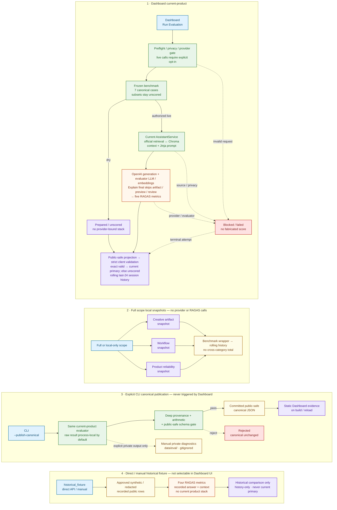

# Evaluation Workflow

## Purpose

This map shows how evaluation evidence is produced, validated, stored, and
displayed. It separates a Dashboard runtime run from the explicit CLI
publication path so neither can be mistaken for the other. Blue is client work,
green is application runtime, yellow is storage, orange is an external provider
boundary, purple is evidence, and red is a blocked or rejected path.
The [standalone Mermaid source](evaluation_workflow.mmd) contains the same
diagram for slide and README reuse.

## Key properties

- The Dashboard live lane uses the current `AssistantService`, real official-doc
  retrieval, local Chroma, the current Jinja prompt renderer, and OpenAI
  generation. Its Explain requests finalize before artifact extraction,
  preview, critique, review, or refinement.
- The five current-product metrics are context precision, faithfulness, answer
  relevancy, context relevancy, and context recall. Only context precision and
  context recall consume the authored reference.
- A safe runtime result can become the current Dashboard score after strict
  client validation. It is also added to a rolling 24-entry session history;
  this is not canonical publication or an append-only audit log.
- Full scope adds three local workspace snapshots. Those lanes do not invoke
  the provider or RAGAS, and the wrapper deliberately has no cross-category
  product score.
- Historical fixtures evaluate recorded public rows with four metrics and are
  comparison-only. They use the same metric set without context recall and do
  not exercise the current retrieval, prompt, or generation stack.

## Truth boundary

- The Dashboard UI submits only `current_product`; `historical_fixture` is an
  explicit API or manual lane.
- A dry run fingerprints the frozen selection but stops before constructing or
  invoking the provider-bound retrieval, generation, embedding, and evaluator
  stack.
- Questions, references, generated answers, and retrieved excerpts remain out
  of the public-safe API projection and committed canonical artifact.
- Only the explicit CLI `--publish-canonical` path can replace the committed
  canonical JSON. The Dashboard reads that file as static evidence on build or
  reload; a Dashboard run never writes it.
- Exact diagnostics require a separate manual option below gitignored
  `data/eval/` and are never Dashboard-default or public evidence.

## Deeper links

- [Evaluation API and async job registry](../src/creative_coding_assistant/api/evaluation.py)
- [Current-product runner](../src/creative_coding_assistant/eval/current_product.py)
- [Explicit publication and private-diagnostic CLI](../src/creative_coding_assistant/eval/current_product_cli.py)
- [RAGAS metric wiring](../src/creative_coding_assistant/eval/ragas_runner.py)
- [Dashboard run and polling client](../clients/nextjs/src/components/workstation-shell.tsx)
- [Strict client evidence validation](../clients/nextjs/src/lib/evaluation-benchmark.ts)
- [Static canonical evidence import](../clients/nextjs/src/lib/current-ragas-evidence.ts)
- [Committed canonical evidence](../demo/evaluation/current_product_ragas_evidence.json)
- [Canonical public-safe schema](../demo/evaluation/current_product_ragas_evidence.schema.json)
- [End-to-End Product Workflow](end_to_end_product_workflow.md)
