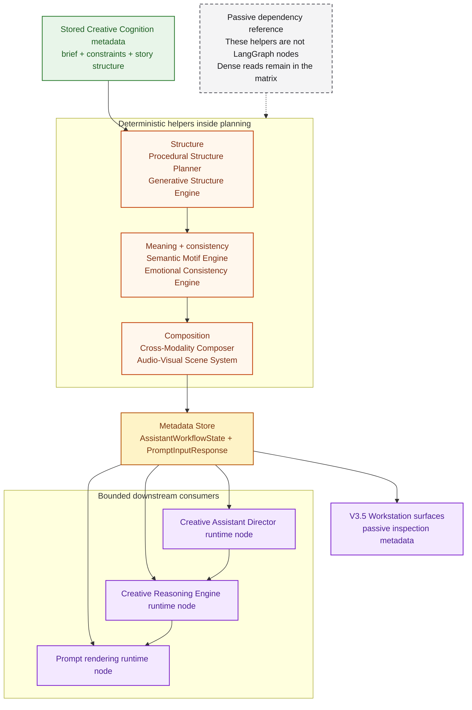

# Generative Design Dependency Graph

This document is the developer inspection view for the Generative Design
metadata catalog historically labeled V3.2. It focuses on six deterministic
capabilities and how they extend stored Creative Cognition metadata inside the
single `planning` runtime node.

> **Reference notice:** This is a passive dependency reference, not a runtime
> route or an agent topology. Start with
> [System Architecture Overview](system_architecture_overview.md),
> [End-to-End Product Workflow](end_to_end_product_workflow.md), and
> [Single and Multi Runtime Routes](workflow_graph.md) for executable behavior.
> Version labels below identify registry provenance, not a delivery schedule.

It is the dense companion to:

- [workflow_graph.md](workflow_graph.md) and
  [workflow_graph.mmd](workflow_graph.mmd), which document the real LangGraph
  runtime graph
- [creative_intelligence_graph.md](creative_intelligence_graph.md) and
  [creative_intelligence_graph.mmd](creative_intelligence_graph.mmd), which
  provide the readable capability pipeline
- [artifact_intelligence_graph.md](artifact_intelligence_graph.md) and
  [artifact_intelligence_graph.mmd](artifact_intelligence_graph.mmd), which
  document the downstream V3.3 Artifact Intelligence pipeline
- [workstation_surface_graph.md](workstation_surface_graph.md) and
  [workstation_surface_graph.mmd](workstation_surface_graph.mmd), which
  document the V3.5 workstation surfaces that inspect hydrated design metadata

## Scope And Boundary

- The graph below shows important internal dependencies, not every possible edge
- The dependency matrix below is the preferred way to show dense dependencies
- V3.2 capabilities are internal deterministic helpers, not separate LangGraph
  nodes with their own retries or failure routing
- V3.2 remains metadata and design guidance, not code generation execution,
  runtime mutation, provider routing, or preview behavior changes
- The structure feeds Artifact Intelligence, Creative Evaluation metadata, and
  workstation inspection surfaces without creating another runtime subsystem
- Older documentation called the dependency seams a “future V4 multi-agent
  blueprint.” That label is retired; the current Multi path is bounded and
  sequential, while these helpers remain inside `planning`
  <!-- Compatibility phrase: future V4 multi-agent blueprint -->
- Versioned stabilization entries preserve these dependency relationships

The raw Mermaid source for this diagram is available in
[generative_design_graph.mmd](generative_design_graph.mmd).

## Generative Design Relationship Map

- Structure grounding: `Procedural Structure Planner` turns upstream cognition,
  constraints, and composition into `procedural_structure`; `Generative
  Structure Engine` turns that into `generative_structure`. Later V3.2 engines
  use this concrete structural frame before motifs, emotion, modality, or scene
  guidance are derived.
- Motif guidance: `Semantic Motif Engine` reads story, composition, procedural
  structure, and generative structure. It produces `semantic_motif` so
  emotional consistency, cross-modality, and scene guidance share a coherent
  symbolic motif.
- Emotional alignment: `Emotional Consistency Engine` reads motif, structure,
  story, quality, and constraint metadata. It produces `emotional_consistency`
  that keeps cross-modality and scene guidance aligned with the intended affect.
- Cross-modality composition: `Cross-Modality Composer` reads structure, motif,
  emotion, and upstream execution metadata. It produces `cross_modality` so
  visual, audio, interaction, and timing guidance stay coordinated.
- Audio-visual scene handoff: `Audio-Visual Scene System` reads all V3.2 outputs
  plus upstream cognition metadata. It produces `audio_visual_scene`, then
  stores V3.2 outputs for V3.3 Artifact Intelligence, Director, Reasoning,
  prompt rendering, and workstation inspection.

## Why The Graph Is Selective

- The graph emphasizes major shaping edges instead of every argument in every
  function call
- Important shared inputs such as `request`, `route_decision`, and
  `creative_translation` are omitted from the drawing to preserve readability
- The exact planning-time read sets are listed in the matrix below

## Dependency Matrix

The dependency matrix is the preferred way to show dense dependencies.

| Capability | Reads | Produces | Used by |
| --- | --- | --- | --- |
| `Procedural Structure Planner` | `request`, `route_decision`, `creative_translation` `creative_intent`, `creative_hierarchy`, `creative_plan` `creative_constraints`, `creative_constraint_priorities` `creative_strategy`, `creative_techniques` `runtime_capabilities`, `creative_tradeoffs`, `creative_quality_prediction` `symbolic_narrative`, `creative_composition` | `procedural_structure` | `Generative Structure Engine`, `Semantic Motif Engine`, `Emotional Consistency Engine`, `Cross-Modality Composer`, `Audio-Visual Scene System`, metadata store |
| `Generative Structure Engine` | `request`, `route_decision`, `creative_translation` `creative_intent`, `creative_hierarchy`, `creative_plan` `creative_constraints`, `creative_constraint_priorities` `creative_strategy`, `creative_techniques` `runtime_capabilities`, `creative_tradeoffs`, `creative_quality_prediction` `symbolic_narrative`, `creative_composition`, `procedural_structure` | `generative_structure` | `Semantic Motif Engine`, `Emotional Consistency Engine`, `Cross-Modality Composer`, `Audio-Visual Scene System`, metadata store |
| `Semantic Motif Engine` | `request`, `route_decision`, `creative_translation` `creative_intent`, `creative_hierarchy`, `creative_plan` `creative_constraints`, `creative_constraint_priorities` `creative_strategy`, `creative_techniques`, `creative_tradeoffs`, `creative_quality_prediction` `symbolic_narrative`, `creative_composition`, `procedural_structure`, `generative_structure` | `semantic_motif` | `Emotional Consistency Engine`, `Cross-Modality Composer`, `Audio-Visual Scene System`, metadata store |
| `Emotional Consistency Engine` | `request`, `route_decision`, `creative_translation` `creative_intent`, `creative_hierarchy`, `creative_plan` `creative_constraints`, `creative_constraint_priorities` `creative_strategy`, `creative_techniques` `runtime_capabilities`, `creative_tradeoffs`, `creative_quality_prediction` `symbolic_narrative`, `creative_composition`, `procedural_structure`, `generative_structure`, `semantic_motif` | `emotional_consistency` | `Cross-Modality Composer`, `Audio-Visual Scene System`, metadata store |
| `Cross-Modality Composer` | `request`, `route_decision`, `creative_translation` `creative_intent`, `creative_hierarchy`, `creative_plan` `creative_constraints`, `creative_constraint_priorities` `creative_strategy`, `creative_techniques` `runtime_capabilities`, `creative_tradeoffs`, `creative_quality_prediction` `symbolic_narrative`, `creative_composition`, `procedural_structure`, `generative_structure`, `semantic_motif`, `emotional_consistency` | `cross_modality` | `Audio-Visual Scene System`, metadata store |
| `Audio-Visual Scene System` | `request`, `route_decision`, `creative_translation` `creative_intent`, `creative_hierarchy`, `creative_plan` `creative_constraints`, `creative_constraint_priorities` `creative_strategy`, `creative_techniques` `runtime_capabilities`, `creative_tradeoffs`, `creative_quality_prediction` `symbolic_narrative`, `creative_composition`, `procedural_structure`, `generative_structure`, `semantic_motif`, `emotional_consistency`, `cross_modality` | `audio_visual_scene` | V3.3 Artifact Intelligence stack, metadata store, `Creative Assistant Director runtime node`, `Creative Reasoning Engine runtime node`, `prompt rendering runtime node` |

## Downstream Consumption

- All six V3.2 outputs are stored on `AssistantWorkflowState` and mirrored into
  `PromptInputResponse`
- `Creative Assistant Director runtime node` reads the stored V3.2 metadata
  after `planning` completes
- `Creative Reasoning Engine runtime node` reads the stored V3.2 metadata after
  the Director brief is available
- `prompt rendering runtime node` serializes the stored V3.2 metadata into
  dedicated prompt sections alongside the V3.1 cognition metadata
- The V3.3 Artifact Intelligence stack reads the stored V3.1 and V3.2
  metadata inside the same `planning` runtime node, then contributes artifact
  planning, compatibility, critique/refinement, merge, export, and engine
  contract metadata to workflow serialization and stream hydration
- V3.5 workstation surfaces read hydrated V3.2 summaries through the creative
  timeline, V3 inspector panels, and workstation dashboard so operators can
  inspect design metadata without adding new backend graph nodes
