# Generative Design Dependency Graph

This document is the developer inspection view for the V3.2 Generative Design
Core. It focuses on the six V3.2 capabilities and how they extend stored V3.1
Creative Cognition metadata inside the single `planning` runtime node.

It is the dense companion to:

- [workflow_graph.md](workflow_graph.md) and
  [workflow_graph.mmd](workflow_graph.mmd), which document the real LangGraph
  runtime graph
- [creative_intelligence_graph.md](creative_intelligence_graph.md) and
  [creative_intelligence_graph.mmd](creative_intelligence_graph.mmd), which
  provide the readable capability pipeline
- [artifact_intelligence_graph.md](artifact_intelligence_graph.md) and
  [artifact_intelligence_graph.mmd](artifact_intelligence_graph.mmd), which
  document the downstream V3.3 Artifact Intelligence pipeline
- [workstation_surface_graph.md](workstation_surface_graph.md) and
  [workstation_surface_graph.mmd](workstation_surface_graph.mmd), which
  document the V3.5 workstation surfaces that inspect hydrated design metadata

## Scope And Boundary

- The graph below shows important internal dependencies, not every possible edge
- The dependency matrix below is the preferred way to show dense dependencies
- V3.2 capabilities are internal deterministic helpers, not separate LangGraph
  nodes with their own retries or failure routing
- V3.2 remains metadata and design guidance, not code generation execution,
  runtime mutation, provider routing, or preview behavior changes
- The current structure feeds the V3.3 Artifact Intelligence stack, V3.4
  Creative Evaluation metadata, and V3.5 workstation inspection surfaces, but
  it is still a future V4 multi-agent blueprint rather than an implemented
  multi-agent runtime
- V3.6 stabilization keeps these V3.2 dependency relationships unchanged

```mermaid
flowchart LR
    classDef upstream fill:#E8F5E9,stroke:#2E7D32,color:#1B5E20,stroke-width:1.5px;
    classDef bundle fill:#E0F2FE,stroke:#0369A1,color:#0C4A6E,stroke-width:1.5px;
    classDef design fill:#FFF7ED,stroke:#C2410C,color:#7C2D12,stroke-width:1.5px;
    classDef store fill:#FEF3C7,stroke:#B45309,color:#78350F,stroke-width:1.5px;
    classDef consumer fill:#F3E8FF,stroke:#7E22CE,color:#4C1D95,stroke-width:1.5px;
    classDef note fill:#F4F4F5,stroke:#52525B,color:#18181B,stroke-width:1.5px,stroke-dasharray: 6 4;
    classDef relationship fill:#FEFCE8,stroke:#A16207,color:#713F12,stroke-width:1.5px,stroke-dasharray: 6 4;

    subgraph upstream_core["1. Upstream V3.1 Creative Cognition"]
        direction TB
        brief["Brief layer<br/>Creative Intent Decomposer<br/>Creative Hierarchy Planner<br/>Creative Strategy Engine<br/>Creative Technique Selector"]:::upstream
        execution["Execution layer<br/>Creative Execution Plan<br/>Creative Constraint Solver<br/>Runtime Capability Reasoner<br/>Creative Trade-off Explorer<br/>Creative Constraint Prioritizer<br/>Creative Quality Predictor"]:::bundle
        story["Structure layer<br/>Symbolic Narrative Planner<br/>Creative Composition Planner"]:::upstream
    end

    subgraph design_core["2. V3.2 Generative Design Core"]
        direction TB
        procedural["Procedural Structure Planner"]:::design
        generative["Generative Structure Engine"]:::design
        motif["Semantic Motif Engine"]:::design
        emotion["Emotional Consistency Engine"]:::design
        cross["Cross-Modality Composer"]:::design
        scene["Audio-Visual Scene System"]:::design
    end

    metadata_store["Metadata Store<br/>AssistantWorkflowState + PromptInputResponse"]:::store
    director["Creative Assistant Director runtime node"]:::consumer
    reasoning["Creative Reasoning Engine runtime node"]:::consumer
    prompt_rendering["Prompt rendering runtime node"]:::consumer
    workstation["V3.5 Workstation surfaces<br/>timeline + inspector + dashboard"]:::consumer
    note["Selective graph only<br/>Use the matrix below for exhaustive reads"]:::note
    structure_boundary["Structure relationship<br/>procedural structure grounds<br/>generative structure"]:::relationship
    motif_boundary["Motif relationship<br/>story + structure produce<br/>semantic motif guidance"]:::relationship
    emotion_boundary["Emotional relationship<br/>motif + structure align<br/>emotional consistency"]:::relationship
    modality_boundary["Cross-modality relationship<br/>emotion + motif coordinate<br/>modality mapping"]:::relationship
    scene_boundary["Scene relationship<br/>cross-modality resolves<br/>audio-visual scene guidance"]:::relationship

    brief --> procedural
    execution --> procedural
    story --> procedural

    execution --> generative
    story --> generative
    procedural --> generative

    story --> motif
    procedural --> motif
    generative --> motif

    execution --> emotion
    story --> emotion
    procedural --> emotion
    generative --> emotion
    motif --> emotion

    execution --> cross
    story --> cross
    procedural --> cross
    generative --> cross
    motif --> cross
    emotion --> cross

    execution --> scene
    story --> scene
    procedural --> scene
    generative --> scene
    motif --> scene
    emotion --> scene
    cross --> scene

    procedural -.-> metadata_store
    generative -.-> metadata_store
    motif -.-> metadata_store
    emotion -.-> metadata_store
    cross -.-> metadata_store
    scene -.-> metadata_store

    metadata_store --> director
    metadata_store --> reasoning
    metadata_store --> prompt_rendering
    metadata_store --> workstation
    director --> reasoning --> prompt_rendering
    note -.-> design_core
    procedural -. grounds .-> structure_boundary
    structure_boundary -. feeds .-> generative
    generative -. shapes .-> motif_boundary
    story -. supplies narrative .-> motif_boundary
    motif_boundary -. guides .-> motif
    motif -. anchors .-> emotion_boundary
    generative -. structures .-> emotion_boundary
    emotion_boundary -. aligns .-> emotion
    emotion -. balances .-> modality_boundary
    motif -. maps .-> modality_boundary
    modality_boundary -. composes .-> cross
    cross -. resolves .-> scene_boundary
    scene_boundary -. guides .-> scene
    scene_boundary -. publishes .-> metadata_store
```

The raw Mermaid source for this detailed dependency view is available in
[generative_design_graph.mmd](generative_design_graph.mmd).

## Generative Design Relationship Map

- Structure grounding: `Procedural Structure Planner` turns upstream cognition,
  constraints, and composition into `procedural_structure`; `Generative
  Structure Engine` turns that into `generative_structure`. Later V3.2 engines
  use this concrete structural frame before motifs, emotion, modality, or scene
  guidance are derived.
- Motif guidance: `Semantic Motif Engine` reads story, composition, procedural
  structure, and generative structure. It produces `semantic_motif` so
  emotional consistency, cross-modality, and scene guidance share a coherent
  symbolic motif.
- Emotional alignment: `Emotional Consistency Engine` reads motif, structure,
  story, quality, and constraint metadata. It produces `emotional_consistency`
  that keeps cross-modality and scene guidance aligned with the intended affect.
- Cross-modality composition: `Cross-Modality Composer` reads structure, motif,
  emotion, and upstream execution metadata. It produces `cross_modality` so
  visual, audio, interaction, and timing guidance stay coordinated.
- Audio-visual scene handoff: `Audio-Visual Scene System` reads all V3.2 outputs
  plus upstream cognition metadata. It produces `audio_visual_scene`, then
  stores V3.2 outputs for V3.3 Artifact Intelligence, Director, Reasoning,
  prompt rendering, and workstation inspection.

## Why The Graph Is Selective

- The graph emphasizes major shaping edges instead of every argument in every
  function call
- Important shared inputs such as `request`, `route_decision`, and
  `creative_translation` are omitted from the drawing to preserve readability
- The exact planning-time read sets are listed in the matrix below

## Dependency Matrix

The dependency matrix is the preferred way to show dense dependencies.

| Capability | Reads | Produces | Used by |
| --- | --- | --- | --- |
| `Procedural Structure Planner` | `request`, `route_decision`, `creative_translation` `creative_intent`, `creative_hierarchy`, `creative_plan` `creative_constraints`, `creative_constraint_priorities` `creative_strategy`, `creative_techniques` `runtime_capabilities`, `creative_tradeoffs`, `creative_quality_prediction` `symbolic_narrative`, `creative_composition` | `procedural_structure` | `Generative Structure Engine`, `Semantic Motif Engine`, `Emotional Consistency Engine`, `Cross-Modality Composer`, `Audio-Visual Scene System`, metadata store |
| `Generative Structure Engine` | `request`, `route_decision`, `creative_translation` `creative_intent`, `creative_hierarchy`, `creative_plan` `creative_constraints`, `creative_constraint_priorities` `creative_strategy`, `creative_techniques` `runtime_capabilities`, `creative_tradeoffs`, `creative_quality_prediction` `symbolic_narrative`, `creative_composition`, `procedural_structure` | `generative_structure` | `Semantic Motif Engine`, `Emotional Consistency Engine`, `Cross-Modality Composer`, `Audio-Visual Scene System`, metadata store |
| `Semantic Motif Engine` | `request`, `route_decision`, `creative_translation` `creative_intent`, `creative_hierarchy`, `creative_plan` `creative_constraints`, `creative_constraint_priorities` `creative_strategy`, `creative_techniques`, `creative_tradeoffs`, `creative_quality_prediction` `symbolic_narrative`, `creative_composition`, `procedural_structure`, `generative_structure` | `semantic_motif` | `Emotional Consistency Engine`, `Cross-Modality Composer`, `Audio-Visual Scene System`, metadata store |
| `Emotional Consistency Engine` | `request`, `route_decision`, `creative_translation` `creative_intent`, `creative_hierarchy`, `creative_plan` `creative_constraints`, `creative_constraint_priorities` `creative_strategy`, `creative_techniques` `runtime_capabilities`, `creative_tradeoffs`, `creative_quality_prediction` `symbolic_narrative`, `creative_composition`, `procedural_structure`, `generative_structure`, `semantic_motif` | `emotional_consistency` | `Cross-Modality Composer`, `Audio-Visual Scene System`, metadata store |
| `Cross-Modality Composer` | `request`, `route_decision`, `creative_translation` `creative_intent`, `creative_hierarchy`, `creative_plan` `creative_constraints`, `creative_constraint_priorities` `creative_strategy`, `creative_techniques` `runtime_capabilities`, `creative_tradeoffs`, `creative_quality_prediction` `symbolic_narrative`, `creative_composition`, `procedural_structure`, `generative_structure`, `semantic_motif`, `emotional_consistency` | `cross_modality` | `Audio-Visual Scene System`, metadata store |
| `Audio-Visual Scene System` | `request`, `route_decision`, `creative_translation` `creative_intent`, `creative_hierarchy`, `creative_plan` `creative_constraints`, `creative_constraint_priorities` `creative_strategy`, `creative_techniques` `runtime_capabilities`, `creative_tradeoffs`, `creative_quality_prediction` `symbolic_narrative`, `creative_composition`, `procedural_structure`, `generative_structure`, `semantic_motif`, `emotional_consistency`, `cross_modality` | `audio_visual_scene` | V3.3 Artifact Intelligence stack, metadata store, `Creative Assistant Director runtime node`, `Creative Reasoning Engine runtime node`, `prompt rendering runtime node` |

## Downstream Consumption

- All six V3.2 outputs are stored on `AssistantWorkflowState` and mirrored into
  `PromptInputResponse`
- `Creative Assistant Director runtime node` reads the stored V3.2 metadata
  after `planning` completes
- `Creative Reasoning Engine runtime node` reads the stored V3.2 metadata after
  the Director brief is available
- `prompt rendering runtime node` serializes the stored V3.2 metadata into
  dedicated prompt sections alongside the V3.1 cognition metadata
- The V3.3 Artifact Intelligence stack reads the stored V3.1 and V3.2
  metadata inside the same `planning` runtime node, then contributes artifact
  planning, compatibility, critique/refinement, merge, export, and engine
  contract metadata to workflow serialization and stream hydration
- V3.5 workstation surfaces read hydrated V3.2 summaries through the creative
  timeline, V3 inspector panels, and workstation dashboard so operators can
  inspect design metadata without adding new backend graph nodes
