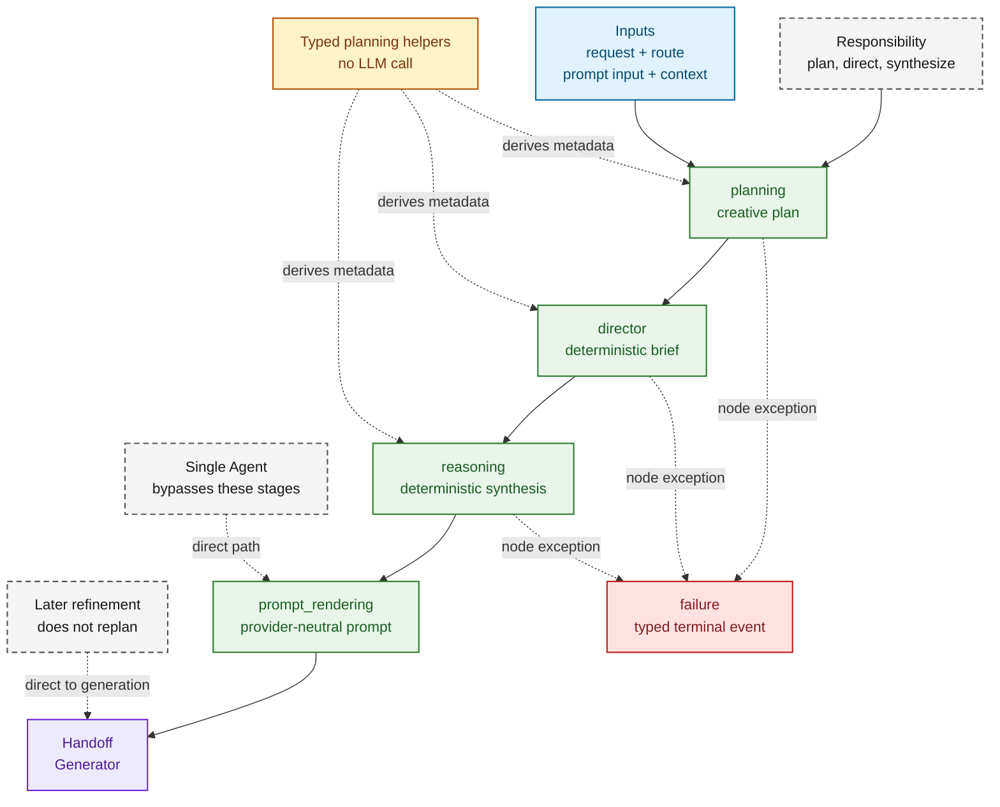
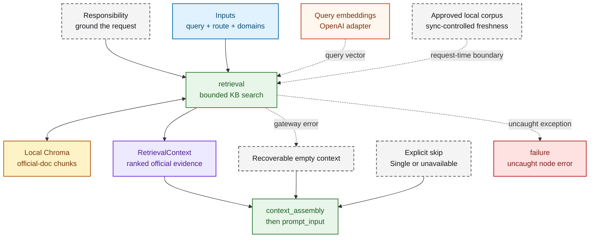
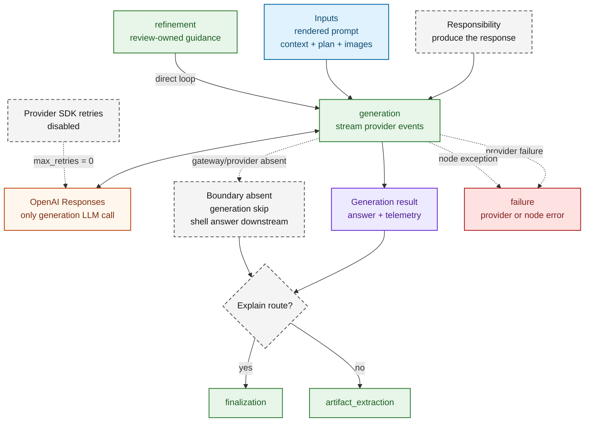
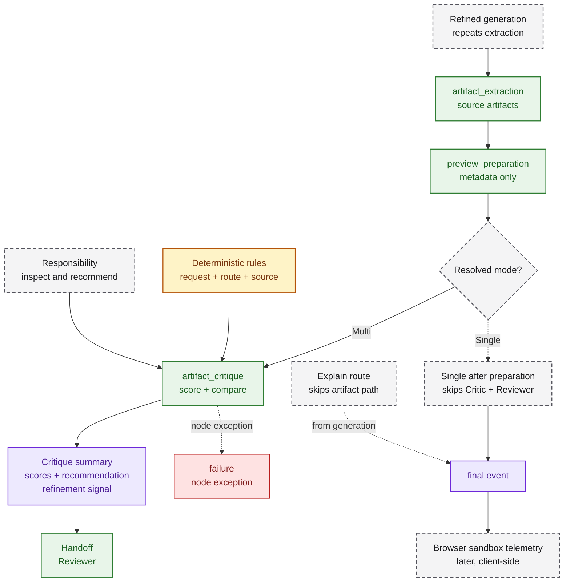
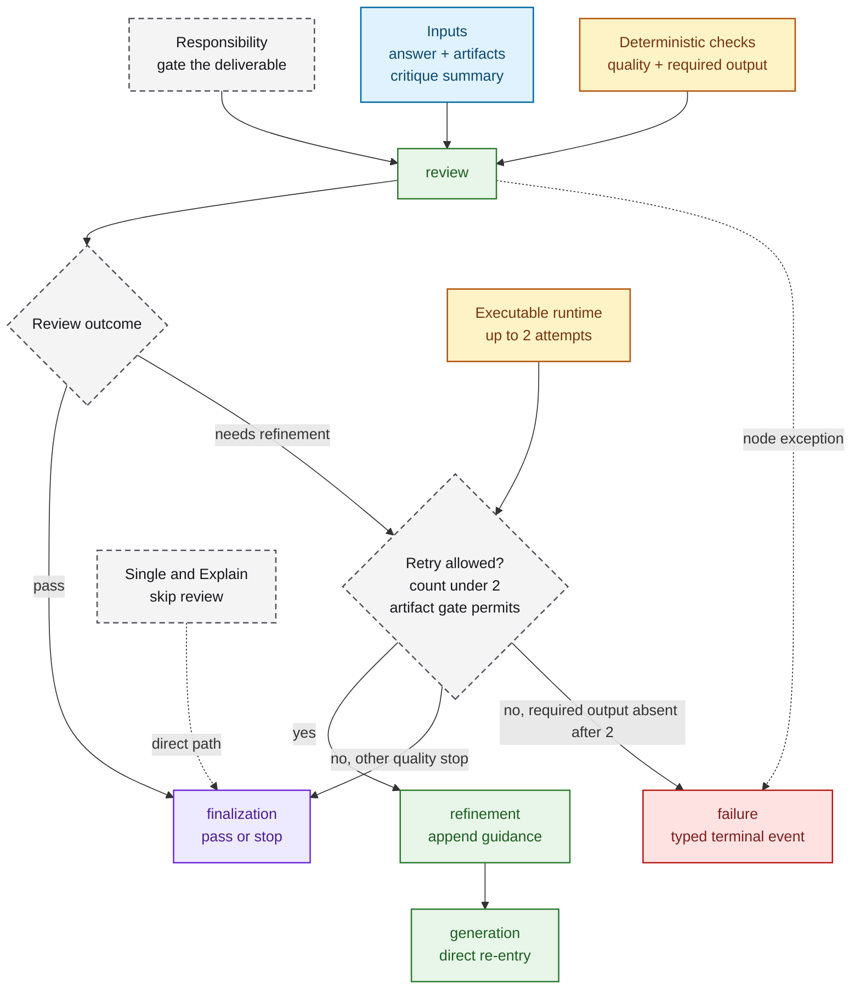

# Published Multi-Agent Role Flows

The Multi Agent route publishes five role names: Planner, Researcher, Generator,
Critic, and Reviewer. They are sequential responsibilities inside one compiled
LangGraph, not five autonomous workers or a parallel swarm. Planning, direction,
reasoning, critique, and review are deterministic application stages. Only
`generation` calls the configured OpenAI generation provider.

The diagrams below show executable stages and handoffs. A role label describes
ownership; green is a real runtime node or stage, yellow is bounded evidence,
orange is an external provider, and gray is a non-executing boundary.

## Planner

Purpose: turn the routed request and assembled context into bounded creative
guidance before prompt rendering.

What to notice:

- Director and Reasoning are deterministic handoffs within the Planner
  responsibility; neither is another model call.
- Single Agent goes from `prompt_input` directly to `prompt_rendering`. Multi
  Agent follows `planning → director → reasoning → prompt_rendering`.
- A later review retry does not re-enter Planner; refinement returns directly to
  Generator.

Truth boundary: the many typed planning and advisory registries do not become
extra runtime agents merely because the planning node derives their metadata.

Deeper links: [planning node](../src/creative_coding_assistant/orchestration/runtime/nodes/planning_node.py),
[Director node](../src/creative_coding_assistant/orchestration/runtime/nodes/director.py),
[Reasoning node](../src/creative_coding_assistant/orchestration/runtime/nodes/reasoning.py), and
[route transitions](../src/creative_coding_assistant/orchestration/runtime/nodes/transitions.py).

## Researcher

Purpose: retrieve bounded official-document evidence for the Multi Agent route
before context assembly.

What to notice:

- The default researcher uses query embeddings and schema-versioned records in
  the local official-document Chroma collection. Excluding request-time
  open-web fetches is intended to improve reproducibility, provenance, latency,
  evaluation stability, and resistance to changing or untrusted content. Index
  freshness is bounded by explicit per-source synchronization.
- A retrieval-gateway error is normalized to an empty, recoverable context and
  generation continues. Missing retrieval infrastructure and Single Agent are
  explicit skips.
- Review-driven refinement does not rerun retrieval; it returns directly to
  generation.

Truth boundary: Researcher is the retrieval responsibility, not an independent
LLM worker. Memory retrieval is a separate preceding graph node and Chroma
collection.

Deeper links: [retrieval node](../src/creative_coding_assistant/orchestration/runtime/nodes/retrieval.py),
[retrieval adapter](../src/creative_coding_assistant/orchestration/runtime/retrieval.py),
[recoverable retrieval boundary](../src/creative_coding_assistant/orchestration/runtime/service.py), and
[service composition](../src/creative_coding_assistant/app/bootstrap.py).

## Generator

Purpose: turn the rendered provider-neutral prompt into the assistant answer and
optional code artifacts.

What to notice:

- This is the only role that calls the configured OpenAI generation provider.
  Validated image data may cross this boundary with the rendered prompt.
- Explain goes directly from generation to finalization, so it skips artifact
  extraction, preview, critique, and review.
- A Reviewer-approved refinement is a new generation call, but it loops directly
  from `refinement` to `generation`; it does not rerun research or planning.

Truth boundary: provider retries are disabled. Workflow refinement owns any
additional generation call, and no dynamic provider/model router is active.

Deeper links: [generation node](../src/creative_coding_assistant/orchestration/runtime/nodes/generation.py),
[provider-neutral contracts](../src/creative_coding_assistant/llm/generation.py),
[OpenAI adapter](../src/creative_coding_assistant/llm/openai_adapter.py), and
[generation transition](../src/creative_coding_assistant/orchestration/runtime/nodes/transitions.py).

## Critic

Purpose: score inspectable generated artifacts and recommend what the Reviewer
should accept or refine.

What to notice:

- Backend `preview_preparation` creates renderer/runtime metadata. It does not
  execute the artifact or observe a browser frame.
- Critique uses artifact source, route/request data, deterministic rules, and
  the prepared preview result. Browser sandbox telemetry exists only after the
  final event and feeds client Runtime, Preview, Dashboard, and Inspector views.
- A Reviewer-approved retry produces a new generation result, then repeats
  extraction, preview preparation, and critique. A browser error alone does not
  trigger that loop.

Truth boundary: browser telemetry is not an input to backend critique, and a
backend “preview prepared” result is not proof of visible runtime success.

Deeper links: [artifact nodes](../src/creative_coding_assistant/orchestration/runtime/nodes/artifacts.py),
[artifact and preview preparation](../src/creative_coding_assistant/orchestration/runtime/artifacts.py),
[browser runtime stage](../clients/nextjs/src/components/preview-runtime-stage.tsx), and
[sandbox runtime](../clients/nextjs/src/lib/preview-sandbox-runtime.ts).

## Reviewer

Purpose: apply the deterministic quality and deliverable gate, then finalize,
request bounded refinement, or fail a missing required deliverable.

What to notice:

- The executable gate permits up to two refinement attempts. Artifact-backed
  passes can stop earlier after sufficient improvement, preview-safety failure,
  or no useful opportunity.
- `refinement` appends guidance to the existing rendered prompt and returns
  directly to `generation`. Successful retry then repeats extraction, preview
  preparation, critique, and review.

Truth boundary: a required deliverable still missing after two attempts becomes
a typed terminal failure. Other non-retriable or exhausted quality findings may
finalize with the review evidence instead of causing that deliverable failure.
Single Agent and Explain do not execute this Reviewer path.

Deeper links: [review node](../src/creative_coding_assistant/orchestration/runtime/nodes/review.py),
[review transition logic](../src/creative_coding_assistant/orchestration/runtime/nodes/review_logic.py),
[refinement node](../src/creative_coding_assistant/orchestration/runtime/nodes/refinement.py),
and [runtime refinement limit](../src/creative_coding_assistant/orchestration/runtime/workflow_review.py).

## Shared execution boundary

These five views are slices of the same sequential graph. They should be read
with the [end-to-end product workflow](end_to_end_product_workflow.md), not
connected into a parallel-agent topology. Routing publishes the selected
responsibilities; LangGraph node events and final payloads are the execution
evidence.
