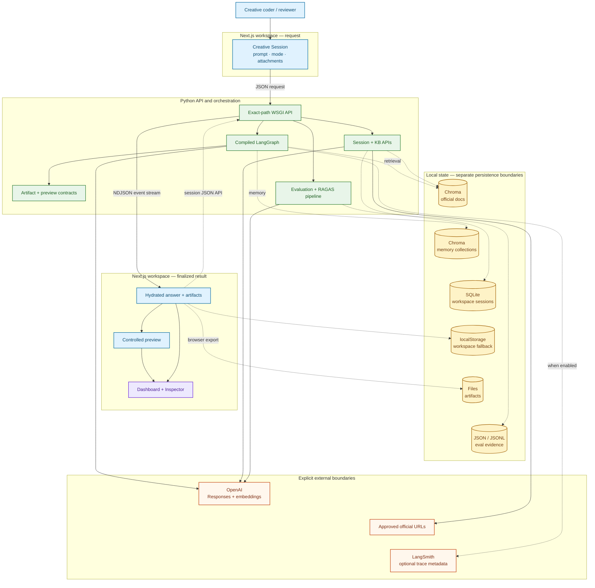

# System Architecture Overview

## Purpose

This is the primary reviewer-facing map of the current V9 product. It shows the
browser workspace, Python boundary, compiled request workflow, local stores,
provider calls, preview runtime, evaluation path, and evidence surfaces without
expanding every internal node.

## What the reviewer should notice

- The browser uses the local HTTP API; it never calls a model or embedding
  provider directly.
- The request graph, KB/evaluation actions, browser preview, and workspace
  persistence are related product paths with different owners.
- Dashboard and Inspector project published run, preview, persistence, and
  evaluation evidence; they are not additional workflow agents.

Blue nodes are browser surfaces, green nodes are backend runtime boundaries,
yellow cylinders are local stores, orange nodes are external systems, and
purple nodes are evidence projections. Solid arrows show calls or data flow;
the dashed LangSmith edge is optional.

## Truth boundary

The backend prepares artifact and preview contracts, but executable preview
source runs later inside the controlled browser surface. Evaluation uses a
separate API pipeline and is not a hidden LangGraph node. OpenAI is the only
configured generation-provider route; model/provider matrices elsewhere in the
repository remain advisory unless runtime evidence says otherwise.

## Deeper documentation

- [End-to-End Product Workflow](end_to_end_product_workflow.md)
- [Exact Runtime Routes](workflow_graph.md)
- [Artifact and Preview Runtime](artifact_preview_runtime.md)
- [Evaluation / RAGAS Workflow](evaluation_workflow.md)
- [System Overview](../docs/SYSTEM_OVERVIEW.md)
