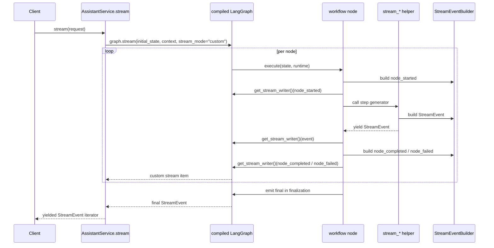
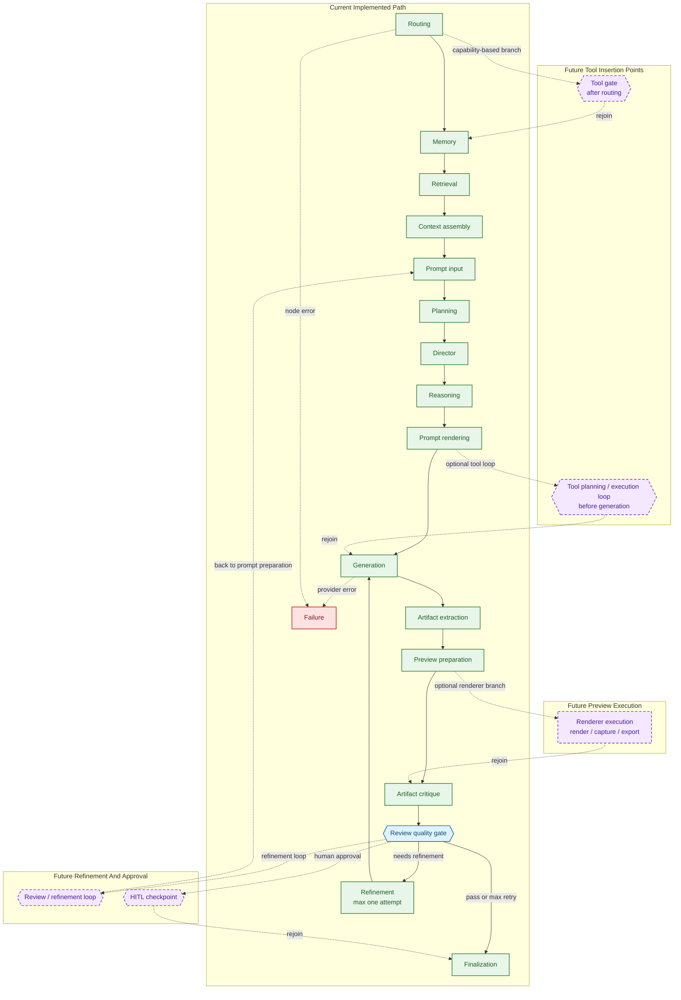

# Workflow Graph

This document describes the real LangGraph workflow currently executed by the backend. It is documentation for the implementation in:

- `src/creative_coding_assistant/orchestration/workflow_graph.py`
- `src/creative_coding_assistant/orchestration/workflow.py`
- `src/creative_coding_assistant/orchestration/service.py`
- `src/creative_coding_assistant/orchestration/events.py`
- `tests/test_langgraph_workflow_integration.py`

## Runtime Graph Vs Internal Capability Graph

This file documents the real LangGraph runtime graph compiled by
`build_assistant_workflow_graph()`. It should stay small and truthful to the
current backend execution order rather than expanding every internal helper into
its own graph node.

The V3.4 metadata planning pass still runs inside the single `planning`
runtime node. V3.5 Creative Workstation does not add LangGraph runtime nodes;
it hydrates workstation surfaces from the existing workspace snapshot, stream
events, workflow trace, V3 metadata, and static workstation surface contracts.
V3.6 keeps the same runtime node set while stabilizing graph registration,
stream/event payload helpers, workflow serialization, and local backend
mounting around the existing implementation.
V4.1 Multi-Agent Core keeps that same runtime node set. It adds passive
agent identity, contract, memory, role, boundary, and advisory metadata
registries that describe future agent responsibilities without invoking
agents, routing tasks, rendering agent text into prompts, or adding workflow
payload behavior.
V4.2 Agent Orchestration builds on V4.1 as passive orchestration metadata. It
adds dynamic routing profiles, blackboard channel contracts, shared context
views, dependency graphs, scheduling groups, coordination, debate, consensus,
capability alignment, escalation signals, lifecycle metadata, state
synchronization metadata, workflow-to-agent handoff contracts, and an
integration manifest. These registries are discoverable Python metadata APIs;
they do not execute orchestration, invoke agents, synchronize runtime state,
mutate blackboard storage, change provider/model routing, alter prompts, add
workflow nodes, trigger retries, or modify generated output.
V4.3 Hybrid Agentic Workflow builds on V4.2 as passive hybrid workflow
metadata. It declares the V3 backbone, conditional escalation candidates,
specialist-loop candidates, gates, creative escalation policy, reflection
escalation, debate, voting, confidence fusion, provenance, traces, exploration
budgets, result normalization, return handoff, HITL gates, confidence/cost/
latency threshold routing, ambiguity/risk/quality escalation, adaptive
multi-agent escalation, and integration source coverage. These registries are
inspectable metadata APIs; they do not execute escalation, invoke agents,
change LangGraph node order, route providers or models, select runtimes,
trigger retries, mutate prompts, or modify generated output.
V4.4 Hybrid Studio builds on V4.3 as passive hybrid studio metadata. It
declares local model surfaces, cloud model surfaces, hybrid execution
profiles, Auto Mode postures, Studio Mode surfaces, HITL decisions, provider
selection visibility, execution simulation, model/cost/quality profiles,
local/cloud comparisons, agent workspace views, agent conversation views,
workspace snapshots, session replay, execution replay, and Hybrid Studio
Integration source coverage. These registries are inspectable metadata APIs;
they do not activate Studio runtime, execute providers, invoke agents, change
LangGraph node order, change provider/model routing, select runtimes, request
human input, write replay storage, trigger retries, mutate storage, or modify
generated output.
V4.5 Multimodal Studio builds on V4.4 as passive multimodal studio metadata.
It declares live preview, multi preview, interactive canvas, visual workspace,
runtime collaboration, artifact collaboration, artifact provenance, artifact
lineage, cross-agent workspace, shared artifact board, workspace history,
branching timeline, creative evolution timeline, real-time workflow
visualization, and integration source coverage. These registries are
inspectable metadata APIs; they do not execute rendering, activate Studio
runtime, change LangGraph node order, route providers or models, select
runtimes, control workflows, request human input, trigger retries, mutate
artifacts, modify generated output, persist collaboration storage, subscribe
to live streams, or open networking.
V4.6 Agentic Studio Hardening builds on V4.5 as passive hardening and audit
metadata. It declares contract audit, policy audit, hybrid workflow audit,
registry audit, memory/context boundary audit, collaboration and diversity
audit, explainability/reliability/determinism audit, telemetry/cost/performance
foundation coverage, architecture consistency, final hardening, and LangGraph
error-path audit coverage. These registries are inspectable metadata APIs; they
do not execute hardening checks, add LangGraph nodes, bypass failure
normalization, activate passive registries, route providers or models, select
runtimes, control workflows, trigger retries, invoke agents, mutate storage,
execute artifacts, or modify generated output.
V5.1 Execution Optimization Engine keeps the same LangGraph runtime node set
while adding bounded analysis, planning, compression, cache, reuse, pruning,
forecasting, path optimization, strategy selection, architecture consistency,
and runtime failure-audit metadata. These surfaces are importable Python
contracts and deterministic local helpers; they do not add graph nodes, compile
or execute alternate graphs, change provider/model routing, enforce budgets,
apply pruning or selected strategies, trigger retries, mutate prompts, persist
storage, or modify generated output.
V5.2 Intelligent Model Routing Engine also keeps the same LangGraph runtime
node set while adding advisory model routing, local/cloud routing, hybrid
routing, quality/cost optimization, cost estimation, budget policy, HITL budget
gate, runtime recommendation, execution policy, model recommendation, model and
provider capability matrices, quality/cost prediction, creative prediction,
routing explainability, architecture consistency, and runtime failure-path
audit metadata. These surfaces are importable Python contracts and
deterministic local helpers; they do not apply routing, switch providers or
models, execute providers, enforce budgets, emit HITL requests, select
runtimes, control workflows, trigger retries, mutate prompts, persist storage,
apply Runtime Evolution, or modify generated output.
V5.3 Performance Engine keeps the same LangGraph runtime node set while adding
advisory parallel scheduling, latency, async execution, streaming, retry
policy, load balancing, execution profiling, workflow replay, execution replay,
bottleneck detection, throughput, performance prediction, performance
benchmarking, reasoning budget, performance regression, resource utilization,
architecture consistency, and runtime failure-path audit metadata. These
surfaces are importable Python contracts and deterministic local helpers; they
do not measure live performance, execute workflows, execute benchmarks, execute
replay, allocate resources, enforce capacity or budgets, select runtimes,
control workflows, trigger retries, route providers or models, mutate prompts,
persist storage, apply Runtime Evolution, or modify generated output.
V5.4 Production Observability keeps the same LangGraph runtime node set while
adding read-only token, cost, quality, performance, telemetry, workflow
diagnostic, agent diagnostic, routing diagnostic, escalation diagnostic,
failure, error, workflow health, system health, creative analytics, confidence
analytics, diversity analytics, runtime timeline, workflow explainability,
architecture consistency, and runtime failure-path audit metadata. These
surfaces are importable Python contracts and deterministic local helpers; they
do not collect live metrics, emit telemetry or alerts, capture traces, execute
health checks, classify live errors, remediate failures, reconstruct timelines,
generate explanations, request human review, control workflows, trigger
retries, route providers or models, mutate prompts, persist storage, apply
Runtime Evolution, or modify generated output.
V5.5 Adaptive Execution Intelligence keeps the same LangGraph runtime node set
while adding controlled adaptive execution policy/simulation, advisory hybrid
workflow optimization, escalation optimization, agent activation optimization,
adaptive cost/quality and latency posture, dynamic execution strategy
selection, dynamic agent/resource allocation, workflow self-tuning posture,
execution confidence, workflow risk, creative exploration, emergence, agent
diversity, reflection budget, adaptive policy explainability, architecture
consistency, and runtime failure-path audit metadata. These surfaces are
importable Python contracts and deterministic local helpers; they do not
mutate configured provider/model routing, silently switch providers or models,
execute providers, instantiate or invoke agents, allocate resources,
enforce budgets, emit HITL requests, compile graphs, execute or control
workflows, mutate workflow graphs, trigger retries or refinements, mutate
prompts, persist storage, apply Runtime Evolution, or modify generated output.
V5.6 Production Release keeps the same LangGraph runtime node set while adding
production-release readiness metadata for final optimization, packaging,
release-candidate posture, demo asset readiness, deployment assumptions,
production readiness, creative readiness, architecture freeze, release audit,
final hardening, architecture consistency, and runtime failure-path audit
coverage. These surfaces are importable Python contracts and deterministic
local helpers; they do not install dependencies, run package builds, deploy
services, create release artifacts, generate assets, execute retrieval,
execute providers, mutate configured provider/model routing, emit HITL
requests, compile graphs, execute or control workflows, mutate workflow
graphs, apply Runtime Evolution, merge, push, tag, or modify generated output.
`_planning_node()` deterministically derives and stores the V3.1 Creative
Cognition metadata, the V3.2 Generative Design metadata, the V3.3 Artifact
Intelligence metadata, and the V3.4 Creative Evaluation metadata:

- `creative_intent`
- `creative_hierarchy`
- `creative_strategy`
- `creative_techniques`
- `creative_plan`
- `creative_constraints`
- `runtime_capabilities`
- `creative_tradeoffs`
- `creative_constraint_priorities`
- `creative_quality_prediction`
- `symbolic_narrative`
- `creative_composition`
- `procedural_structure`
- `generative_structure`
- `semantic_motif`
- `emotional_consistency`
- `cross_modality`
- `audio_visual_scene`
- `artifact_plan`
- `artifact_dependency_graph`
- `runtime_compatibility`
- `artifact_capability_matrix`
- `multi_artifact_strategy`
- `artifact_critic`
- `artifact_refiner`
- `artifact_intelligence_synthesis`
- `artifact_merge_planner`
- `artifact_export_intelligence`
- `artifact_engine_contracts`
- `creative_critic`
- `self_evaluation`
- `creative_improvement_planner`
- `reflection_loop`
- `creative_confidence`
- `creative_score`
- `consistency_validation`
- `evaluation_report`
- `evaluation_engine_contracts`

Those typed results are persisted on `AssistantWorkflowState` and mirrored into
`PromptInputResponse`. The downstream `director` and `reasoning` runtime nodes
consume that metadata, and `prompt_rendering` serializes it into provider prompt
sections. The internal architecture is documented separately as:

- [creative_intelligence_graph.md](creative_intelligence_graph.md) and
  [creative_intelligence_graph.mmd](creative_intelligence_graph.mmd) for the
  readable capability pipeline
- [generative_design_graph.md](generative_design_graph.md) and
  [generative_design_graph.mmd](generative_design_graph.mmd) for the denser
  V3.2 dependency graph and dependency matrix
- [artifact_intelligence_graph.md](artifact_intelligence_graph.md) and
  [artifact_intelligence_graph.mmd](artifact_intelligence_graph.mmd) for the
  V3.3 Artifact Intelligence dependency graph and engine contract registry
- [workstation_surface_graph.md](workstation_surface_graph.md) and
  [workstation_surface_graph.mmd](workstation_surface_graph.mmd) for the V3.5
  Creative Workstation surface graph and contract boundary

Those internal helpers produce metadata, design guidance, artifact
intelligence, evaluation summaries, and contract summaries, plus workstation
surface contracts, not code generation execution, export execution, runtime
mutation, provider routing, retries, evaluation behavior changes, or preview
behavior changes.

This separation is intentional:

- LangGraph owns execution order, retries, lifecycle events, and failure routing
- The internal Creative Intelligence, Generative Design, Artifact Intelligence,
  and Creative Evaluation layers own bounded, inspectable metadata derivation
- The V3.5 Workstation layer owns client-side inspection, provenance, timeline,
  dashboard, and contract surfaces over existing metadata
- The V4.1 Multi-Agent Core layer owns passive agent role and contract
  definitions over the completed V3 platform
- The V4.2 Agent Orchestration layer owns passive orchestration contracts over
  those V4.1 agent roles, but still does not own runtime execution
- The V4.3 Hybrid Agentic Workflow layer owns passive escalation, handoff,
  threshold, adaptive, and integration metadata over the stable V3 backbone
  and V4 contracts, but still does not own runtime execution
- The V4.4 Hybrid Studio layer owns passive local/cloud model, hybrid
  execution, Studio surface, HITL, profile, comparison, workspace, snapshot,
  replay, and integration metadata over the V4 contract stack, but still does
  not own runtime execution or Studio runtime activation
- The V4.5 Multimodal Studio layer owns passive preview, canvas, visual
  workspace, collaboration, provenance, lineage, history, branching, evolution,
  workflow visualization, and integration metadata, but still does not own
  rendering execution or Studio runtime activation
- The V4.6 Agentic Studio Hardening layer owns passive audit, foundation,
  architecture consistency, final hardening, and LangGraph error-path coverage
  metadata, but still does not own runtime hardening execution, failure
  recovery behavior, provider/model routing, or generated-output mutation
- The V5.1 Execution Optimization Engine layer owns bounded execution
  analysis, context/cost budget planning, compression summaries, cache/reuse
  metadata, pruning plans, cost forecasts, path candidates, advisory strategy
  selection, architecture consistency, and runtime failure audit metadata, but
  still does not own LangGraph execution, provider/model routing, retry
  triggering, budget enforcement, strategy application, or generated-output
  mutation
- The V5.2 Intelligent Model Routing Engine layer owns advisory model route
  candidates, local/cloud and hybrid posture, quality/cost optimization, cost
  estimates, budget policy, HITL budget gate, runtime/execution policy, model
  recommendations, capability matrices, quality/cost and creative prediction,
  routing explanations, architecture consistency, and runtime failure audit
  metadata, but still does not own provider/model routing application, provider
  execution, HITL request emission, budget enforcement, runtime selection,
  workflow control, or generated-output mutation
- The V5.3 Performance Engine layer owns advisory scheduling, latency, async,
  streaming, retry-policy, load-balancing, profiling, replay, bottleneck,
  throughput, prediction, benchmarking, reasoning-budget, regression,
  resource-utilization, architecture consistency, and runtime failure audit
  metadata, but still does not own runtime measurement, workflow execution,
  benchmark execution, replay execution, resource allocation, capacity or
  budget enforcement, provider/model routing, retry triggering, workflow
  control, or generated-output mutation
- The V5.4 Production Observability layer owns read-only dashboards,
  production telemetry metadata, diagnostics, failure/error intelligence,
  health monitoring, creative/confidence/diversity analytics, timeline,
  explainability, architecture consistency, and runtime failure audit metadata,
  but still does not own live metric collection, telemetry or alert emission,
  trace capture, health check execution, live error classification,
  remediation, workflow control, provider/model routing, retry triggering, or
  generated-output mutation
- The V5.5 Adaptive Execution Intelligence layer owns controlled adaptive
  execution policy/simulation, advisory hybrid workflow, escalation, agent
  activation, adaptive cost/quality and latency, dynamic strategy,
  agent/resource allocation, self-tuning, confidence/risk, creative
  exploration, emergence, diversity, reflection budget, explainability,
  architecture consistency, and runtime failure audit metadata, but still does
  not own provider/model routing mutation, provider execution, agent
  invocation, resource allocation, budget enforcement, HITL request emission,
  workflow control, workflow graph mutation, retry triggering, automatic local
  model downloads, or generated-output mutation
- The V5.6 Production Release layer owns final optimization, packaging,
  release-candidate, demo asset, deployment, production readiness, creative
  readiness, architecture freeze, release audit, final hardening, architecture
  consistency, and runtime failure audit metadata, but still does not own
  dependency installation, package builds, deployment execution, provider/model
  routing mutation, provider execution, workflow control, release operations,
  Runtime Evolution, or generated-output mutation
- The internal capability pipeline and dependency graph remain decomposition
  candidates for later orchestration, but they are not a true multi-agent or
  multi-node runtime graph here

## V4.1 Multi-Agent Core Contract Boundary

V4.1 introduces a static Multi-Agent Core as metadata, not a runtime
orchestration layer. The backend exposes inspectable registries for agent
identities, contracts, memory access boundaries, role ordering, role authority
boundaries, and advisory operational metadata. The role set covers Planner,
Research, Style, Runtime, Artifact, Art Direction, Aesthetic Critic, Narrative
& Symbolic, Creative Curator, Critic, Refiner, and Final Synthesizer agents.

These registries sit beside the V3 engine and workstation contract registries.
They are importable Python metadata APIs for future orchestration consumers, but
they do not enter provider prompts, workflow event payloads, LangGraph node ordering,
provider/model routing, runtime selection, retries, artifact execution, final
response generation, or generated output modification.

| Registry | Current boundary |
| --- | --- |
| Agent Identity Registry | Stable names, role families, capability classes, visibility, and version metadata |
| Agent Contract Registry | Per-agent passive input, output, capability, cost, latency, and future hook metadata |
| Agent Memory Contract Registry | Session, artifact, evaluation, provenance, and future blackboard read/write/reference boundaries without storage |
| Agent Role Registry | Static role order, role-family grouping, and capability-family grouping |
| Agent Boundary Registry | Role-specific allowed inputs, allowed outputs, forbidden behaviors, and rationale |
| Agent Metadata Registry | Advisory cacheability, parallelization, observability, auditability, cost, latency, and future-readiness metadata |

## V4.2 Agent Orchestration Metadata Boundary

V4.2 introduces orchestration contracts over the V4.1 agent society without
turning the current backend into an active multi-agent runtime. The registries
describe future orchestration surfaces, safety boundaries, and consistency
relationships. They remain metadata-only and are covered by hardening tests
that prove they do not leak into provider/model routing, prompt rendering,
workflow node order, generated outputs, retries, or storage behavior.

| Registry | Current boundary |
| --- | --- |
| Agent Routing Registry | Advisory agent-route profiles only; does not route providers, models, workflows, or tasks |
| Blackboard Memory Registry | Planned blackboard channels and permissions only; does not persist, read, write, or mutate runtime blackboard state |
| Shared Context View Registry | Scoped per-agent context visibility only; does not materialize shared context or expose unrestricted global state |
| Agent Dependency Graph Registry | Static dependency metadata only; does not schedule or execute dependency traversal |
| Parallel Scheduling Registry | Future concurrency groups only; does not run agents in parallel or alter workflow execution |
| Agent Coordination Registry | Responsibility and handoff event contracts only; does not coordinate live agents |
| Agent Debate Registry | Advisory debate rounds, claims, and participants only; does not run debates or trigger retries |
| Consensus Builder Registry | Voting input and agreement-surface metadata only; does not vote or select outputs |
| Agent Capability Alignment Registry | V4.1 role-to-V4.2 capability alignment only; does not activate capabilities |
| Agent Escalation Signal Registry | Advisory escalation signals only; does not escalate, route providers, or trigger HITL |
| Agent Lifecycle Registry | Planned state and transition metadata only; does not run lifecycle transitions |
| Agent State Synchronization Registry | Checkpoint, consistency, stale-warning, and conflict-surface metadata only; does not synchronize runtime state |
| Workflow Agent Handoff Registry | V3 workflow-surface to V4 agent handoff metadata only; does not alter workflow payloads or prompts |
| Orchestration Contract Integration Registry | Discoverability manifest only; does not create an active orchestration path |

## V4.3 Hybrid Agentic Workflow Metadata Boundary

V4.3 introduces hybrid workflow metadata over the stable V3 graph and the V4.1/
V4.2 agent contract layers. The registries describe future escalation
readiness and source coverage. They remain metadata-only and are covered by
tests that prove they do not change provider/model routing, runtime selection,
prompt rendering, workflow node order, retries, generated outputs, or active
multi-agent behavior.

| Registry group | Current boundary |
| --- | --- |
| V3 Backbone Mode Registry | Declares the current V3 workflow graph as the active backbone without changing node order |
| Conditional Multi-Agent Escalation Registry | Describes advisory escalation candidates without evaluating conditions or invoking agents |
| Specialist Agent Loop Registry | Describes bounded future loop candidates without executing loops or coordinating agents |
| Escalation Gate and Creative Escalation Policy registries | Describe advisory gates and creative-domain escalation rules without evaluating or approving escalation |
| Reflection, Debate, Voting, and Confidence Fusion registries | Describe future review, debate, vote, and confidence context without running debates, voting, or selecting outputs |
| Decision Provenance and Escalation Trace registries | Describe future lineage and trace visibility without recording traces or writing memory |
| Creative Exploration Budget, Result Normalization, and Return-to-Workflow Handoff registries | Describe future budget, result packet, and handoff context without enforcing budgets, transforming outputs, or changing workflow control |
| HITL Gate and Confidence/Cost/Latency Threshold Routing registries | Describe human-review visibility and advisory threshold bands without triggering HITL, routing, runtime selection, or retries |
| Ambiguity, Risk, Quality, and Adaptive Escalation registries | Describe advisory escalation posture without evaluating ambiguity/risk/quality, executing escalation, orchestrating agents, or triggering refinement |
| Hybrid Workflow Integration source coverage | Exposes the full passive V4.3 source set for audit and inspection without adding runtime behavior |

## V4.4 Hybrid Studio Metadata Boundary

V4.4 introduces Hybrid Studio metadata over the passive V4.1, V4.2, and V4.3
contract layers without turning the current backend into an active Studio
runtime. The registries describe future local/cloud model inspection,
operator-visible Studio surfaces, replay context, and source coverage. They
remain metadata-only and are covered by hardening tests that prove they do not
activate Studio runtime, execute providers, invoke agents, change
provider/model routing, select runtimes, request human input, control
workflows, persist replay data, trigger retries, mutate storage, alter prompts,
change workflow node order, or modify generated output.
The V4.4 Hybrid Studio layer does not activate Studio runtime.

| Registry group | Current boundary |
| --- | --- |
| Local Model Registry | Describes candidate local model surfaces without discovering runtimes, starting local processes, executing local providers, routing models, or selecting models automatically |
| Cloud Model Registry | Describes candidate cloud model surfaces without calling cloud providers, routing providers/models, selecting models automatically, or optimizing cost/latency |
| Hybrid Execution Registry | Describes advisory local/cloud coordination profiles without executing providers, running fallback, parallel model calls, routing, or automatic model selection |
| Auto Mode Registry | Describes advisory Auto Mode postures without executing workflows, automatic provider/model selection, hybrid execution, HITL requests, or retries |
| Studio Mode Registry | Describes inspectable Studio Mode surfaces without workflow control, runtime control, provider/model routing, artifact execution, or human-input requests |
| HITL Decision Registry | Describes human-review visibility without requesting human input, approving escalation, interrupting workflows, controlling workflows, or triggering retries |
| Provider Selection Registry | Describes provider-candidate visibility without selecting providers, switching models, executing providers, routing providers/models, or requesting human input |
| Execution Simulator Registry | Describes passive simulation metadata without simulation runtime execution, provider execution, artifact execution, workflow transition execution, or generated-output mutation |
| Model Profile Registry | Describes advisory model profiles without model selection, provider execution, cost scoring, quality scoring, execution optimization, or retries |
| Cost Profile Registry | Describes advisory cost posture without cost scoring, pricing lookup, budget enforcement, cost-based routing, provider execution, or model selection |
| Quality Profile Registry | Describes advisory quality posture without quality scoring, quality evaluation, quality escalation, refinement triggering, workflow control, or human-input requests |
| Local/Cloud Comparison Registry | Describes advisory local/cloud comparison metadata without executing providers, parallel model execution, winner selection, fallback execution, cost scoring, or quality scoring |
| Agent Workspace Registry | Describes passive agent workspace visibility without agent instantiation, agent invocation, multi-agent orchestration, workspace mutation, memory writes, or workflow control |
| Agent Conversation View Registry | Describes passive conversation visibility without conversation persistence, agent message generation, agent invocation, memory writes, workspace mutation, or workflow control |
| Workspace Snapshot Registry | Describes snapshot-context metadata without live workspace reads, snapshot capture, snapshot persistence, conversation recording, memory reads, or memory writes |
| Session Replay Registry | Describes session replay context without session replay execution, session recording, timeline reconstruction, replay persistence, conversation persistence, or snapshot capture |
| Execution Replay Registry | Describes execution replay context without provider execution, model selection, execution trace reconstruction, replay persistence, cost scoring, quality scoring, or workflow control |
| Hybrid Studio Integration Registry | Exposes Hybrid Studio Integration source coverage across the full passive V4.4 source set for audit and inspection without adding runtime behavior or activating Studio runtime |

## V4.5 Multimodal Studio Metadata Boundary

V4.5 introduces Multimodal Studio metadata over the passive V4.4 surface
without turning the current backend into an active multimodal Studio runtime.
The registries describe future preview inspection, multi-preview comparison,
interactive canvas boundaries, visual workspace context, runtime and artifact
collaboration, provenance, lineage, workspace history, branching, creative
evolution, workflow visualization, and source coverage. They remain
metadata-only and are covered by tests that prove they do not execute
rendering, activate Studio runtime, change provider/model routing, select
runtimes, request human input, control workflows, persist collaboration
storage, subscribe to live streams, open networking, trigger retries, mutate
artifacts, alter prompts, change workflow node order, or modify generated
output.
The V4.5 Multimodal Studio layer does not execute rendering.

| Registry group | Current boundary |
| --- | --- |
| Live Preview Registry | Describes preview target, renderer match, source metadata, and runtime status surfaces without executing rendering, changing browser canvas behavior, routing providers/models, networking, retries, persistence, or output mutation |
| Multi Preview Registry | Describes passive multi-output comparison surfaces without executing rendering, selecting artifacts, mutating generated output, changing browser canvas behavior, provider/model routing, networking, or persistence |
| Interactive Canvas Registry | Describes canvas inspection, timeline scrub, shader parameter, and audio-reactive controls without executing rendering, binding input handlers, mutating canvas contexts, changing browser canvas behavior, provider/model routing, networking, or output mutation |
| Visual Workspace Registry | Describes inspector, comparison, preview shelf, and composition workspace context without mutating workspace state, selecting artifacts, executing rendering, binding canvas input, provider/model routing, networking, or output mutation |
| Runtime Collaboration Registry | Describes runtime trace, stream event, console, and operator-context surfaces without runtime synchronization, rendering execution, workflow control, human-input requests, provider/model routing, retries, networking, or output mutation |
| Artifact Collaboration Registry | Describes artifact selection, inspection, comparison, and refinement surfaces without creating collaborative board state, mutating artifacts, persisting collaboration storage, invoking agents, controlling workflows, or output mutation |
| Artifact Provenance Registry | Describes evidence, payload, evaluation, and missing-source provenance surfaces without provenance recording, artifact mutation, persistent provenance storage, rendering execution, workflow control, or output mutation |
| Artifact Lineage Registry | Describes dependency, transition, timeline-stage, and missing-artifact lineage surfaces without lineage inference, timeline reconstruction, provenance recording, persistent lineage storage, artifact mutation, or workflow control |
| Cross-Agent Workspace Registry | Describes agent workspace, shared context, blackboard, and lineage workspace surfaces without agent instantiation, agent invocation, shared context materialization, blackboard writes, workspace mutation, or output mutation |
| Shared Artifact Board Registry | Describes selection, comparison, provenance-lineage, and handoff board surfaces without board state creation, artifact mutation, artifact selection changes, board persistence, agent invocation, or output mutation |
| Workspace History Registry | Describes session record, snapshot, artifact board, and runtime-event history surfaces without recording history, capturing snapshots, reconstructing timelines, persisting history storage, replaying runtime events, or mutating workspace state |
| Branching Timeline Registry | Describes workflow branch, artifact variant, review retry, and fallback failure branch surfaces without creating branches, executing branch routing, reconstructing timelines, replaying events, triggering retries, mutating workflow state, or output mutation |
| Creative Evolution Timeline Registry | Describes intent, artifact iteration, quality refinement, and final synthesis evolution surfaces without generating creative evolution, reconstructing timelines, creating branches, mutating artifacts, changing quality scores, or recording provenance |
| Real-Time Workflow Visualization Registry | Describes runtime state, timeline event, metadata stage, and console health visualization surfaces without subscribing to live streams, mutating workflow state, replaying events, controlling runtime consoles, executing rendering, or networking |
| Multimodal Studio Integration Registry | Exposes Multimodal Studio Integration source coverage across the full passive V4.5 source set for audit and inspection without activating Studio runtime, executing rendering, provider/model routing, artifact mutation, workflow control, collaboration storage persistence, or networking |

## V4.6 Agentic Studio Hardening Metadata Boundary

V4.6 introduces passive hardening coverage over the V4.1-V4.5 Agentic Studio
metadata stack. The registries describe source coverage, consistency checks,
failure-path audit evidence, and blocked runtime behaviors. They remain
metadata-only and are covered by tests that prove they do not execute hardening
checks, add LangGraph nodes, bypass failure normalization, activate passive
registries, change provider/model routing, select runtimes, control workflows,
trigger retries, mutate storage, invoke agents, execute artifacts, alter
prompts, change workflow node order, or modify generated output.

| Registry group | Current boundary |
| --- | --- |
| Agent Contract Audit Registry | Describes passive per-agent contract coverage without changing contracts or invoking agents |
| Escalation Policy Audit Registry and Hybrid Workflow Audit Registry | Describe policy and workflow readiness coverage without evaluating escalation, routing providers, or executing hybrid workflow behavior |
| Agent Registry Audit Registry | Describes registry discoverability coverage without turning passive metadata imports into active runtime behavior |
| Blackboard Audit Registry and Shared Context Audit Registry | Describe memory/context boundary coverage without storage reads, writes, blackboard mutation, or shared context materialization |
| Agent Collaboration Audit Registry and Creative Diversity Audit Registry | Describe collaboration and diversity coverage without coordinating agents, running debates, building consensus, or generating variants |
| Agent Explainability Audit Registry, Agent Reliability Audit Registry, and Agent Determinism Audit Registry | Describe quality and determinism coverage without changing prompts, retries, routing, workflow control, or generated output |
| Agent Telemetry Foundation Registry, Agent Cost Tracking Foundation Registry, and Agent Performance Tracking Foundation Registry | Describe observability, cost, and performance foundation coverage without telemetry emission, pricing lookup, cost routing, latency routing, scheduling, or provider execution |
| Architecture Consistency Pass Registry and Final V4 Hardening Registry | Describe architecture/source coverage and hardening closure without changing architecture docs at runtime, mutating workflow graph order, or activating hardening behavior |
| LangGraph Error Path Audit | Documents tested and documented terminal failure coverage for provider errors, stream errors, planning helper failures, prompt rendering failures, serialization failures, workflow state consistency after failures, refinement/review failures, workstation hydration failures, preview preparation failures, artifact extraction failures, artifact critique failures, registry loading failures, passive metadata import failures, and backend/frontend boundary failures without adding runtime recovery behavior |

## V5.1 Execution Optimization Metadata Boundary

V5.1 introduces execution optimization surfaces over the stable V3 runtime
graph and V4 passive contract stack. The implementation adds typed metadata
and deterministic local planning helpers for execution graph analysis,
workflow cost and complexity analysis, creative complexity analysis, context
and exploration budget planning, context routing, prompt/retrieval/memory
compression, in-memory cache lookup, context reuse, workflow pruning,
execution cost forecasting, execution path optimization, advisory execution
strategy selection, architecture consistency coverage, and runtime failure
path audit coverage.

These surfaces are not a replacement runtime. They do not add LangGraph nodes,
compile alternate graphs, invoke node handlers, select runtime execution paths,
apply strategies, route providers or models, enforce budgets, trigger retries,
mutate prompts, write persistent storage, mutate memory, or modify generated
output.

| Surface group | Current boundary |
| --- | --- |
| Execution graph, cost, workflow complexity, and creative complexity analyzers | Derive bounded topology, token, structural, and creative-pressure metadata without compiling or executing the graph, routing providers, triggering retries, scoring creative output, or mutating prompts |
| Context budget, exploration budget, and context router planners | Allocate and route advisory context/exploration metadata without trimming source context, enforcing budgets, routing providers/models, executing variants, or changing workflow control |
| Prompt compression, retrieval compression, and memory summarization | Produce separate compressed or summarized artifacts without mutating source prompts, source chunks, memory records, retrieval filters, provider prompts, persistent storage, or generated output |
| Cache layer and context reuse planner | Model deterministic in-memory cache hit/miss/stale and reusable context metadata without persistent cache writes, network cache access, shared-context materialization, memory writes, routing, or output mutation |
| Workflow pruning and execution cost forecasting | Expose pruning candidates and token forecast scenarios without removing workflow nodes, applying pruning, looking up provider pricing, enforcing budgets, route-by-cost behavior, or workflow control |
| Execution path optimization and execution strategy selection | Rank advisory path candidates and select one strategy profile without selecting runtime paths, applying strategies, changing graph order, triggering retries, controlling workflows, or routing providers/models |
| Architecture consistency and runtime failure path audit | Verify V5.1 surfaces preserve architecture and failure-path boundaries without executing audits as runtime recovery, activating passive registries, mutating architecture docs at runtime, or changing output behavior |

## V5.2 Intelligent Model Routing Metadata Boundary

V5.2 introduces advisory model-routing metadata over the stable V3 runtime
graph, V4 passive contract stack, and V5.1 execution optimization metadata.
The implementation adds typed metadata and deterministic local helpers for
model route candidates, local/cloud routing posture, hybrid routing posture,
quality/cost optimization, cost estimation, budget policy, HITL budget gate
posture, runtime recommendations, execution policy posture, model
recommendations, model capability rows, provider capability rows, quality and
cost prediction bands, creative quality/diversity/consistency prediction,
routing explanations, architecture consistency coverage, and runtime
failure-path audit coverage.

These surfaces are not an active routing layer. They do not apply routing,
switch providers or models, execute providers, enforce budgets, emit HITL
requests, request human input, select runtimes, control workflows, trigger
retries, mutate prompts, write persistent storage, activate passive registries
as runtime behavior, apply Runtime Evolution, or modify generated output.

Canonical V5.2 surfaces are Model Router, Local vs Cloud Routing, Hybrid
Routing, Quality/Cost Optimizer, Cost Estimator, Budget Policies, HITL Budget
Gate, Runtime Recommendation Engine, Execution Policy Engine, Model
Recommendation Engine, Model Capability Matrix, Provider Capability Matrix,
Quality Prediction Engine, Cost Prediction Engine, Creative Quality Predictor,
Creative Diversity Predictor, Creative Consistency Predictor, and Routing
Explainability.

| Surface group | Current boundary |
| --- | --- |
| Model, local/cloud, and hybrid routing | Rank advisory route candidates without selecting providers, switching models, executing providers, or changing LangGraph routing |
| Quality/cost optimization, cost estimation, budget policy, and HITL budget gate | Project relative quality/cost and budget posture without pricing lookup, budget enforcement, HITL emission, provider execution, or cost-based routing |
| Runtime recommendation, execution policy, and model recommendation | Derive advisory policy and recommendation metadata without applying policies, selecting runtimes, switching models, controlling workflows, or triggering retries |
| Model and provider capability matrices | Project passive model/provider profile metadata into rows without discovering live models, scoring live providers, routing providers, or executing providers |
| Quality, cost, and creative prediction | Produce prediction bands and creative posture metadata without evaluating generated artifacts, generating variants, enforcing budgets, or routing by score |
| Routing explainability | Summarize routing, quality, cost, and recommendation metadata without changing decisions, prompts, storage, or generated output |
| Architecture consistency and runtime failure path audit | Verify V5.2 source coverage, passive activation, and failure-path boundaries without executing audits as recovery behavior or changing output behavior |

## V5.3 Performance Engine Metadata Boundary

V5.3 introduces advisory performance metadata over the stable V3 runtime graph,
V4 passive contract stack, V5.1 execution optimization metadata, and V5.2
model-routing metadata. The implementation adds typed metadata and
deterministic local helpers for parallel scheduling, latency optimization,
async readiness, streaming optimization, retry policy posture, load balancing,
execution profiling, workflow replay, execution replay, bottleneck detection,
throughput optimization, performance prediction, performance benchmarking,
reasoning budget optimization, performance regression detection, resource
utilization optimization, architecture consistency coverage, and runtime
failure-path audit coverage.

These surfaces are not an active performance runtime. They do not measure live
latency or throughput, install profilers, collect traces, execute workflows,
execute benchmarks, execute replay, allocate resources, autoscale, enforce
capacity or budgets, select runtimes, control workflows, trigger retries, route
providers or models, mutate prompts, write persistent storage, activate passive
registries as runtime behavior, apply Runtime Evolution, or modify generated
output.

Canonical V5.3 surfaces are Parallel Scheduler, Latency Optimizer, Async
Execution, Streaming Optimizer, Retry Policies, Load Balancer, Execution
Profiling, Workflow Replay Engine, Execution Replay Engine, Bottleneck
Detection, Throughput Optimizer, Performance Prediction, Performance
Benchmarking, Reasoning Budget Optimizer, Performance Regression Detection,
Resource Utilization Optimizer, Performance Architecture Consistency, and
Performance Failure Path Audit.

| Surface group | Current boundary |
| --- | --- |
| Parallel scheduling, latency, async, streaming, and retry policy posture | Rank advisory scheduling, latency, async, streaming, and retry candidates without running tasks in parallel, measuring latency, creating async tasks, reordering streams, or triggering retries |
| Load balancing, profiling, replay, and bottleneck posture | Derive advisory balancing, profiling, replay, and bottleneck metadata without balancing live load, installing profilers, executing replay, invoking node handlers, or changing workflow control |
| Throughput, prediction, benchmarking, and reasoning budget posture | Project throughput, performance, benchmark, and reasoning-budget posture without measuring throughput, executing benchmarks, enforcing token budgets, selecting models, or routing by score |
| Regression and resource utilization posture | Flag advisory regression and resource recommendations without comparing live telemetry, allocating resources, enforcing capacity, autoscaling, controlling queues, or changing provider/model routing |
| Architecture consistency and runtime failure path audit | Verify V5.3 source coverage, passive activation, Runtime Evolution, architecture, and failure-path boundaries without executing audits as recovery behavior or changing output behavior |

## V5.4 Production Observability Metadata Boundary

V5.4 introduces read-only production observability metadata over the stable V3
runtime graph, V4 passive contract stack, V5.1 execution optimization
metadata, V5.2 model-routing metadata, and V5.3 performance metadata. The
implementation adds typed metadata and deterministic local helpers for token,
cost, quality, performance, production telemetry, workflow diagnostics, agent
diagnostics, routing diagnostics, escalation diagnostics, failure analysis,
error intelligence, workflow health monitoring, system health monitoring,
creative analytics, confidence analytics, creative diversity analytics,
runtime timeline, workflow explainability, architecture consistency coverage,
and runtime failure-path audit coverage.

These surfaces are not an active telemetry or operations runtime. They do not
collect live metrics, emit telemetry or alerts, capture traces, execute health
checks, classify live errors, remediate failures, reconstruct timelines,
record provenance, generate explanations, request human review, execute or
control workflows, trigger retries, route providers or models, mutate prompts,
write persistent storage, activate passive registries as runtime behavior,
apply Runtime Evolution, or modify generated output.

Canonical V5.4 surfaces are Token Dashboard, Cost Dashboard, Quality
Dashboard, Performance Dashboard, Production Telemetry, Workflow Diagnostics,
Agent Diagnostics, Routing Diagnostics, Escalation Diagnostics, Failure
Analysis, Error Intelligence, Workflow Health Monitoring, System Health
Monitoring, Creative Analytics, Confidence Analytics, Creative Diversity
Analytics, Runtime Timeline, Workflow Explainability Dashboard, Production
Observability Architecture Consistency, and Production Observability Failure
Path Audit.

| Surface group | Current boundary |
| --- | --- |
| Token, cost, quality, and performance dashboards | Summarize existing advisory budget, cost, quality, and performance metadata without live usage metering, pricing lookup, generated-output evaluation, runtime measurement, budget enforcement, or provider/model routing |
| Production telemetry and diagnostics | Project telemetry, workflow, agent, routing, and escalation diagnostic boundaries without telemetry emission, trace capture, routing application, escalation triggering, HITL requests, or workflow control |
| Failure, error, and health monitoring | Summarize failure, error, workflow health, and system health context without live error capture, health check execution, alerting, remediation, resource allocation, or workflow mutation |
| Creative, confidence, and diversity analytics | Aggregate creative, confidence, and diversity posture without scoring generated output, calculating confidence, evaluating thresholds, generating variants, enforcing budgets, or triggering refinement |
| Runtime timeline, explainability, architecture, and failure audit | Verify V5.4 source coverage, read-only observability, Runtime Evolution, architecture, and failure-path boundaries without timeline reconstruction, provenance recording, explanation generation, or recovery execution |

## V5.5 Adaptive Execution Intelligence Metadata Boundary

V5.5 introduces controlled adaptive execution policy and simulation over the
stable V3 runtime graph, V4 passive contract stack, V5.1 execution
optimization metadata, V5.2 model-routing metadata, V5.3 performance
metadata, and V5.4 production observability metadata. The implementation adds
typed deterministic helpers for task-aware allow/confirm/block decisions,
provider/model path readiness, pre-run tradeoff simulation, hybrid workflow
policy, fallback/escalation policy, adaptive hybrid workflow optimization,
adaptive escalation optimization, agent activation optimization, adaptive
cost/quality optimization, adaptive latency optimization, dynamic execution
strategy selection, dynamic agent allocation, dynamic resource allocation,
workflow self-tuning policy posture, execution confidence signals, workflow
risk factors, creative exploration optimization, emergence optimization, agent
diversity optimization, reflection budget optimization, adaptive policy
explainability, architecture consistency coverage, and runtime failure-path
audit coverage.

These surfaces are controlled policy helpers, not provider or workflow
execution. They do not mutate configured routing, silently switch providers or
models, execute providers, instantiate or invoke agents, activate agents,
allocate agents or resources, measure runtime resources, enforce budgets, emit
HITL requests, request human input on their own, compile graphs, execute or
control workflows, mutate workflow graphs, trigger retries or refinements,
mutate prompts, write persistent storage, activate passive registries as
runtime behavior, apply Runtime Evolution, download local models, provision
providers, install runtimes, or modify generated output.

Canonical V5.5 surfaces are Adaptive Hybrid Workflow Optimizer, Adaptive
Escalation Optimizer, Agent Activation Optimizer, Adaptive Cost/Quality
Optimizer, Adaptive Latency Optimizer, Adaptive Execution Strategy Selection,
Adaptive Execution Policy Engine, Dynamic Agent Allocation, Dynamic Resource
Allocation, Workflow Self-Tuning Policies, Execution Confidence Engine,
Workflow Risk Engine, Creative Exploration Optimizer, Emergence Optimizer,
Agent Diversity Optimizer, Reflection Budget Optimizer, Adaptive Policy
Explainability, Adaptive Execution Architecture Consistency, and Adaptive
Execution Failure Path Audit.

| Surface group | Current boundary |
| --- | --- |
| Hybrid workflow, escalation, and agent activation posture | Combine advisory path/routing, escalation, HITL, lifecycle, and capability metadata without applying escalation, emitting HITL requests, invoking or activating agents, executing providers, or changing workflow control |
| Adaptive cost/quality, latency, dynamic strategy, and controlled policy | Rank advisory cost/quality, latency, and strategy candidates and apply controlled allow/confirm/block policy decisions without pricing lookup, live measurement, provider execution, model/provider switching, runtime installation, automatic downloads, HITL emission, or routing mutation |
| Dynamic agent/resource allocation and self-tuning posture | Project allocation and self-tuning recommendations without allocating agents or resources, changing queues or capacity, triggering retries, reordering workflows, compiling graphs, or executing node handlers |
| Confidence, risk, exploration, emergence, diversity, and reflection posture | Summarize advisory confidence, risk, creative exploration, emergence, diversity, and reflection budgets without applying risk decisions, generating variants, selecting artifacts, running reflection loops, or enforcing token budgets |
| Explainability, architecture, and failure audit | Explain adaptive policy posture and verify V5.5 source coverage, controlled policy activation, Runtime Evolution, architecture, and failure-path boundaries without routing providers/models, emitting HITL, or recovery execution |

## V5.6 Production Release Metadata Boundary

V5.6 introduces production-release readiness metadata over the stable V3
runtime graph, V4 passive contract stack, and V5.1-V5.5 metadata layers. The
implementation adds typed deterministic helpers for final optimization,
packaging readiness, release-candidate posture, demo asset readiness,
deployment assumptions, production readiness review, creative readiness review,
architecture freeze, release audit, final production hardening, architecture
consistency coverage, and runtime failure-path audit coverage.

These surfaces are release-readiness helpers, not packaging, deployment, or
release execution. They do not install dependencies, run package builds, start
servers, deploy services, create containers, create release artifacts, create
tags, merge, push, provision providers, execute providers, mutate configured
provider/model routing, execute retrieval, generate assets, render previews,
emit HITL requests, compile graphs, execute or control workflows, mutate
workflow graphs, trigger retries or refinements, mutate prompts, write
persistent storage, activate passive registries as runtime behavior, apply
Runtime Evolution, or modify generated output.

Canonical V5.6 surfaces are Production Release Final Optimization, Production
Packaging, Production Release Candidate, Production Demo Assets, Production
Deployment, Production Readiness Review, Production Creative Readiness Review,
Production Architecture Freeze, Production Release Audit, Production Final
Hardening, Production Architecture Consistency, and Production Release Failure
Path Audit.

| Surface group | Current boundary |
| --- | --- |
| Final optimization and packaging readiness | Inspect existing execution, routing, provider, health, explainability, adaptive policy, package, frontend, environment, runtime-data, and script metadata without mutating configuration, installing dependencies, running builds, provisioning providers, or changing routing |
| Release candidate, demo assets, and deployment assumptions | Record release-candidate posture, existing demo media, retrieval scenario descriptions, local runtime entrypoints, and external deployment manifest assumptions without creating release artifacts, generating assets, executing retrieval, starting servers, or deploying services |
| Production and creative readiness reviews | Aggregate configuration, safety, UX explainability, deterministic failure, prompt, preview, creative quality, diversity, consistency, and workflow narrative posture without provider execution, preview rendering, generated-output evaluation, retrieval execution, or HITL emission |
| Architecture freeze, release audit, hardening, consistency, and failure audit | Freeze production architecture assumptions, aggregate release controls, record guarded hardening actions, verify source coverage, and audit runtime failure-path boundaries without architecture expansion, workflow graph mutation, terminal routing mutation, recovery behavior, merge/push/tag operations, Runtime Evolution, or output mutation |

## Current Implemented Flow

The graph is compiled once in `AssistantService.__init__()` and executed
through `graph.stream(..., stream_mode="custom")`. Control flow is linear
through intake, routing, context preparation, prompt preparation, answer
production, artifact preparation, and artifact critique before `review`, where
the graph applies a bounded quality gate. Passing outputs continue to
`finalization`; failing outputs enter one `refinement` attempt and loop back to
`generation`. Explicit provider failures and caught node errors route into a
terminal `failure` node.

Phase ownership:

- Intake and routing (`intake`, `routing`): request receipt, route selection,
  route payload storage, and initial status events.
- Context preparation (`memory`, `retrieval`, `context_assembly`): optional
  memory and knowledge context collection before prompt inputs are built.
- Prompt preparation (`prompt_input`, `planning`, `director`, `reasoning`,
  `prompt_rendering`): prompt input construction, V3.1-V3.4 metadata
  derivation, Director guidance, Reasoning synthesis, and provider prompt
  serialization.
- Answer production (`generation`, `artifact_extraction`,
  `preview_preparation`, `artifact_critique`, `review`, `refinement`,
  `finalization`, `failure`): provider streaming, generated artifact metadata,
  preview metadata, critique metadata, deterministic review, bounded
  refinement, final response, and terminal failure handling.

The `planning` node remains one LangGraph node even though it derives the full
Creative Cognition, Generative Design, Artifact Intelligence, and Creative
Evaluation stacks internally. `director` and `reasoning` remain separate
runtime nodes because they synthesize and package that stored metadata after
the planning pass completes.

In the diagrams below:

- solid green nodes are implemented runtime nodes grouped by execution phase
- the blue diamond is the implemented conditional quality gate
- the red node is the implemented terminal failure path
- gray start/end and dashed annotations are graph boundaries or documentation
  notes, not additional runtime nodes
- gold dashed annotations mark the V3 metadata handoff from planning into
  Director, Reasoning, and prompt rendering

```mermaid
flowchart TB
    classDef boundary fill:#F4F4F5,stroke:#52525B,color:#18181B,stroke-width:1.5px;
    classDef implemented fill:#E8F5E9,stroke:#2E7D32,color:#1B5E20,stroke-width:1.5px;
    classDef gate fill:#E0F2FE,stroke:#0369A1,color:#0C4A6E,stroke-width:1.5px;
    classDef failure fill:#FEE2E2,stroke:#B91C1C,color:#7F1D1D,stroke-width:1.5px;
    classDef terminal fill:#E3F2FD,stroke:#1565C0,color:#0D47A1,stroke-width:1.5px;
    classDef relationship fill:#FEFCE8,stroke:#A16207,color:#713F12,stroke-width:1.5px,stroke-dasharray: 6 4;

    start([START])
    finish([END])

    subgraph phase_1["Phase 1: Intake and Routing"]
        direction TB
        intake["Intake<br/>emit status: request_received"]
        routing["Routing<br/>select route<br/>store route_decision + route_payload<br/>emit status: route_selected"]
    end

    subgraph phase_2["Phase 2: Context Preparation"]
        direction TB
        memory["Memory<br/>retrieve memory context<br/>complete or skip"]
        retrieval["Retrieval<br/>retrieve KB context<br/>complete or skip"]
        context_assembly["Context assembly<br/>combine memory + retrieval<br/>complete or skip"]
    end

    subgraph phase_3["Phase 3: Prompt Preparation"]
        direction TB
        prompt_input["Prompt input<br/>build prompt inputs<br/>complete or skip"]
        planning["Planning<br/>derive V3.1-V3.4 metadata<br/>complete or skip"]
        director["Director<br/>derive bounded guidance<br/>complete or skip"]
        reasoning["Reasoning<br/>synthesize stored metadata signals<br/>complete or skip"]
        prompt_rendering["Prompt rendering<br/>serialize provider prompt sections<br/>complete or skip"]
    end

    subgraph phase_4["Phase 4: Answer Production"]
        direction TB
        generation["Generation<br/>prepare provider input<br/>stream tokens<br/>store generation_result"]
        artifact_extraction["Artifact extraction<br/>normalize code artifacts<br/>emit artifact_extracted"]
        preview_preparation["Preview preparation<br/>prepare preview metadata<br/>emit preview_artifact"]
        artifact_critique["Artifact critique<br/>score artifacts<br/>emit artifact_critique"]
        review{{"Review quality gate<br/>deterministic checks<br/>emit review + retry events"}}
        refinement["Refinement<br/>append guidance<br/>emit refinement_completed<br/>max one attempt"]
        finalization["Finalization<br/>resolve final answer<br/>emit final<br/>finish_workflow()"]
        failure["Failure<br/>emit final failure answer<br/>mark workflow FAILED"]
    end

    metadata_boundary["Metadata boundary<br/>V3.1-V3.4 planning outputs<br/>stored on workflow + prompt input state"]:::relationship
    workstation_boundary["Workstation inspection boundary<br/>stream events + snapshots hydrate UI<br/>no extra runtime nodes"]:::relationship
    orchestration_boundary["V4.2 orchestration metadata boundary<br/>passive registries over V4.1 agents<br/>no runtime orchestration"]:::relationship
    hybrid_workflow_boundary["V4.3 hybrid workflow metadata boundary<br/>passive escalation + integration registries<br/>no runtime escalation"]:::relationship
    hybrid_studio_boundary["V4.4 hybrid studio metadata boundary<br/>passive local/cloud + Studio inspection registries<br/>no Studio runtime"]:::relationship
    multimodal_studio_boundary["V4.5 multimodal studio metadata boundary<br/>passive preview + canvas + lineage registries<br/>no rendering execution"]:::relationship
    hardening_boundary["V4.6 agentic studio hardening metadata boundary<br/>passive audit + error-path coverage<br/>terminal failure audit only"]:::relationship
    model_routing_boundary["V5.2 model routing metadata boundary<br/>advisory routing + budget + explainability<br/>no provider/model switching"]:::relationship
    performance_boundary["V5.3 performance metadata boundary<br/>advisory scheduling + profiling + benchmarking<br/>no runtime measurement or control"]:::relationship
    observability_boundary["V5.4 production observability metadata boundary<br/>read-only dashboards + diagnostics<br/>no live telemetry emission"]:::relationship
    adaptive_execution_boundary["V5.5 adaptive execution policy boundary<br/>controlled allow/confirm/block simulation<br/>no provider execution or routing mutation"]:::relationship

    start --> intake --> routing --> memory --> retrieval --> context_assembly --> prompt_input --> planning --> director --> reasoning --> prompt_rendering --> generation --> artifact_extraction --> preview_preparation --> artifact_critique --> review
    review -->|"pass or max retry"| finalization --> finish
    review -->|"needs refinement and count < 1"| refinement --> generation
    planning -. stores .-> metadata_boundary
    metadata_boundary -. consumed by .-> director
    metadata_boundary -. consumed by .-> reasoning
    metadata_boundary -. serialized by .-> prompt_rendering
    artifact_extraction -. stream metadata .-> workstation_boundary
    preview_preparation -. preview metadata .-> workstation_boundary
    artifact_critique -. critique metadata .-> workstation_boundary
    review -. decision metadata .-> workstation_boundary
    finalization -. final payload .-> workstation_boundary
    metadata_boundary -. future contract references .-> orchestration_boundary
    workstation_boundary -. inspection context references .-> orchestration_boundary
    orchestration_boundary -. future escalation context .-> hybrid_workflow_boundary
    metadata_boundary -. V3 backbone references .-> hybrid_workflow_boundary
    workstation_boundary -. review surface context .-> hybrid_workflow_boundary
    hybrid_workflow_boundary -. future Studio context .-> hybrid_studio_boundary
    metadata_boundary -. passive model/profile references .-> hybrid_studio_boundary
    workstation_boundary -. Studio inspection context .-> hybrid_studio_boundary
    hybrid_studio_boundary -. future multimodal context .-> multimodal_studio_boundary
    workstation_boundary -. preview + timeline context .-> multimodal_studio_boundary
    multimodal_studio_boundary -. hardening source coverage .-> hardening_boundary
    failure -. terminal failure coverage .-> hardening_boundary
    hardening_boundary -. advisory execution context .-> model_routing_boundary
    routing -. stable route reference .-> model_routing_boundary
    model_routing_boundary -. advisory routing posture .-> performance_boundary
    hardening_boundary -. performance audit sources .-> performance_boundary
    failure -. terminal failure coverage .-> performance_boundary
    performance_boundary -. performance posture sources .-> observability_boundary
    model_routing_boundary -. routing posture sources .-> observability_boundary
    failure -. terminal failure coverage .-> observability_boundary
    observability_boundary -. observability posture sources .-> adaptive_execution_boundary
    model_routing_boundary -. routing posture sources .-> adaptive_execution_boundary
    performance_boundary -. performance posture sources .-> adaptive_execution_boundary
    failure -. terminal failure coverage .-> adaptive_execution_boundary
    intake -. intake_error .-> failure
    routing -. routing_error .-> failure
    memory -. memory_error .-> failure
    retrieval -. retrieval_error .-> failure
    context_assembly -. context_error .-> failure
    prompt_input -. prompt_input_error .-> failure
    planning -. planning_error .-> failure
    director -. director_error .-> failure
    reasoning -. reasoning_error .-> failure
    prompt_rendering -. prompt_rendering_error .-> failure
    generation -. stream_error / provider_error .-> failure
    artifact_extraction -. extraction_error .-> failure
    preview_preparation -. preview_error .-> failure
    artifact_critique -. critique_error .-> failure
    review -. review_error .-> failure
    refinement -. refinement_error .-> failure
    finalization -. finalization_error .-> failure
    failure --> finish

    class start boundary
    class finish terminal
    class intake,routing,memory,retrieval,context_assembly,prompt_input,planning,director,reasoning,prompt_rendering,generation,artifact_extraction,preview_preparation,artifact_critique,refinement,finalization implemented
    class review gate
    class failure failure
    class metadata_boundary,workstation_boundary,orchestration_boundary,hybrid_workflow_boundary,hybrid_studio_boundary,multimodal_studio_boundary,hardening_boundary,model_routing_boundary,performance_boundary,observability_boundary,adaptive_execution_boundary relationship
    style phase_1 rx:6px,ry:6px
    style phase_2 rx:6px,ry:6px
    style phase_3 rx:6px,ry:6px
    style phase_4 rx:6px,ry:6px
```

The failure edges above remain real LangGraph transitions into the single
terminal `failure` node. The labels document structured failure categories
carried into that node and then surfaced by the workstation UI; they are not
separate LangGraph nodes.

Frontend-only workstation errors are not LangGraph runtime nodes. Preview and
renderer runtime errors render in the Preview shelf, artifact/export UI errors
render in the Artifacts tab, persistence/session errors render near session
controls, and HITL local approval errors render in the Workflow inspector.

The raw Mermaid source for this diagram is available in
[workflow_graph.mmd](workflow_graph.mmd). The readable internal capability
pipeline is documented in
[creative_intelligence_graph.md](creative_intelligence_graph.md) and
[creative_intelligence_graph.mmd](creative_intelligence_graph.mmd). The denser
V3.2 dependency view and dependency matrix are documented in
[generative_design_graph.md](generative_design_graph.md) and
[generative_design_graph.mmd](generative_design_graph.mmd). The V3.3 Artifact
Intelligence dependency view and engine contract registry are documented in
[artifact_intelligence_graph.md](artifact_intelligence_graph.md) and
[artifact_intelligence_graph.mmd](artifact_intelligence_graph.mmd). The V3.5
workstation surface graph and contract boundary are documented in
[workstation_surface_graph.md](workstation_surface_graph.md) and
[workstation_surface_graph.mmd](workstation_surface_graph.mmd).

## Nodes And Transitions

`ASSISTANT_WORKFLOW_NODE_ORDER` is the source of truth for node ordering:

1. `intake`
2. `routing`
3. `memory`
4. `retrieval`
5. `context_assembly`
6. `prompt_input`
7. `planning`
8. `director`
9. `reasoning`
10. `prompt_rendering`
11. `generation`
12. `artifact_extraction`
13. `preview_preparation`
14. `artifact_critique`
15. `review`
16. `refinement`
17. `finalization`
18. `failure`

Current transition rules:

- `START -> intake`
- Nodes point linearly from `intake` through `artifact_critique`, then into `review`
- `review -> finalization` when the review passes or the refinement limit is
  reached
- `review -> refinement` when the review fails and `refinement_count < 1`
- `refinement -> generation`, then through artifact extraction, preview
  preparation, and artifact critique again
- Any node can route to `failure` when it records `pending_failure`
- `finalization -> END` on success
- `failure -> END`
- The only graph loop is the bounded `refinement -> generation ->
  artifact_extraction -> preview_preparation -> artifact_critique -> review`
  loop
- Completed and failed node events expose `transition_source`,
  `transition_target`, `decision_reason`, and an `edge` object with the same
  decision metadata

Node responsibilities:

- Every node emits `node_started`; completed or skipped nodes emit
  `node_completed`; failing nodes emit `node_failed` before routing to
  `failure`
- `intake`: marks `WorkflowStep.INTAKE` active, emits
  `status/request_received`, then completes the step
- `routing`: computes `RouteDecision`, emits `status/route_selected`, stores
  `route_decision` in workflow state and `route_payload` in graph state
- `memory`: calls the memory step generator and either stores `memory_context`
  or skips the step
- `retrieval`: calls the retrieval step generator and either stores
  `retrieval_context` or skips the step
- `context_assembly`: combines memory and retrieval context when a context
  assembler is configured
- `prompt_input`: builds prompt inputs when a prompt input builder is configured
- `planning`: derives `CreativeExecutionPlan` plus bounded metadata for V3.1
  Creative Cognition, V3.2 Generative Design, V3.3 Artifact Intelligence, and
  V3.4 Creative Evaluation. It stores those results in workflow state and prompt
  input metadata, then emits `planning/creative_plan_prepared`.
- `director`: derives bounded `CreativeAssistantDirectorBrief` metadata from
  route, retrieval, clarification, critique/review/refinement signals, and the
  stored Creative Cognition, Generative Design, Artifact Intelligence, and
  Creative Evaluation metadata. It stores the brief in workflow state and prompt
  input metadata, then emits `planning/creative_director_prepared`.
- `reasoning`: derives `CreativeReasoningResult` from the stored Creative
  Cognition, Generative Design, Artifact Intelligence, Creative Evaluation
  metadata, and the Director brief. It stores the result in workflow state and
  prompt input metadata, then emits `planning/creative_reasoning_prepared`.
- `prompt_rendering`: renders the final provider prompt from prompt inputs plus
  stored Creative Cognition, Generative Design, Artifact Intelligence, Creative
  Evaluation profile sections, Director metadata, and Reasoning metadata when
  prompt inputs exist. Artifact, Evaluation, and Workstation contract registries
  remain metadata-only and are not rendered into provider prompt text.
- `generation`: prepares provider input, forwards generation stream events, and
  stores the transient `generation_result`
- `artifact_extraction`: detects generated code artifacts, normalizes workflow artifact metadata, stores `artifacts`, and emits `artifact_extracted`
- `preview_preparation`: prepares preview-ready runtime metadata for previewable artifacts, stores `preview_results`, and emits `preview_artifact`
- `artifact_critique`: scores generated artifacts across quality dimensions,
  stores per-artifact critique metadata and the recommended candidate, and emits
  `artifact_critique` progress events
- `review`: runs deterministic quality checks, stores `review_result`, emits `review_passed` or `review_failed`, and selects the next graph edge
- `review`: emits `refinement_requested` and `retry_started` when a failed
  review can enter the bounded retry loop; emits `retry_completed` after a retry
  resolves
- `refinement`: appends refinement guidance to the rendered prompt, emits
  `refinement_completed`, increments `refinement_count`, and sends control back
  to `generation`
- `finalization`: resolves the final answer from `generation_result.answer` or the shell fallback, emits the `final` event, and marks the workflow completed
- `failure`: emits a terminal failure answer, marks `WorkflowStatus.FAILED`,
  and closes the graph cleanly after explicit provider failures or caught node
  exceptions

## Workflow State Lifecycle

There are two layers of runtime state.

`AssistantWorkflowState` is the durable typed workflow state:

- Created by `begin_assistant_workflow(request)`
- Starts as `status=running`, `current_step=None`
- Moves one step at a time through `start_workflow_step()`
- Resolves each step through `complete_workflow_step()` or `skip_workflow_step()`
- Stores durable routing and context outputs: `route_decision`,
  `memory_context`, `retrieval_context`, `assembled_context`, and
  `prompt_input`
- Stores V3.1 Creative Cognition metadata: `creative_intent`,
  `creative_hierarchy`, `creative_strategy`, `creative_techniques`,
  `creative_plan`, `creative_constraints`, `creative_constraint_priorities`,
  `runtime_capabilities`, `creative_tradeoffs`,
  `creative_quality_prediction`, `symbolic_narrative`, and
  `creative_composition`
- Stores V3.2 Generative Design metadata: `procedural_structure`,
  `generative_structure`, `semantic_motif`, `emotional_consistency`,
  `cross_modality`, and `audio_visual_scene`
- Stores V3.3 Artifact Intelligence metadata: `artifact_plan`,
  `artifact_dependency_graph`, `runtime_compatibility`,
  `artifact_capability_matrix`, `multi_artifact_strategy`, `artifact_critic`,
  `artifact_refiner`, `artifact_intelligence_synthesis`,
  `artifact_merge_planner`, `artifact_export_intelligence`, and
  `artifact_engine_contracts`
- Stores V3.4 Creative Evaluation metadata: `creative_critic`,
  `self_evaluation`, `creative_improvement_planner`, `reflection_loop`,
  `creative_confidence`, `creative_score`, `consistency_validation`,
  `evaluation_report`, and `evaluation_engine_contracts`
- Stores downstream prompt and answer outputs: `creative_director`,
  `creative_reasoning`, `rendered_prompt`, extracted `artifacts`, prepared
  `preview_results`, `artifact_critique_summary`, and `final_answer`
- Stores review metadata through `review_result` and `refinement_count`
- Stores typed failure metadata through `failure_info`
- Reaches terminal completion only through `finish_workflow()` while `FINALIZATION` is active
- Reaches terminal failure through `fail_workflow()` in the `failure` node

`AssistantWorkflowGraphState` is the LangGraph transport state:

- Always carries `workflow_state`
- Also carries `route_payload` for final event rendering
- Also carries `generation_result` as an ephemeral object needed by `finalization`
- Also carries `pending_failure` and `failure_event_emitted` while the graph is transitioning into the failure node
- Keeps the graph runtime small without forcing all transient objects into the Pydantic workflow model

Important current behavior:

- Optional steps skip when their gateway or input is missing
- `artifact_extraction` skips when generation produced no code artifact
- `preview_preparation` skips when no extracted artifact has a supported preview target
- `artifact_critique` skips when there are no extracted artifacts
- `review` always runs and records a deterministic review result
- `refinement` runs at most once and only after a failed review
- Explicit provider errors bypass `review` and route directly to `failure`
- `generation_result` is not persisted into `AssistantWorkflowState`; only `final_answer` is
- Stream events emitted through graph nodes include workflow runtime metadata for the workstation inspector

## Stream Event Flow

The graph preserves the existing event protocol by reusing one `StreamEventBuilder` instance for the entire request.

What actually flows through the stream:

- Every executed graph node emits `node_started` followed by `node_completed`, or `node_failed` on caught failures
- `intake` emits `status`
- `routing` emits `status`
- `memory` emits `memory`
- `retrieval` emits `retrieval`
- `context_assembly` emits `context`
- `prompt_input` emits `prompt_input`
- `planning` emits `planning`
- `prompt_rendering` emits `prompt_rendered`
- `generation` emits `generation_input`, `token_delta`, and possibly `error`
- `artifact_extraction` emits `artifact_extracted` when code artifacts are detected
- `preview_preparation` emits `preview_artifact` when preview metadata is prepared
- `artifact_critique` emits `critique_started`, `artifact_scored`,
  `artifact_selected_recommended`, optional `artifact_refinement_requested`, and
  `critique_completed`
- `review` emits `review_passed` or `review_failed` with score, rationale, full
  review metadata, and edge decision metadata
- `review` emits `refinement_requested` and `retry_started` when it sends control to `refinement`
- `refinement` emits `refinement_completed` with retry reason/count before returning control to `generation`
- `review` emits `retry_completed` after a retry resolves or exhausts
- `finalization` emits `final` with the final answer plus structured `artifacts` and `preview_results`
- `failure` emits `final` and may emit `error` if the failing node did not already emit one

Important stream guarantees:

- Sequence numbers remain monotonic because the same `StreamEventBuilder` instance is shared across all nodes
- Only `StreamEvent` instances are surfaced from the graph stream; helper return values become state updates instead
- The final event is still emitted exactly once by `finalization`
- Legacy `status`, generation, artifact, preview, error, and `final` events remain present, with lifecycle truth events surrounding them
- Generation paths with runnable code now surface artifact, preview, and critique events before finalization

## Current Implemented Flow Vs Future Extension Points

Current implemented flow:

- Linear path through prompt input, planning, director, reasoning, prompt
  rendering, generation, artifact extraction, preview preparation, artifact
  critique, and `review`
- Conditional review edge
- Bounded one-attempt refinement loop
- Workflow-owned artifact extraction, preview metadata preparation, and artifact critique metadata
- V3.3 Artifact Intelligence metadata, V3.4 Creative Evaluation metadata,
  export-planning intelligence, and engine contract registry serialization
- V3.5 Creative Workstation stream hydration, workstation state, session
  intelligence, workflow explorer, provenance, timeline, inspector panels,
  dashboard, and static workstation contract registry exposure
- V4.2 Agent Orchestration metadata registries for future routing,
  blackboard, shared context, dependency, scheduling, coordination, debate,
  consensus, lifecycle, state synchronization, workflow handoff, and
  integration-manifest surfaces without active orchestration
- V4.4 Hybrid Studio metadata registries for future local/cloud model
  inspection, hybrid execution visibility, Auto Mode, Studio Mode, HITL,
  provider selection, execution simulation, model/cost/quality profiles,
  comparison, agent workspace, conversation, snapshot, session replay,
  execution replay, and integration surfaces without active Studio runtime
- Node lifecycle, review outcome, retry, refinement, and edge decision events
- Explicit failure node and failure transitions
- No tool nodes
- No renderer execution or preview capture inside the backend graph
- No HITL checkpoints

Future extension points can be added incrementally without replacing the current graph shape.

Conservative insertion points:

- Tools: the least disruptive gate is immediately after `routing`, because
  route capabilities already exist there; a richer tool loop can also sit
  between `prompt_rendering` and `generation`
- Review loops: the current `review` gate is the natural anchor for richer future retry loops back to `prompt_input` or `generation`
- Preview execution: renderer execution and capture can branch from
  `preview_preparation` and rejoin before artifact critique or `review` without
  changing the request/response contract
- HITL checkpoints: the safest first checkpoint is between `review` and `finalization`, where a human can approve, edit, or reject a nearly complete result
- Creative Intelligence, Generative Design, Artifact Intelligence, and Creative
  Evaluation
  decomposition: the internal views documented in
  `creative_intelligence_graph.*`, `generative_design_graph.*`, and
  `artifact_intelligence_graph.*` are the current blueprint for any future V4
  split into smaller nodes or agents
- Workstation surfaces: `workstation_surface_graph.*` documents how existing
  stream and snapshot metadata becomes inspectable without adding backend graph
  nodes

Later extension points remain future work until they are represented in the
runtime graph. The current graph does not implement multi-agent execution,
runtime optimization systems, preview capture, or long-horizon learning loops.

## Known Limits In The Current Runtime

- Route selection does not currently alter graph control flow
- Creative Cognition, Generative Design, Artifact Intelligence, and Creative
  Evaluation helpers do not yet own separate LangGraph nodes, retries, or
  failure transitions; they execute synchronously inside `planning`
- `artifact_critique` and `review` are deterministic and intentionally lightweight; they are not LLM evaluators
- Preview preparation creates runtime metadata but does not execute renderers or capture frames
- Unexpected failures are normalized into the workflow only when a node catches them and records `pending_failure`
- Stream event types such as `tool_start`, `tool_result`, and `eval_update` exist in contracts but are not emitted by the current graph

## Validation Pointers

The current behavior described here is covered directly by:

- `tests/test_workflow_foundation.py`
- `tests/test_langgraph_workflow_integration.py`

Those tests currently verify:

- explicit step ordering
- state completion and skipped-step behavior
- compiled graph execution
- graph-owned artifact extraction, preview preparation, and artifact critique events
- node lifecycle, critique, review outcome, retry, refinement, and edge decision events
- terminal failure routing and failed workflow state
- stream ordering and legacy event compatibility
