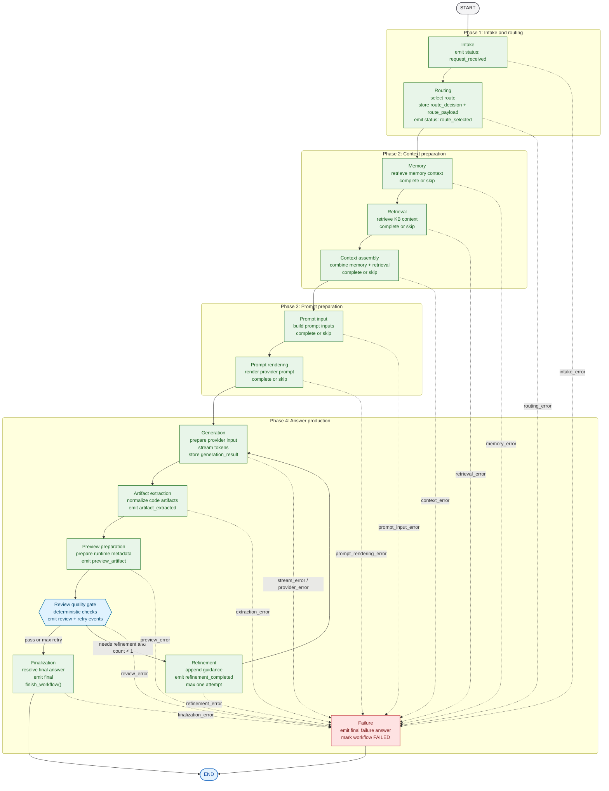
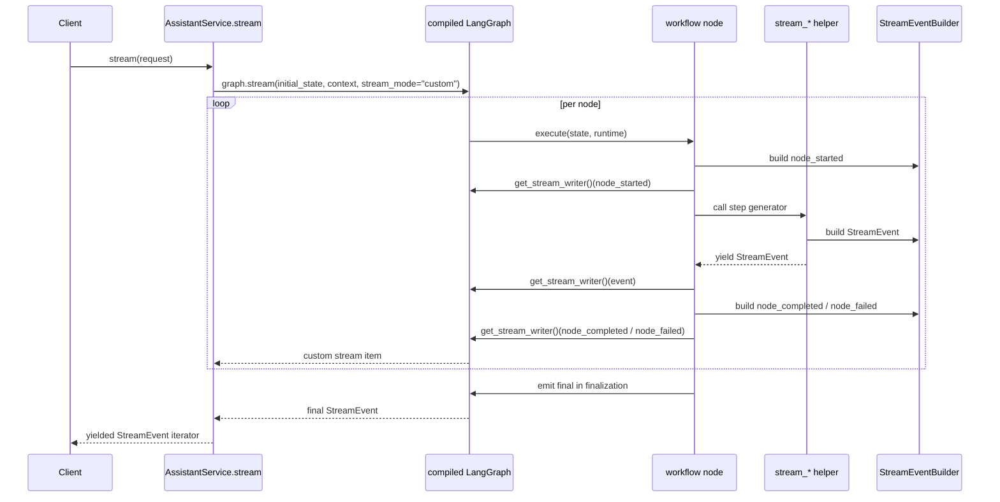
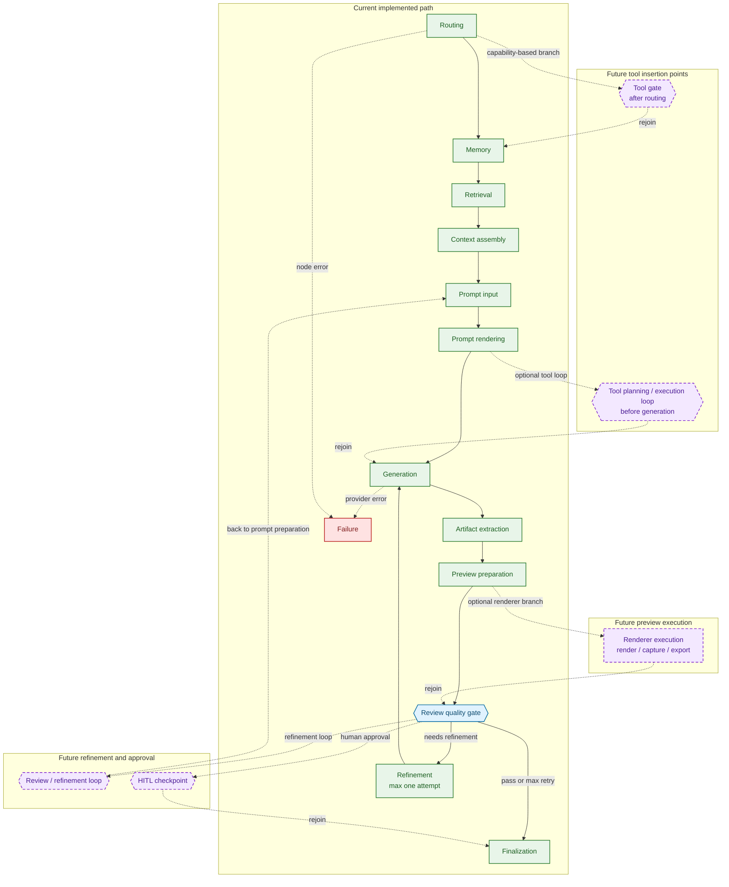

# Workflow Graph

This document describes the real LangGraph workflow currently executed by the backend. It is documentation for the implementation in:

- `src/creative_coding_assistant/orchestration/workflow_graph.py`
- `src/creative_coding_assistant/orchestration/workflow.py`
- `src/creative_coding_assistant/orchestration/service.py`
- `src/creative_coding_assistant/orchestration/events.py`
- `tests/test_langgraph_workflow_integration.py`

## Current Implemented Flow

The graph is compiled once in `AssistantService.__init__()` and executed through `graph.stream(..., stream_mode="custom")`. Control flow is linear through generation, workflow-owned artifact extraction, and preview preparation before `review`, where the graph applies a bounded quality gate. Passing outputs continue to `finalization`; failing outputs enter one `refinement` attempt and loop back to `generation`. Explicit provider failures and caught node errors route into a terminal `failure` node.

In the diagrams below:

- solid green nodes are implemented runtime nodes
- the blue diamond is the implemented conditional quality gate
- the red node is the implemented terminal failure path
- purple dashed nodes and edges are future-only extension points

The failure edges above remain real LangGraph transitions into the single terminal `failure` node. The labels document structured failure categories carried into that node and then surfaced by the workstation UI; they are not separate LangGraph nodes.

Frontend-only workstation errors are not LangGraph runtime nodes. Preview/renderer runtime errors render in the Preview shelf, artifact/export UI errors render in the Artifacts tab, persistence/session errors render near session controls, and HITL local approval errors render in the Workflow inspector.

The raw Mermaid source for the implemented graph is also available in [workflow_graph.mmd](/Users/k/Desktop/CC/the_turing_college/extra_projects/creative_coding_assistant/architecture/workflow_graph.mmd).

## Nodes And Transitions

`ASSISTANT_WORKFLOW_NODE_ORDER` is the source of truth for node ordering:

1. `intake`
2. `routing`
3. `memory`
4. `retrieval`
5. `context_assembly`
6. `prompt_input`
7. `prompt_rendering`
8. `generation`
9. `artifact_extraction`
10. `preview_preparation`
11. `review`
12. `refinement`
13. `finalization`
14. `failure`

Current transition rules:

- `START -> intake`
- Nodes point linearly from `intake` through `preview_preparation`, then into `review`
- `review -> finalization` when the review passes or the refinement limit is reached
- `review -> refinement` when the review fails and `refinement_count < 1`
- `refinement -> generation`, then through artifact extraction and preview preparation again
- Any node can route to `failure` when it records `pending_failure`
- `finalization -> END` on success
- `failure -> END`
- The only graph loop is the bounded `refinement -> generation -> artifact_extraction -> preview_preparation -> review` loop
- Completed and failed node events expose `transition_source`, `transition_target`, `decision_reason`, and an `edge` object with the same decision metadata

Node responsibilities:

- Every node emits `node_started`; completed or skipped nodes emit `node_completed`; failing nodes emit `node_failed` before routing to `failure`
- `intake`: marks `WorkflowStep.INTAKE` active, emits `status/request_received`, then completes the step
- `routing`: computes `RouteDecision`, emits `status/route_selected`, stores `route_decision` in workflow state and `route_payload` in graph state
- `memory`: calls the memory step generator and either stores `memory_context` or skips the step
- `retrieval`: calls the retrieval step generator and either stores `retrieval_context` or skips the step
- `context_assembly`: combines memory and retrieval context when a context assembler is configured
- `prompt_input`: builds prompt inputs when a prompt input builder is configured
- `prompt_rendering`: renders the final provider prompt when prompt inputs exist
- `generation`: prepares provider input, forwards generation stream events, and stores the transient `generation_result`
- `artifact_extraction`: detects generated code artifacts, normalizes workflow artifact metadata, stores `artifacts`, and emits `artifact_extracted`
- `preview_preparation`: prepares preview-ready runtime metadata for previewable artifacts, stores `preview_results`, and emits `preview_artifact`
- `review`: runs deterministic quality checks, stores `review_result`, emits `review_passed` or `review_failed`, and selects the next graph edge
- `review`: emits `refinement_requested` and `retry_started` when a failed review can enter the bounded retry loop; emits `retry_completed` after a retry resolves
- `refinement`: appends refinement guidance to the rendered prompt, emits `refinement_completed`, increments `refinement_count`, and sends control back to `generation`
- `finalization`: resolves the final answer from `generation_result.answer` or the shell fallback, emits the `final` event, and marks the workflow completed
- `failure`: emits a terminal failure answer, marks `WorkflowStatus.FAILED`, and closes the graph cleanly after explicit provider failures or caught node exceptions

## Workflow State Lifecycle

There are two layers of runtime state.

`AssistantWorkflowState` is the durable typed workflow state:

- Created by `begin_assistant_workflow(request)`
- Starts as `status=running`, `current_step=None`
- Moves one step at a time through `start_workflow_step()`
- Resolves each step through `complete_workflow_step()` or `skip_workflow_step()`
- Stores durable outputs such as `route_decision`, `memory_context`, `retrieval_context`, `assembled_context`, `prompt_input`, `rendered_prompt`, extracted `artifacts`, prepared `preview_results`, and `final_answer`
- Stores review metadata through `review_result` and `refinement_count`
- Stores typed failure metadata through `failure_info`
- Reaches terminal completion only through `finish_workflow()` while `FINALIZATION` is active
- Reaches terminal failure through `fail_workflow()` in the `failure` node

`AssistantWorkflowGraphState` is the LangGraph transport state:

- Always carries `workflow_state`
- Also carries `route_payload` for final event rendering
- Also carries `generation_result` as an ephemeral object needed by `finalization`
- Also carries `pending_failure` and `failure_event_emitted` while the graph is transitioning into the failure node
- Keeps the graph runtime small without forcing all transient objects into the Pydantic workflow model

Important current behavior:

- Optional steps skip when their gateway or input is missing
- `artifact_extraction` skips when generation produced no code artifact
- `preview_preparation` skips when no extracted artifact has a supported preview target
- `review` always runs and records a deterministic review result
- `refinement` runs at most once and only after a failed review
- Explicit provider errors bypass `review` and route directly to `failure`
- `generation_result` is not persisted into `AssistantWorkflowState`; only `final_answer` is
- Stream events emitted through graph nodes include workflow runtime metadata for the workstation inspector

## Stream Event Flow

The graph preserves the existing event protocol by reusing one `StreamEventBuilder` instance for the entire request.

What actually flows through the stream:

- Every executed graph node emits `node_started` followed by `node_completed`, or `node_failed` on caught failures
- `intake` emits `status`
- `routing` emits `status`
- `memory` emits `memory`
- `retrieval` emits `retrieval`
- `context_assembly` emits `context`
- `prompt_input` emits `prompt_input`
- `prompt_rendering` emits `prompt_rendered`
- `generation` emits `generation_input`, `token_delta`, and possibly `error`
- `artifact_extraction` emits `artifact_extracted` when code artifacts are detected
- `preview_preparation` emits `preview_artifact` when preview metadata is prepared
- `review` emits `review_passed` or `review_failed` with score, rationale, full review metadata, and edge decision metadata
- `review` emits `refinement_requested` and `retry_started` when it sends control to `refinement`
- `refinement` emits `refinement_completed` with retry reason/count before returning control to `generation`
- `review` emits `retry_completed` after a retry resolves or exhausts
- `finalization` emits `final` with the final answer plus structured `artifacts` and `preview_results`
- `failure` emits `final` and may emit `error` if the failing node did not already emit one

Important stream guarantees:

- Sequence numbers remain monotonic because the same `StreamEventBuilder` instance is shared across all nodes
- Only `StreamEvent` instances are surfaced from the graph stream; helper return values become state updates instead
- The final event is still emitted exactly once by `finalization`
- Legacy `status`, generation, artifact, preview, error, and `final` events remain present, with lifecycle truth events surrounding them
- Generation paths with runnable code now surface artifact and preview events before finalization

## Current Implemented Flow Vs Future Extension Points

Current implemented flow:

- Linear path through generation, artifact extraction, preview preparation, and `review`
- Conditional review edge
- Bounded one-attempt refinement loop
- Workflow-owned artifact extraction and preview metadata preparation
- Node lifecycle, review outcome, retry, refinement, and edge decision events
- Explicit failure node and failure transitions
- No tool nodes
- No renderer execution or preview capture inside the backend graph
- No HITL checkpoints

Future extension points can be added incrementally without replacing the current graph shape.

Conservative insertion points:

- Tools: the least disruptive gate is immediately after `routing`, because route capabilities already exist there; a richer tool loop can also sit between `prompt_rendering` and `generation`
- Review loops: the current `review` gate is the natural anchor for richer future retry loops back to `prompt_input` or `generation`
- Preview execution: renderer execution and capture can branch from `preview_preparation` and rejoin before `review` without changing the request/response contract
- HITL checkpoints: the safest first checkpoint is between `review` and `finalization`, where a human can approve, edit, or reject a nearly complete result

## Known Limits In The Current Runtime

- Route selection does not currently alter graph control flow
- `review` is deterministic and intentionally lightweight; it is not an LLM evaluator
- Preview preparation creates runtime metadata but does not execute renderers or capture frames
- Unexpected failures are normalized into the workflow only when a node catches them and records `pending_failure`
- Stream event types such as `tool_start`, `tool_result`, and `eval_update` exist in contracts but are not emitted by the current graph

## Validation Pointers

The current behavior described here is covered directly by:

- `tests/test_workflow_foundation.py`
- `tests/test_langgraph_workflow_integration.py`

Those tests currently verify:

- explicit step ordering
- state completion and skipped-step behavior
- compiled graph execution
- graph-owned artifact extraction and preview preparation events
- node lifecycle, review outcome, retry, refinement, and edge decision events
- terminal failure routing and failed workflow state
- stream ordering and legacy event compatibility
