# Runtime Workflow Graph

This document describes the compiled LangGraph executed by the Python backend.
It separates real request transitions from the repository's large inventory of
typed planning, advisory, and audit contracts. Those contracts can enrich state
or documentation, but their names do not make them runtime agents or graph
nodes.

The implementation sources are
[`runtime/graph_builder.py`](../src/creative_coding_assistant/orchestration/runtime/graph_builder.py),
[`runtime/nodes/registry.py`](../src/creative_coding_assistant/orchestration/runtime/nodes/registry.py),
[`runtime/nodes/transitions.py`](../src/creative_coding_assistant/orchestration/runtime/nodes/transitions.py),
and the grouped handlers under
[`runtime/nodes/`](../src/creative_coding_assistant/orchestration/runtime/nodes/).
The standalone [Mermaid source](workflow_graph.mmd) is the visual source of
truth for the route branches.

## What actually executes

Every request enters `intake`, then `routing`, then `memory`. The execution plan
published by routing controls later branches:

| Resolved route | Retrieval | Prompt preparation | After preview | Refinement budget |
|---|---|---|---|---:|
| Single Agent | Handler runs but records a skip | `prompt_input` goes directly to `prompt_rendering` | Goes directly to `finalization` | 0 |
| Multi Agent | Requests official-source retrieval when configured | Runs `planning`, `director`, and `reasoning` before `prompt_rendering` | Runs `artifact_critique` and `review` | At most 1 |
| Auto | Resolves to Single or Multi, then follows that route | Follows the resolved route | Follows the resolved route | Follows the resolved route |

Auto is a selector, not a third execution graph. Its Single condition requires
an Explain or Debug task with no official-document capability, no attachment,
and at most one domain. The default route map currently gives every task mode
official-document capability, so ordinary Auto requests currently resolve to
Multi. The client waits for and displays the backend's published resolution.

Multi Agent is a sequential multi-node runtime graph with planner, researcher,
generator, critic, and reviewer responsibilities. It is not a true multi-agent
swarm: planning, Director guidance, reasoning, critique, and review are typed
application logic, while only `generation` invokes the configured generation
provider. A retry re-enters `generation` after `refinement` and can happen once.

## Registered node order

`ASSISTANT_WORKFLOW_NODE_ORDER` is the source of truth for node ordering:

1. `intake`
2. `routing`
3. `memory`
4. `retrieval`
5. `context_assembly`
6. `prompt_input`
7. `planning`
8. `director`
9. `reasoning`
10. `prompt_rendering`
11. `generation`
12. `artifact_extraction`
13. `preview_preparation`
14. `artifact_critique`
15. `review`
16. `refinement`
17. `finalization`
18. `failure`

Current transition rules:

- Registry order is not a claim that every node runs for every request. The
  full ordered spine is
  `start --> intake --> routing --> memory --> retrieval --> context_assembly --> prompt_input --> planning --> director --> reasoning --> prompt_rendering --> generation`.
- After `prompt_input`, a clarification response goes to `finalization`, Single
  goes to `prompt_rendering`, and Multi goes to `planning`.
- `planning --> director --> reasoning --> prompt_rendering --> generation` is
  the Multi prompt-preparation path.
- `generation --> artifact_extraction --> preview_preparation` is common to
  successful generation.
- After preview preparation, Single goes to `finalization`; Multi goes to
  `artifact_critique --> review`.
- Review passes or an exhausted retry budget go to `finalization`. A permitted
  retry goes to `refinement --> generation`.
- A pending normalized failure at any conditional boundary goes to `failure`.
  `failure` emits the terminal failure response and ends the graph.

## Runtime and provider boundaries

```mermaid
flowchart LR
    ui["Next.js Creative Session"] --> api["Exact-path WSGI API"]
    api --> intake --> routing --> memory --> retrieval --> context_assembly --> prompt_input
    prompt_input -->|"Single"| prompt_rendering
    prompt_input -->|"Multi"| planning --> director --> reasoning --> prompt_rendering
    prompt_input -->|"clarification"| finalization
    prompt_rendering --> generation --> artifact_extraction --> preview_preparation
    preview_preparation -->|"Single"| finalization
    preview_preparation -->|"Multi"| artifact_critique --> review
    review -->|"pass or retry exhausted"| finalization
    review -->|"refine once"| refinement --> generation
    finalization --> terminal["final event"] --> ui
    failure --> failed["terminal failure event"] --> ui
    retrieval -. "query embeddings" .-> embeddings["OpenAI embeddings"]
    retrieval <--> chroma["local Chroma"]
    generation -. "configured-provider request payload" .-> responses["OpenAI Responses"]
```



The WSGI layer validates the request and streams newline-delimited JSON events. Retrieval
can send the query to the embeddings provider and reads selected chunks from
local Chroma. Generation constructs an OpenAI Responses payload from the
rendered prompt and validated image data; live receipt and image use remain
run-specific evidence. Extracted code stays in application state, preview
preparation publishes metadata, and the browser runs only a supported preview
adapter. SQLite session persistence is outside the graph; request-scoped image
bytes are deliberately removed from saved sessions.

## Runtime Graph Vs Internal Capability Graph

The runtime graph stays small. Dense internal dependencies are documented in:

- [creative_intelligence_graph.md](creative_intelligence_graph.md) and
  [creative_intelligence_graph.mmd](creative_intelligence_graph.mmd)
- [generative_design_graph.md](generative_design_graph.md) and
  [generative_design_graph.mmd](generative_design_graph.mmd)
- [artifact_intelligence_graph.md](artifact_intelligence_graph.md) and
  [artifact_intelligence_graph.mmd](artifact_intelligence_graph.mmd)
- [workstation_surface_graph.md](workstation_surface_graph.md) and
  [workstation_surface_graph.mmd](workstation_surface_graph.mmd)

Those helpers and views produce metadata, design guidance, artifact
intelligence, evaluation summaries, and contract summaries, plus workstation surface contracts.
They are not code generation execution and are not separate
LangGraph nodes. Their data may be derived inside an existing handler and, only
where the prompt renderer explicitly includes it, reach generation. Passive
registry metadata that is not selected by the prompt contract does not enter
provider prompts.

## Repository-only non-runtime contract inventory

The following sections exist to prevent an important architecture mistake: the
repository exposes many importable metadata contracts, but they do not enlarge
the real graph shown above. They do not imply autonomous routing, live
telemetry, local-model execution, human-intervention requests, or a true
multi-agent runtime.

<details>
<summary>Show typed contract families and their execution boundaries</summary>

## V4.1 Multi-Agent Core Contract Boundary

The Agent Contract Registry, Agent Memory Contract Registry, Agent Metadata Registry,
agent identity/role/boundary registries, and capability metadata
describe possible responsibilities. They do not instantiate or invoke agents,
change prompts, add graph nodes, or change output.

## V4.2 Agent Orchestration Metadata Boundary

The Agent Routing Registry, Blackboard Memory Registry, shared-context,
dependency, scheduling, coordination, debate, consensus, capability-alignment,
escalation-signal, lifecycle, state-synchronization, Workflow Agent Handoff
Registry, and Orchestration Contract Integration Registry are passive orchestration metadata.
They do not execute orchestration, mutate blackboard
state, add retries, or change LangGraph node ordering. Their registry records do
not enter provider prompts; in other words, they do not enter provider prompts.

Exact source label: `Workflow Agent Handoff Registry`.

## V4.3 Hybrid Agentic Workflow Metadata Boundary

This passive hybrid workflow metadata includes the V3 Backbone Mode Registry,
Conditional Multi-Agent Escalation Registry, Specialist Agent Loop Registry,
Escalation Gate Registry, Creative Escalation Policy Registry, Reflection
Escalation Registry, Hybrid Agent Debate Loop Registry, Hybrid Agent Voting
Registry, Agent Confidence Fusion Registry, Decision Provenance Registry,
Escalation Trace Registry, Creative Exploration Budget Registry, Result
Normalization Registry, Return-to-Workflow Handoff Registry, HITL Escalation
Gate Registry, Confidence Threshold Routing Registry, Cost Threshold Routing
Registry, Latency Threshold Routing Registry, Ambiguity Escalation Registry,
Risk Escalation Registry, Quality Escalation Registry, and Adaptive Multi-Agent
Escalation Registry. Hybrid Workflow Integration source coverage is descriptive
only. These contracts do not execute escalation, route providers, request human
input, or bypass failure normalization.

## V4.4 Hybrid Studio Metadata Boundary

This passive hybrid studio metadata includes the Local Model Registry, Cloud
Model Registry, Hybrid Execution Registry, Auto Mode Registry, Studio Mode
Registry, HITL Decision Registry, Provider Selection Registry, Execution
Simulator Registry, Model Profile Registry, Cost Profile Registry, Quality
Profile Registry, Local/Cloud Comparison Registry, Agent Workspace Registry,
Agent Conversation View Registry, Workspace Snapshot Registry, Session Replay
Registry, Execution Replay Registry, and Hybrid Studio Integration Registry.
Hybrid Studio Integration source coverage is metadata only. It does not
activate providers, select a local model, write replay storage, or request human
input; specifically, it does not activate Studio runtime.

Exact source labels: `Cloud Model Registry`; `Studio Mode Registry`;
`Execution Simulator Registry`; `Quality Profile Registry`; `Session Replay Registry`.

## V4.5 Multimodal Studio Metadata Boundary

This passive multimodal studio metadata includes the Live Preview Registry,
Multi Preview Registry, Interactive Canvas Registry, Visual Workspace Registry,
Runtime Collaboration Registry, Artifact Collaboration Registry, Artifact
Provenance Registry, Artifact Lineage Registry, Cross-Agent Workspace Registry,
Shared Artifact Board Registry, Workspace History Registry, Branching Timeline
Registry, Creative Evolution Timeline Registry, Real-Time Workflow Visualization
Registry, and Multimodal Studio Integration Registry. Multimodal Studio Integration source coverage
is descriptive only. It does not execute rendering,
open network connections, persist collaboration state, or mutate artifacts.

Exact source labels: `Artifact Provenance Registry`; `Branching Timeline Registry`;
`Real-Time Workflow Visualization Registry`.

## V4.6 Agentic Studio Hardening Metadata Boundary

This passive hardening and audit metadata includes the Agent Contract Audit
Registry, Escalation Policy Audit Registry, Hybrid Workflow Audit Registry,
Agent Registry Audit Registry, Blackboard Audit Registry, Shared Context Audit
Registry, Agent Collaboration Audit Registry, Creative Diversity Audit Registry,
Agent Explainability Audit Registry, Agent Reliability Audit Registry, Agent
Determinism Audit Registry, Agent Telemetry Foundation Registry, Agent Cost
Tracking Foundation Registry, Agent Performance Tracking Foundation Registry,
Architecture Consistency Pass Registry, Final V4 Hardening Registry, and
LangGraph Error Path Audit. These contracts do not execute hardening checks,
emit telemetry, activate passive registries, or bypass failure normalization.

Exact source labels: `Agent Contract Audit Registry`; `Shared Context Audit Registry`;
`Agent Determinism Audit Registry`; `Agent Cost Tracking Foundation Registry`.

## V5.2 Intelligent Model Routing Metadata Boundary

The advisory model-routing metadata covers Model Router, Local vs Cloud Routing,
Hybrid Routing, Quality/Cost Optimizer, Cost Estimator, Budget Policies, HITL
Budget Gate, Runtime Recommendation Engine, Execution Policy Engine, Model
Recommendation Engine, Model Capability Matrix, Provider Capability Matrix,
Quality Prediction Engine, Cost Prediction Engine, Creative Quality Predictor,
Creative Diversity Predictor, Creative Consistency Predictor, and Routing
Explainability. These surfaces do not apply routing, enforce budgets, execute
providers, or switch the configured adapter: there is no provider/model
switching.

The operational boundary is **no provider/model switching**. Exact source labels:
`HITL Budget Gate`; `Model Recommendation Engine`; `Routing Explainability`.

## V5.4 Production Observability Metadata Boundary

The read-only production observability metadata covers Token Dashboard, Cost
Dashboard, Quality Dashboard, Performance Dashboard, Production Telemetry,
Workflow Diagnostics, Agent Diagnostics, Routing Diagnostics, Escalation
Diagnostics, Failure Analysis, Error Intelligence, Workflow Health Monitoring,
System Health Monitoring, Creative Analytics, Confidence Analytics, Creative
Diversity Analytics, Runtime Timeline, Workflow Explainability Dashboard,
Production Observability Architecture Consistency, and Production Observability
Failure Path Audit. These surfaces do not collect or emit live telemetry,
control workflows, remediate failures, or persist monitoring data.

Exact source labels: `Cost Dashboard`; `Escalation Diagnostics`;
`Creative Diversity Analytics`; `Production Observability Failure Path Audit`.

## V5.5 Adaptive Execution Intelligence Metadata Boundary

The controlled adaptive execution policy/simulation surfaces cover Adaptive
Hybrid Workflow Optimizer, Adaptive Escalation Optimizer, Agent Activation
Optimizer, Adaptive Cost/Quality Optimizer, Adaptive Latency Optimizer, Adaptive
Execution Strategy Selection, Adaptive Execution Policy Engine, Dynamic Agent
Allocation, Dynamic Resource Allocation, Workflow Self-Tuning Policies,
Execution Confidence Engine, Workflow Risk Engine, Creative Exploration
Optimizer, Emergence Optimizer, Agent Diversity Optimizer, Reflection Budget
Optimizer, Adaptive Policy Explainability, Adaptive Execution Architecture
Consistency, and Adaptive Execution Failure Path Audit. These contracts do not
execute providers, allocate resources, apply routing, mutate the graph, or
trigger retries beyond the one compiled review loop.

Exact source labels: `Adaptive Hybrid Workflow Optimizer`; `Agent Activation Optimizer`;
`Adaptive Execution Strategy Selection`; `Dynamic Agent Allocation`;
`Creative Exploration Optimizer`; `Reflection Budget Optimizer`;
`Adaptive Execution Architecture Consistency`.

</details>

## Reviewer verification

Run the focused alignment test and inspect the Mermaid source:

```bash
.venv/bin/python -m pytest -q tests/test_workflow_documentation_alignment.py
.venv/bin/python scripts/v7_quality_gates.py docs-mermaid
```

Then submit one Single and one Multi request and compare the streamed node lists.
For Auto, verify the published resolved mode rather than predicting it in the
client. See the [Architecture Walkthrough](../docs/ARCHITECTURE_WALKTHROUGH.md)
for the full UI-to-provider request path.
