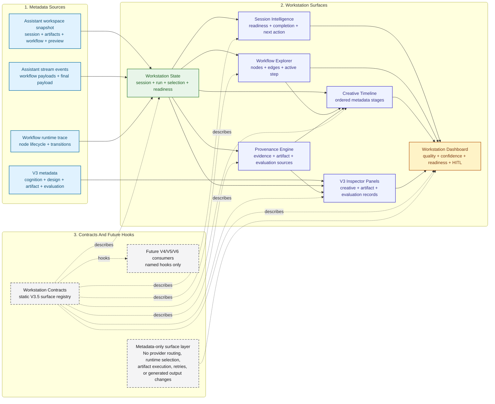

# Workstation Surface Graph

This document describes the V3.5 Creative Workstation surface layer. The
workstation turns existing workflow, artifact, evaluation, provenance, and
session metadata into inspectable product surfaces without changing backend
generation behavior. V3.6 keeps the same surface list and stabilizes the
documentation, stream hydration, and backend bridge boundaries around it.

It is the Experience Layer companion to:

- [workflow_graph.md](workflow_graph.md) and
  [workflow_graph.mmd](workflow_graph.mmd), which document the real LangGraph
  runtime graph
- [creative_intelligence_graph.md](creative_intelligence_graph.md) and
  [creative_intelligence_graph.mmd](creative_intelligence_graph.mmd), which
  document the readable internal capability pipeline
- [generative_design_graph.md](generative_design_graph.md) and
  [generative_design_graph.mmd](generative_design_graph.mmd), which document
  the V3.2 design dependency graph
- [artifact_intelligence_graph.md](artifact_intelligence_graph.md) and
  [artifact_intelligence_graph.mmd](artifact_intelligence_graph.mmd), which
  document the V3.3 artifact dependency graph and engine contracts
- [engine_matrix.md](engine_matrix.md), which places the workstation in the
  cross-cutting engine view

## Scope And Boundary

- V3.5 Creative Workstation is a metadata projection and inspection layer.
- The source inputs are the assistant workspace snapshot, stream events,
  workflow runtime trace, and already-produced V3 metadata.
- Workstation surfaces are client-side product views over existing metadata;
  they are not backend LangGraph nodes.
- Workstation contracts describe stable surface inputs, exposed metadata,
  exposed signals, missing-metadata behavior, and future V4/V5/V6 hooks.
- The workstation does not add provider routing, runtime selection, execution
  optimization, artifact execution, artifact modification, autonomous retries,
  preview execution, or generated output changes.
- V3.6 stabilization keeps the workstation as an inspection layer over existing
  stream and workspace metadata.

The raw Mermaid source for this diagram is available in
[workstation_surface_graph.mmd](workstation_surface_graph.mmd).

## Surface Responsibilities

- `Workstation State`: reads the workspace snapshot, stream status, runtime
  trace, and selection state. It exposes session, current run, selection, panel,
  readiness, and metadata status as the shared state model for all workstation
  views.
- `Session Intelligence`: reads workstation state and optional session stream
  metadata. It exposes readiness, completion status, warnings, and recommended
  operator actions as session-level operator context.
- `Workflow Explorer`: reads workstation state, workflow runtime trace, and the
  workflow snapshot. It exposes nodes, edges, active step, progress, and runtime
  status as an inspectable workflow map.
- `Provenance Engine`: reads workstation state, artifact metadata, evaluation
  metadata, and final payload metadata. It exposes evidence, dependency,
  artifact, evaluation, and missing-source provenance for generated outputs and
  evaluations.
- `Creative Timeline`: reads workstation state, workflow explorer, provenance,
  and V3 metadata. It exposes ordered request, planning, retrieval, creative,
  artifact, evaluation, and final stages as a chronological explanation of
  request evolution.
- `V3 Inspector Panels`: reads workstation state, provenance, and V3 metadata
  groups. It exposes creative intelligence, generative design, artifact
  intelligence, evaluation, and provenance panels for dense metadata inspection.
- `Workstation Dashboard`: reads workstation state, workflow runtime, inspector
  panels, and artifact snapshot. It exposes quality, confidence, consistency,
  artifact readiness, runtime fit, evaluation, workflow health, and HITL cards
  as a compact operator summary.

## Contract Surface

The workstation contract registry is exposed as
`workstation_engine_contract_registry.v1`. It describes these seven surfaces
with stable IDs:

1. `workstation_state`
2. `session_intelligence`
3. `workflow_explorer`
4. `provenance_engine`
5. `creative_timeline`
6. `v3_inspector_panels`
7. `workstation_dashboard`

Each contract describes:

- required and optional metadata inputs
- exposed metadata and exposed signals
- stability signals and missing-metadata behavior
- estimated local cost and latency metadata
- named hooks for V4 Agentic Studio, V5 controlled adaptive execution policy
  metadata, and V6 Creative Evolution

The named hooks are contract metadata only. They do not create agents, apply
adaptive execution policy, run learning loops, or introduce autonomous
workflow behavior.

## Runtime Relationship

The workstation reads from the stream and workspace snapshot after the backend
workflow emits metadata. It does not alter the LangGraph node order, review
gate, refinement limit, finalization path, failure path, or provider prompt
rendering path. The runtime graph remains the source of truth for execution;
the workstation graph is the source of truth for how existing metadata becomes
inspectable in the product.
