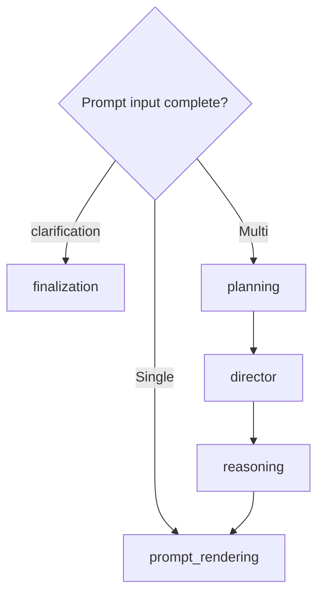

# Architecture Walkthrough

This walkthrough follows one submitted request through the current product. It
distinguishes executable runtime behavior from typed planning metadata, browser
presentation, and separate offline evaluation evidence.

## 1. The browser creates a bounded request

The Next.js workstation collects:

- the user query;
- one task mode: Generate, Explain, Debug, Design, Review, or Preview;
- zero or more selected creative domains;
- one workflow choice: Auto, Single Agent, or Multi Agent;
- bounded creativity controls and explicit local preference signals;
- optional selected-artifact refinement context;
- up to four validated image references.

An image is read into a browser data URL only after its MIME type, size, and
signature pass. The browser does not inspect pixels semantically. On explicit
submission, the request serializer revalidates the queued attachments and sends
them with the prompt. The session snapshot path removes request-scoped image
bytes rather than restoring them later.

The client posts JSON to `/api/assistant/stream` and reads one JSON object per
newline. Stream events, not UI inference, are the authority for the route,
node transitions, provider state, artifacts, previews, and terminal outcome.

Source: [workstation shell](../clients/nextjs/src/components/workstation-shell.tsx),
[multimodal request serializer](../clients/nextjs/src/lib/multimodal-attachments.ts),
and [stream client](../clients/nextjs/src/lib/assistant-stream.ts).

## 2. WSGI validates before composing the service

The exact-path WSGI application:

1. accepts `POST` or CORS `OPTIONS` at `/api/assistant/stream`;
2. limits the body to 8 MiB;
3. rejects malformed JSON, unknown request fields, invalid enums, unsafe file
   names, mismatched image metadata, and unsupported image signatures;
4. applies the public request-safety boundary;
5. lazily composes the assistant service;
6. serializes each typed `StreamEvent` to NDJSON.

A top-level exception becomes a recoverable stream error rather than an HTML
error page or fabricated final answer. Contract-version and request-ID headers
make the browser/API boundary inspectable.

Source: [streaming API](../src/creative_coding_assistant/api/streaming.py) and
[backend dispatcher](../src/creative_coding_assistant/api/dev_server.py).

## 3. Composition wires local state and external adapters

`build_assistant_service()` loads settings and creates a persistent Chroma
client. It wires:

- Chroma conversation, summary, and project-memory repositories;
- an OpenAI query embedder when embedding credentials exist;
- a Chroma official-doc retriever when the embedder exists;
- context assembly, structured prompt input, and Jinja prompt rendering;
- a provider-neutral generation gateway and the OpenAI generation provider;
- a local live-session evaluation recorder;
- a conversation-memory recorder only when OpenAI embeddings are configured;
- optional LangSmith observability.

There is no dynamic service discovery. OpenAI is the only supported
`GenerationProviderName`; missing credentials remain a runtime readiness or
provider failure instead of causing an unannounced provider fallback.

Source: [service bootstrap](../src/creative_coding_assistant/app/bootstrap.py),
[provider factory](../src/creative_coding_assistant/llm/factory.py), and
[settings](../src/creative_coding_assistant/core/config.py).

## 4. Intake and routing publish the execution plan

The compiled LangGraph starts at `intake`. Intake emits request metadata,
including only image names/types/sizes—not image data URLs—and marks the node
complete. `routing` then:

1. maps the task mode to a route and capability set;
2. resolves explicit or inferred domains;
3. resolves Single Agent or Multi Agent execution;
4. emits `route_selected` with requested mode, resolved mode, rationale, roles,
   research decision, and maximum refinement loops.

### Explicit Single Agent

The plan publishes only the `generator` role, `researcher_required=false`, and
zero refinement loops.

### Explicit Multi Agent

The plan publishes `planner`, `researcher`, `generator`, `critic`, and
`reviewer`, requires bounded retrieval, and allows at most one refinement loop.
Those are application responsibilities, not five independent provider clients.

### Auto

The resolver contains a narrow Single condition: Explain or Debug, no
`official_docs` capability, no attachment, and at most one domain. The current
default route map includes `official_docs` for every task mode, so ordinary
requests using the default router currently resolve Auto to Multi Agent. The UI
still waits for and displays the published resolution; it does not hard-code
that outcome, so a future or injected route decision without that capability
can truthfully resolve to Single.

Source: [routing](../src/creative_coding_assistant/orchestration/runtime/routing.py)
and [execution-plan resolver](../src/creative_coding_assistant/orchestration/runtime/execution.py).

## 5. Memory and retrieval are separate

### Memory

When the route publishes `memory_context` and request IDs exist, the memory
adapter reads recent conversation turns, the latest running summary, and
project-memory records from separate local Chroma collections. It does not
perform an external model call during this read.

### Retrieval

Single Agent explicitly skips the retrieval node with
`single_agent_researcher_not_selected`.

Multi Agent attempts request-scoped retrieval when the service has an embedder
and retrieval gateway. The request query is embedded with OpenAI, local Chroma
returns candidate official-document chunks, and bounded ranking/post-processing
preserves domain and source diversity. The response includes excerpts,
provenance, original and adjusted scores, ranks, and selection reasons.

If the retrieval gateway raises, the service emits a recoverable retrieval
error and uses an empty retrieval context. If credentials or a gateway are
absent, the node is explicitly skipped. Neither path invents a source.

Registration, indexing, selection, prompt inclusion, answer attribution, and
evaluation are six different states; the product should never collapse them
into one “grounded” badge.

Source: [retrieval node](../src/creative_coding_assistant/orchestration/runtime/nodes/retrieval.py),
[retrieval adapter](../src/creative_coding_assistant/orchestration/runtime/retrieval.py),
and [Chroma search](../src/creative_coding_assistant/rag/retrieval/search.py).

## 6. Context becomes provider-neutral prompt input

Context assembly combines available memory and retrieval without mutating the
underlying stores. The structured input builder then derives:

- user intent and domain translation;
- memory and retrieval sections;
- clarification requirements;
- artifact and runtime constraints;
- request-scoped image metadata for prompt context.

Untrusted retrieved or remembered text is isolated as reference material.
Stream summaries expose counts and provenance rather than dumping private
context into logs.

If clarification is required, the graph branches directly from `prompt_input`
to `finalization`; it does not call the generation provider.

Source: [context node](../src/creative_coding_assistant/orchestration/runtime/nodes/context.py),
[prompt input contracts](../src/creative_coding_assistant/orchestration/runtime/prompt_inputs.py),
and [security guardrails](../src/creative_coding_assistant/security/guardrails.py).

## 7. The routes diverge before prompt rendering

Single Agent skips `planning`, `director`, and `reasoning`.

Multi Agent runs those three stages. Planning derives a large set of typed
creative, runtime, and artifact contracts from the request and assembled
context. Director synthesizes priorities and constraints; reasoning synthesizes
an implementation-facing result. These are deterministic Python transformations
and event payloads—not additional OpenAI calls and not visible chain-of-thought.

Jinja rendering turns the selected sections into provider-neutral messages.
The stream emits only redacted summaries of these inputs.

Source: [planning node](../src/creative_coding_assistant/orchestration/runtime/nodes/planning_node.py),
[Director](../src/creative_coding_assistant/orchestration/runtime/nodes/director.py),
[reasoning](../src/creative_coding_assistant/orchestration/runtime/nodes/reasoning.py),
and [prompt rendering](../src/creative_coding_assistant/orchestration/runtime/nodes/generation.py).

## 8. One adapter crosses the generation boundary

`LlmGenerationAdapter` converts rendered sections into a `GenerationInput`.
For every submitted image that still passes the backend contract, it includes a
redacted `GenerationImageInput`. The OpenAI adapter converts the one user
message into ordered Responses content:

1. `input_text` for the user prompt;
2. one `input_image` data URL per submitted image.

Other system, memory, and retrieval messages remain text inputs. Generation
controls are forwarded through the provider-neutral contract. The OpenAI
Responses stream becomes token-delta events followed by completion metadata;
provider, model, response ID, token usage, finish reason, duration, and static
cost-reference metadata can be published without exposing credentials.

An OpenAI error becomes a typed provider error and terminal workflow failure.
There is no silent local answer substituted for a failed live provider call.

Source: [generation contracts](../src/creative_coding_assistant/llm/generation.py),
[OpenAI adapter](../src/creative_coding_assistant/llm/openai_adapter.py), and
[assistant service](../src/creative_coding_assistant/orchestration/runtime/service.py).

## 9. Artifacts and preview evidence are different layers

The backend extracts typed artifacts from the generated answer. It then
prepares preview requests/results based on artifact type, domain, language,
runtime hints, and the canonical domain contract. This is metadata preparation;
the Python process does not execute browser creative code.

The final stream event hydrates the artifact and preview contracts into the
Next.js workspace. The frontend classifies the source again, selects a supported
renderer, validates bounded source patterns, and runs accepted source in a
controlled preview frame. The canonical public live-preview domains are:

- p5.js global-mode JavaScript;
- self-contained Three.js JavaScript;
- a bounded WebGL fragment-shader subset;
- parsed bounded Tone.js programs with explicit user-started audio.

React Three Fiber and Hydra remain code/export under the canonical domain
contract even though source-analysis adapters exist. External tools remain
handoffs. A prepared preview manifest, a renderer match, and visible successful
execution are not interchangeable evidence.

Source: [artifact nodes](../src/creative_coding_assistant/orchestration/runtime/nodes/artifacts.py),
[domain contracts](../src/creative_coding_assistant/domains/experience.py), and
[browser renderer routing](../clients/nextjs/src/lib/preview-renderers.ts).

## 10. Multi Agent can critique and retry once

After preview preparation:

- Single Agent branches directly to finalization.
- Multi Agent runs deterministic artifact critique and workflow review.

The critic scores inspectable artifact properties and publishes recommendations.
The reviewer checks required deliverables and bounded quality findings. A pass
branches to finalization. A refinement request appends explicit guidance to the
rendered prompt, increments the refinement count, and returns to `generation`.
The loop then repeats generation, extraction, preview preparation, critique,
and review once. If the required deliverable is still absent, the workflow
publishes a terminal failure instead of looping indefinitely.

Source: [artifact critique](../src/creative_coding_assistant/orchestration/runtime/nodes/artifacts.py),
[review](../src/creative_coding_assistant/orchestration/runtime/nodes/review.py),
[refinement](../src/creative_coding_assistant/orchestration/runtime/nodes/refinement.py),
and [transitions](../src/creative_coding_assistant/orchestration/runtime/nodes/transitions.py).

## 11. Finalization publishes evidence, not an evaluator score

Finalization selects the provider answer, clarification response, or bounded
service-shell answer. It derives deterministic self-evaluation, improvement,
confidence, score, consistency, and report metadata and emits one final event
containing:

- answer and route/execution payload;
- workflow status, completed/skipped steps, and decisions;
- artifacts, critiques, preview contracts, and typed planning payloads;
- provider/usage telemetry when the provider returned it;
- optional safe observability lineage.

These in-workflow self-evaluation structures are application diagnostics. They
are not RAGAS, human artistic assessment, browser execution proof, or an
official Capstone grade.

Any node exception can branch to `failure`. The failure node emits a typed
error and a final failure answer so the stream remains terminal and reviewable.

## 12. Recording occurs after the stream

In a `finally` block, the service can:

- append a local live-session evaluation row;
- record successful user/assistant turns into Chroma.

Conversation recording is skipped for errored streams, missing conversation
IDs, empty answers, or missing embedding configuration. When it runs, the user
query and assistant answer cross the OpenAI embedding boundary, then both text
and vectors are stored locally. Recording failures are logged but do not change
the already-streamed product outcome.

Workspace session saving is a separate browser-to-SQLite API lifecycle; it is
not the same as LangGraph memory.

## 13. Evaluation is outside the request graph

The Dashboard evaluation endpoint accepts the committed current-product public
benchmark and reviewed synthetic/redacted public datasets. Dry-run is the
default. A live RAGAS run requires both explicit `allowProviderCalls` and
provider credentials, writes private diagnostics locally, and publishes only
the sanitized evidence contract.

The canonical retrieval report is another separate path: it runs seven fixed
queries through the local retriever, records ranked non-text lineage and
fingerprints, and does not generate answers or compute RAGAS. The current
seven-case RAGAS evidence generates and evaluates answers; the 35-case catalog
is contract coverage, while Full records three additional local snapshot lanes.
Keep those lanes separate when presenting results.

## Runtime truth table

| Question | Answer |
|---|---|
| Does Single Agent retrieve official docs? | No; the researcher/retrieval node is explicitly skipped |
| Does Multi Agent make five parallel LLM calls? | No; it exposes five sequential responsibilities around one generation adapter |
| Can Multi Agent call generation twice? | Yes, only when deterministic review requests its one allowed refinement |
| Does Auto currently choose Single for normal default-router requests? | No; all current task modes publish `official_docs`, so the narrow Single condition is not met |
| Does the Python backend run the creative preview? | No; it prepares contracts and the Next.js browser runs accepted source |
| Is workflow self-evaluation the same as RAGAS? | No |
| Does “registered source” mean “used in this answer”? | No |
| Are images persisted as session attachments? | No; they are request-scoped, though an explicit pre-submit export needs separate review |

Continue with the [System Overview](SYSTEM_OVERVIEW.md),
[Capability Matrix](CAPABILITY_MATRIX.md), and
[standalone runtime graph](../architecture/workflow_graph.md).
