# System Overview

Creative Coding Assistant is a local-first, two-process application: a Next.js
workstation presents the product, and a Python WSGI service owns validation,
orchestration, retrieval, generation, evaluation actions, and persistence APIs.
The normal runtime is deliberately bounded: the browser never calls a model
directly, the backend exposes a fixed route set, and external calls occur only
through explicit provider, embedding, source-sync, evaluation, or optional
tracing adapters.

## System context

### Purpose

This is the primary reviewer-facing map of the current V9 product. It shows the
browser workspace, Python boundary, compiled request workflow, local stores,
provider calls, preview runtime, evaluation path, and evidence surfaces without
expanding every internal node.

```mermaid
flowchart TB
    classDef client fill:#E0F2FE,stroke:#0369A1,color:#0C4A6E,stroke-width:1.5px
    classDef runtime fill:#E8F5E9,stroke:#2E7D32,color:#1B5E20,stroke-width:1.5px
    classDef store fill:#FEF3C7,stroke:#A16207,color:#713F12,stroke-width:1.5px
    classDef external fill:#FFF7ED,stroke:#C2410C,color:#7C2D12,stroke-width:1.5px
    classDef evidence fill:#EDE9FE,stroke:#6D28D9,color:#4C1D95,stroke-width:1.5px

    user["Creative coder / reviewer"]:::client

    subgraph request["Next.js workspace — request"]
        direction LR
        composer["Creative Session<br/>prompt · mode · attachments"]:::client
    end

    subgraph backend["Python API and orchestration"]
        direction TB
        api["Exact-path WSGI API"]:::runtime
        workflow["Compiled LangGraph"]:::runtime
        artifact["Artifact + preview contracts"]:::runtime
        services["Session + KB APIs"]:::runtime
        evaluation["Evaluation + RAGAS pipeline"]:::runtime

        api --> workflow --> artifact
        api --> services
        api --> evaluation
    end

    subgraph result["Next.js workspace — finalized result"]
        direction LR
        hydrate["Hydrated answer + artifacts"]:::client
        preview["Controlled preview"]:::client
        surfaces["Dashboard + Inspector"]:::evidence

        hydrate --> preview --> surfaces
        hydrate --> surfaces
    end

    subgraph state["Local state — separate persistence boundaries"]
        direction LR
        official_chroma[("Chroma<br/>official docs")]:::store
        memory_chroma[("Chroma<br/>memory collections")]:::store
        sqlite[("SQLite<br/>workspace sessions")]:::store
        browser_cache[("localStorage<br/>workspace fallback")]:::store
        artifact_files[("Files<br/>artifacts")]:::store
        eval_files[("JSON / JSONL<br/>eval evidence")]:::store

        official_chroma ~~~ memory_chroma ~~~ sqlite ~~~ browser_cache ~~~ artifact_files ~~~ eval_files
    end

    subgraph providers["Explicit external boundaries"]
        direction LR
        openai["OpenAI<br/>Responses + embeddings"]:::external
        official["Approved official URLs"]:::external
        langsmith["LangSmith<br/>optional trace metadata"]:::external

        openai ~~~ official ~~~ langsmith
    end

    user --> composer
    composer -->|"JSON request"| api
    api -->|"NDJSON event stream"| hydrate

    workflow -. "retrieval" .-> official_chroma
    workflow -. "memory" .-> memory_chroma
    services -.-> official_chroma
    services -.-> sqlite
    hydrate -. "session JSON API" .-> api
    hydrate -.-> browser_cache
    hydrate -. "browser export" .-> artifact_files
    evaluation -.-> eval_files

    workflow --> openai
    services --> openai
    services --> official
    evaluation --> openai
    workflow -. "when enabled" .-> langsmith

    eval_files ~~~ openai
```

### What the reviewer should notice

- The browser uses the local HTTP API; it never calls a model or embedding
  provider directly.
- The request graph, KB/evaluation actions, browser preview, and workspace
  persistence are related product paths with different owners.
- Dashboard and Inspector project published run, preview, persistence, and
  evaluation evidence; they are not additional workflow agents.

Blue nodes are browser surfaces, green nodes are backend runtime boundaries,
yellow cylinders are local stores, orange nodes are external systems, and
purple nodes are evidence projections. Solid arrows show calls or data flow;
the dashed LangSmith edge is optional.

### Truth boundary

The backend prepares artifact and preview contracts, but executable preview
source runs later inside the controlled browser surface. Browser runtime
telemetry is post-final, remains local to the workspace, and does not feed
backend critique or review. Evaluation uses a separate API pipeline and is not
a hidden LangGraph node. OpenAI is the only configured generation-provider
route, and generation is the only graph stage that invokes its text API.

### Deeper documentation

- [Architecture Diagram Guide](../architecture/README.md)
- [End-to-End Product Workflow](../architecture/end_to_end_product_workflow.md)
- [Exact Runtime Routes](../architecture/workflow_graph.md)
- [Artifact and Preview Runtime](../architecture/artifact_preview_runtime.md)
- [Evaluation / RAGAS Workflow](../architecture/evaluation_workflow.md)

## Component responsibilities

| Component | Owns | Does not own |
|---|---|---|
| Next.js workstation | Composer, Dashboard, Inspector, sessions UI, artifact source, exports, preview controls, fullscreen, Demo Mode | Model credentials, retrieval ranking, workflow decisions |
| WSGI API | HTTP validation, CORS, contract versions, fixed dispatch, NDJSON serialization | A generic web framework router or arbitrary plugin endpoints |
| `AssistantService` | Dependency composition, stream lifecycle, provider adapter, eval and memory recording boundaries | Browser rendering |
| LangGraph | Node state, conditional transitions, up to two executable refinement attempts, terminal failure normalization | Parallel agent workers or dynamic tool installation; the published execution-plan maximum still says one |
| Chroma | Official-document vectors and separate memory collections | Workspace layout/session snapshot storage |
| SQLite session store | Workstation snapshots and session lifecycle | Model memory retrieval or official-source embeddings |
| OpenAI adapters | Generation and embeddings behind provider-neutral contracts | Automatic provider switching; OpenAI is the only implemented provider factory route |
| Preview runtime | Executes source that passes the current browser contract | General HTML, React Three Fiber, remote modules, or external DCC execution |
| Evaluation action | Current-product public benchmark or explicitly authorized RAGAS over another reviewed committed dataset | Scoring raw private local sessions by default; treating the 35-contract catalog as 35 executions |

The canonical source locations are the
[Next.js page](../clients/nextjs/src/app/page.tsx),
[WSGI dispatcher](../src/creative_coding_assistant/api/dev_server.py),
[service composition](../src/creative_coding_assistant/app/bootstrap.py),
[runtime graph builder](../src/creative_coding_assistant/orchestration/runtime/graph_builder.py),
and [workflow node registry](../src/creative_coding_assistant/orchestration/runtime/nodes/registry.py).

## Browser product surface

The root Next.js page loads a workspace snapshot and renders one workstation
shell. That shell coordinates:

- prompt, domain, mode, workflow, generation-control, and image-reference input;
- streamed run state and recoverable subsystem errors;
- generated answer, artifact registry, code inspection, refinement, comparison,
  and export;
- controlled p5.js, Three.js, GLSL, and Tone.js preview routes;
- Dashboard and compact Inspector projections of the same published state;
- SQLite-backed session create, rename, restore, update, and delete operations,
  with a browser storage fallback;
- curated Demo Mode prompts that still use the normal request path.

The Dashboard's knowledge inventory is not inferred from one retrieval result.
The domain API returns registered-source metadata and read-only local Chroma
counts separately. Likewise, a preview card is not proof that source executed:
the renderer route, runtime status, visible output, and errors remain distinct.

## HTTP boundary

The development server uses `wsgiref`; the production entrypoint is WSGI for a
compatible server such as Gunicorn. It is not a FastAPI or ASGI application.
The dispatcher matches exact paths:

| Path | Methods | Purpose |
|---|---|---|
| `/api/assistant/stream` | `POST`, `OPTIONS` | Validate one assistant request and return newline-delimited stream events |
| `/api/workspace/session` | `GET`, `POST`, `PUT`, `DELETE`, `OPTIONS` | List, restore, create/update, and delete local workspace sessions |
| `/api/domain-experience` | `GET`, `OPTIONS` | Public-safe domain delivery contracts and read-only KB inventory |
| `/api/evaluation/run` | `GET`, `POST`, `OPTIONS` | Queue selected current-product RAG cases, prepare/authorize an approved-dataset evaluation, or poll a queued run by ID |
| `/api/knowledge-base` | `GET`, `POST`, `OPTIONS` | Inventory, check, validate, update, or rebuild selected official sources |
| `/api/health` | `GET`, `OPTIONS` | General service and configuration status |
| `/api/health/live` | `GET`, `OPTIONS` | Process liveness |
| `/api/health/ready` | `GET`, `OPTIONS` | Dependency and configuration readiness |

The stream request is capped at 8 MiB. It forbids unknown top-level fields and
validates the query, domain alignment, workflow mode, controls, artifact
refinement, and attachments. Each image reference is limited to 1 MiB; at most
four are accepted; PNG, JPEG, WebP, and GIF MIME declarations must match the
decoded file signature.

## Assistant runtime

The graph has a shared front half and two real execution routes. Every request
passes intake, routing, memory, retrieval, context assembly, and prompt input;
Single records retrieval as an explicit skip, while Multi consumes its
retrieval result before deterministic planning, Director, and reasoning stages.
Both routes render the prompt and reach the configured text provider only at
generation.

Auto selects Single exactly when the resolved task route is Explain or Debug,
the request has no attachment, and routing resolved no domains. Every other
Auto request selects Multi. The resolved selection is published in the stream
payload so the UI does not guess it.

Multi Agent is sequential. Its published responsibilities are planner,
researcher, generator, critic, and reviewer, but planning, Director, reasoning,
artifact critique, review, and final self-evaluation are typed deterministic
application logic. For non-Explain output, Single finalizes after artifact and
preview-metadata preparation; Multi adds critique and review. An Explain route
goes from generation directly to finalization, bypassing artifact extraction,
preview preparation, critique, and review.

The executable review logic permits up to two refinement attempts, for at most
three generation passes including the initial pass, and may stop earlier. The
published `execution.max_refinement_loops` field still reports one; this is a
known contract drift, not a one-retry runtime limit.

Use the [End-to-End Product Workflow](../architecture/end_to_end_product_workflow.md)
for the reviewer-scale path, the [Architecture Walkthrough](ARCHITECTURE_WALKTHROUGH.md)
for the narrative, and the [exact runtime routes](../architecture/workflow_graph.md)
for transitions and skip conditions.

## Retrieval and knowledge

Knowledge ingestion and request retrieval are separate operations:

1. The approved source registry defines source IDs, publishers, URLs, domains,
   priorities, and tags.
2. An explicit sync fetches selected official pages, normalizes and chunks
   them, sends chunk text to the embedding provider, and upserts records into
   `kb_official_docs`.
3. A Multi Agent request sends its query to the embedding provider, searches
   local Chroma, applies requested-domain filtering and bounded diversity
   post-processing, and returns ranked chunks with provenance.
4. Context assembly isolates retrieved excerpts as untrusted reference text
   before prompt rendering.
5. The selected excerpts may enter the provider generation prompt. Registration
   or indexing alone does not mean a source grounded a particular answer.

Retrieval failure is recoverable: the service emits an explicit error payload,
continues with an empty retrieval context, and never invents citations. The
fixed seven-query retrieval report is read-only and stores non-text lineage so
ranking changes can be audited without publishing the retrieved excerpts.

## Persistence

### Chroma collections

| Collection | Responsibility |
|---|---|
| `kb_official_docs` | Official documentation chunks and sync metadata |
| `conversation_turns` | Durable user and assistant turns |
| `conversation_summaries` | Running conversation summaries when available |
| `project_memory` | Stable project preferences, goals, and decisions |
| `eval_traces` | Evaluation trace foundations |
| `preview_artifacts_index` | Preview manifest and capture metadata foundations |

The runtime actively reads official docs, conversation turns, summaries, and
project memory through the composed gateways. A successful conversation turn
is written only when a conversation ID, non-error final answer, and OpenAI
embedding configuration exist. The prompt and answer are embedded externally,
then stored locally with their vectors.

### Workspace SQLite

`data/workspace_sessions.sqlite3` stores saved workstation snapshots. The UI
compacts messages and artifacts before persistence and applies a request-scoped
boundary to multimodal state: queued image bytes are not restored as durable
session attachments.

### Files

- `data/eval/` contains private local live-session and RAGAS rows and remains
  untracked.
- `demo/evaluation/` contains reviewed committed public-safe fixtures and
  machine evidence.
- `data/artifacts/` is the configurable local artifact path.

## External-call matrix

| Trigger | Destination | Data sent | Authorization posture |
|---|---|---|---|
| Assistant generation | OpenAI Responses | Configured request can contain rendered prompt messages and explicitly submitted images | User submits a live request; credentials required; current tests establish payload construction, not live provider receipt/use/image influence |
| Query retrieval | OpenAI embeddings | User query text | Happens only when Multi retrieval is selected and configured |
| Conversation recording | OpenAI embeddings | Successful user query and assistant answer | Configured memory recorder; failure does not fail the response |
| KB sync/update | Official URL, then OpenAI embeddings | Approved page fetch; normalized chunk text for embeddings | Explicit CLI or confirmed Dashboard action |
| RAGAS evaluation | OpenAI evaluator/embeddings | Selected committed current-product public benchmark or reviewed sanitized/redacted fixture | Dry-run by default; live action requires provider-call opt-in |
| LangSmith | Configured LangSmith endpoint | Run metadata such as mode, IDs, lengths, counts, route lineage | Disabled unless tracing and key are configured |

## Deployment and security posture

The repository includes a Gunicorn WSGI entrypoint, Docker image, health probes,
durable path configuration, structured logging, and production CORS guards.
Those are deployment foundations, not evidence that a public instance is
running. Authentication, authorization, rate limiting, TLS/WAF termination,
managed secrets, tenant isolation, and managed backups remain platform or
future product responsibilities.

For a local review, bind both services to loopback. For any networked use, set
`CCA_ENVIRONMENT=production`, configure explicit
`CCA_CORS_ALLOWED_ORIGINS`, place an authentication/rate-limit boundary in
front of the WSGI app, and mount the `data/` paths on protected durable
storage.

## Evidence rule

Resolve conflicting claims in this order:

1. behavior observed in the current running application;
2. current deterministic or browser validation;
3. current machine-readable evaluation evidence;
4. current architecture and product documentation;
5. clearly dated historical evidence;
6. clearly labelled future work.

Blocked or missing evidence is neither zero nor a pass. Continue with the
[Capability Matrix](CAPABILITY_MATRIX.md) for the public claim inventory.
