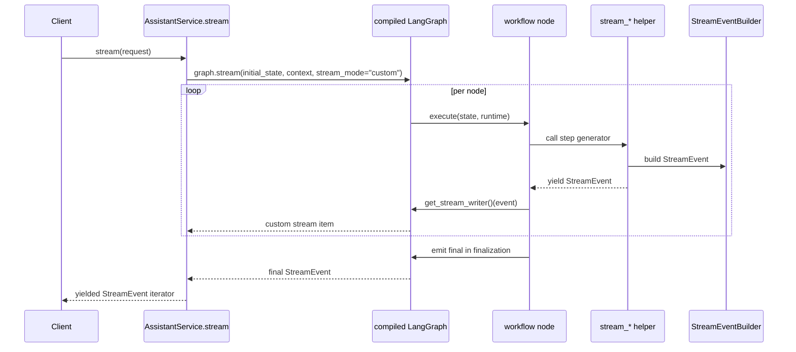

# Workflow Graph

This document describes the real LangGraph workflow currently executed by the backend. It is documentation for the implementation in:

- `src/creative_coding_assistant/orchestration/workflow_graph.py`
- `src/creative_coding_assistant/orchestration/workflow.py`
- `src/creative_coding_assistant/orchestration/service.py`
- `src/creative_coding_assistant/orchestration/events.py`
- `tests/test_langgraph_workflow_integration.py`

## Current Implemented Flow

The graph is compiled once in `AssistantService.__init__()` and executed through `graph.stream(..., stream_mode="custom")`. Control flow is currently linear. Routing affects data and downstream step behavior, but it does not change graph edges yet.

```mermaid
flowchart LR
    start([START])
    intake["intake<br/>start INTAKE<br/>emit status: request_received<br/>complete INTAKE"]
    routing["routing<br/>start ROUTING<br/>route request<br/>emit status: route_selected<br/>store route_decision + route_payload"]
    memory["memory<br/>start MEMORY<br/>run memory step<br/>complete or skip"]
    retrieval["retrieval<br/>start RETRIEVAL<br/>run retrieval step<br/>complete or skip"]
    context_assembly["context_assembly<br/>start CONTEXT_ASSEMBLY<br/>assemble context<br/>complete or skip"]
    prompt_input["prompt_input<br/>start PROMPT_INPUT<br/>build prompt inputs<br/>complete or skip"]
    prompt_rendering["prompt_rendering<br/>start PROMPT_RENDERING<br/>render prompt<br/>complete or skip"]
    generation["generation<br/>start GENERATION<br/>prepare input and stream tokens<br/>complete or skip<br/>store generation_result"]
    review["review<br/>start REVIEW<br/>currently skip REVIEW"]
    finalization["finalization<br/>start FINALIZATION<br/>choose answer<br/>emit FINAL<br/>finish_workflow()"]
    finish([END])

    start --> intake --> routing --> memory --> retrieval --> context_assembly --> prompt_input --> prompt_rendering --> generation --> review --> finalization --> finish
```

The raw Mermaid source for the implemented graph is also available in [workflow_graph.mmd](/Users/k/Desktop/CC/the_turing_college/extra_projects/creative_coding_assistant/docs/workflow_graph.mmd).

## Nodes And Transitions

`ASSISTANT_WORKFLOW_NODE_ORDER` is the source of truth for node ordering:

1. `intake`
2. `routing`
3. `memory`
4. `retrieval`
5. `context_assembly`
6. `prompt_input`
7. `prompt_rendering`
8. `generation`
9. `review`
10. `finalization`

Current transition rules:

- `START -> intake`
- Each node points to the next node in `ASSISTANT_WORKFLOW_NODE_ORDER`
- `finalization -> END`
- There are no conditional edges yet
- There are no graph loops yet
- Failures currently propagate as exceptions instead of traversing an explicit failure edge

Node responsibilities:

- `intake`: marks `WorkflowStep.INTAKE` active, emits `status/request_received`, then completes the step
- `routing`: computes `RouteDecision`, emits `status/route_selected`, stores `route_decision` in workflow state and `route_payload` in graph state
- `memory`: calls the memory step generator and either stores `memory_context` or skips the step
- `retrieval`: calls the retrieval step generator and either stores `retrieval_context` or skips the step
- `context_assembly`: combines memory and retrieval context when a context assembler is configured
- `prompt_input`: builds prompt inputs when a prompt input builder is configured
- `prompt_rendering`: renders the final provider prompt when prompt inputs exist
- `generation`: prepares provider input, forwards generation stream events, and stores the transient `generation_result`
- `review`: exists as a stable insertion point but currently does no work and always skips
- `finalization`: resolves the final answer from `generation_result.answer` or the shell fallback, emits the `final` event, and marks the workflow completed

## Workflow State Lifecycle

There are two layers of runtime state.

`AssistantWorkflowState` is the durable typed workflow state:

- Created by `begin_assistant_workflow(request)`
- Starts as `status=running`, `current_step=None`
- Moves one step at a time through `start_workflow_step()`
- Resolves each step through `complete_workflow_step()` or `skip_workflow_step()`
- Stores durable outputs such as `route_decision`, `memory_context`, `retrieval_context`, `assembled_context`, `prompt_input`, `rendered_prompt`, and `final_answer`
- Reaches terminal completion only through `finish_workflow()` while `FINALIZATION` is active
- Supports `fail_workflow()`, but that path is not yet wired into the LangGraph runtime

`AssistantWorkflowGraphState` is the LangGraph transport state:

- Always carries `workflow_state`
- Also carries `route_payload` for final event rendering
- Also carries `generation_result` as an ephemeral object needed by `finalization`
- Keeps the graph runtime small without forcing all transient objects into the Pydantic workflow model

Important current behavior:

- Optional steps skip when their gateway or input is missing
- `review` is always skipped today
- `generation_result` is not persisted into `AssistantWorkflowState`; only `final_answer` is
- `WorkflowEventMetadata` exists on the state model but is not yet attached to emitted stream events

## Stream Event Flow

The graph preserves the existing event protocol by reusing one `StreamEventBuilder` instance for the entire request.

What actually flows through the stream:

- `intake` emits `status`
- `routing` emits `status`
- `memory` emits `memory`
- `retrieval` emits `retrieval`
- `context_assembly` emits `context`
- `prompt_input` emits `prompt_input`
- `prompt_rendering` emits `prompt_rendered`
- `generation` emits `generation_input`, `token_delta`, and possibly `error`
- `finalization` emits `final`

Important stream guarantees:

- Sequence numbers remain monotonic because the same `StreamEventBuilder` instance is shared across all nodes
- Only `StreamEvent` instances are surfaced from the graph stream; helper return values become state updates instead
- The final event is still emitted exactly once by `finalization`
- The current tests verify backward-compatible event ordering for both shell and generation-backed paths

## Current Implemented Flow Vs Future Extension Points

Current implemented flow:

- Linear graph
- No conditional routing edges
- No tool nodes
- No review loop
- No preview pipeline
- No HITL checkpoints
- No explicit failure node

Future extension points can be added incrementally without replacing the current graph shape.

```mermaid
flowchart LR
    routing[routing]
    memory[memory]
    retrieval[retrieval]
    context_assembly[context_assembly]
    prompt_input[prompt_input]
    prompt_rendering[prompt_rendering]
    generation[generation]
    review[review]
    finalization[finalization]

    tool_gate{{future tool gate}}
    tool_loop{{future tool loop}}
    preview[future preview pipeline]
    hitl{{future HITL checkpoint}}
    retry{{future review loop}}

    routing --> memory --> retrieval --> context_assembly --> prompt_input --> prompt_rendering --> generation --> review --> finalization
    routing -. capability-based branch .-> tool_gate
    tool_gate -. rejoin .-> memory
    prompt_rendering -. optional tool planning/execution .-> tool_loop
    tool_loop -. rejoin .-> generation
    generation -. preview mode .-> preview
    preview -. rejoin .-> review
    review -. correction loop .-> retry
    retry -. back to prompt/generation .-> prompt_input
    review -. approval required .-> hitl
    hitl -. rejoin .-> finalization
```

Conservative insertion points:

- Tools: the least disruptive gate is immediately after `routing`, because route capabilities already exist there; a richer tool loop can also sit between `prompt_rendering` and `generation`
- Review loops: the current `review` placeholder is the natural anchor for a future retry loop back to `prompt_input` or `generation`
- Preview pipeline: a preview branch can sit after `generation` and before `review` so preview artifacts can be inspected without changing the request/response contract
- HITL checkpoints: the safest first checkpoint is between `review` and `finalization`, where a human can approve, edit, or reject a nearly complete result

## Known Limits In The Current Runtime

- Failure handling is still exception-based at the graph boundary; there is no explicit `FAILED` graph path yet
- `WorkflowEventMetadata` is modeled but not emitted with stream events
- Route selection does not currently alter graph control flow
- `review` is a placeholder, not a live evaluation step
- Stream event types such as `tool_start`, `tool_result`, `preview_artifact`, and `eval_update` exist in contracts but are not emitted by the current graph

## Validation Pointers

The current behavior described here is covered directly by:

- `tests/test_workflow_foundation.py`
- `tests/test_langgraph_workflow_integration.py`

Those tests currently verify:

- explicit step ordering
- state completion and skipped-step behavior
- compiled graph execution
- failure propagation
- stream ordering and event-shape compatibility
